# Backlog de Sprints — PhxClaw até 100% de absorção

```text
Sprint SP000001 | 01/10/2026 | planejamento (concluída)
```

Numeração global, sequencial, sem reuso. Estados: **CONCLUÍDA** (integrada e comitada), **EM EXECUÇÃO** (frente rodando agora),
**PLANEJADA** (entra quando a anterior integrar), **BLOQUEADA** (espera decisão ou credencial do dono).
São os quatro que o `tools/dossie/numeros.py` aceita; outro estado é parada do gerador.

Base medida (gerar_absorcao.py, 01/10, contando o que as frentes de git e interação já entregaram e
ainda não comitaram): Claude Code 82,9% · Codex 67,4% · OpenClaw 56,4% · Hermes 55,0% · OpenJarvis 38,2%.
No `phxclaw.json`: **39 chaves «nao» e 15 «parcial»** — são elas que estas sprints fecham. Toda chave
abaixo aparece em exatamente uma sprint.

## Visão geral

| Sprint | Onda | Foco | Chaves | Estado |
|---|---|---|---:|---|
| SP000002 | 3 | Integração da onda 3 (git, interação, canais) e commit | — | CONCLUÍDA (4670bc20) |
| SP000003 | 3 | Canais A: laço único + 8 canais principais | 8 | CONCLUÍDA (4670bc20) |
| SP000004 | 3 | Canais B: 16 canais restantes | 16 | CONCLUÍDA (4670bc20) |
| SP000005 | 4 | Orquestração e plugins | 5 | CONCLUÍDA (4670bc20) |
| SP000006 | 4 | Editor e remoto | 7 | CONCLUÍDA (4670bc20) |
| SP000007 | 4 | Voz e mídia | 5 | CONCLUÍDA (4670bc20) |
| SP000008 | 4 | Integração da onda 4 e commit | — | CONCLUÍDA (4670bc20) |
| SP000009 | 5 | Contexto e dados | 5 | CONCLUÍDA (f27402e5) |
| SP000010 | 5 | Credencial e CI | 4 | CONCLUÍDA (f27402e5) |
| SP000011 | 5 | Medição | 4 | CONCLUÍDA (f27402e5) |
| SP000012 | 5 | Integração da onda 5 e commit | — | CONCLUÍDA (f27402e5) |
| SP000013 | — | Endurecimento (achados ⏸ das revisões) | — | CONCLUÍDA (02/10: A/B/C + D; o que sobrou está nas pendências avulsas) |
| SP000014 | — | Prova real com credenciais | — | BLOQUEADA (dono) |
| SP000015 | — | Ciclo de auto-evolução | — | EM EXECUÇÃO |
| SP000016 | — | Entrega v0.71 | — | PLANEJADA |
| SP000017 | — | Provedores ElevenLabs (fala e transcrição) e Nano Banana (gerar e editar imagem) | — | CONCLUÍDA (f27402e5) |
| SP000018 | — | config.json central, fase 1: catálogo, precedência, recusa de segredo, `phxclaw config`, catraca | — | CONCLUÍDA (f27402e5) |
| SP000019 | — | Tela de configuração do config.json (GET/PUT /v1/config) e phx-grid nas listagens | — | CONCLUÍDA (f27402e5) |
| SP000020 | — | config.json, fase 2: leitores migrados ao ponto único (catraca 127 → 5, os 5 com motivo no script); os 245 JSON de config/ inventariados (`tools/config_inventario.py`) e provados sem segredo (`config_json.rs`); guarda de pulos acusa `return` calado em bloco condicionado a recurso | — | CONCLUÍDA (02/10, frente B; faltam os 5 restantes: 1 nome montado em `canais/ligar.rs`, 4 em arquivos das frentes W1/W2) |
| SP000021 | 6 | Tela→UI-IR com layout pelas caixas do OCR; troca medida para qwen3-vl | — | CONCLUÍDA (onda 6) |
| SP000022 | 6 | Prova de fidelidade da conversão de tela (ida e volta + bloco/texto/posição) | — | CONCLUÍDA (onda 6) |
| SP000023 | 6 | Segredo no commit: gitleaks num hook do git_write | — | CONCLUÍDA (onda 6) |
| SP000024 | 7 | Navegador pela árvore de acessibilidade (refs, elemento novo marcado, coberto por modal fora); MCPs por configuração (context7, dbhub); embedding de código se o recall pedir | — | PLANEJADA |
| SP000025 | 7 | pywinauto pelo device-node num Windows com WinDev | — | BLOQUEADA (dono: máquina Windows) |
| SP000026 | — | Conselho de integradores no agente: `go_no_go` registra parecer por integrador; Go só unânime, um NoGo bloqueia, parecer faltando aguarda | — | CONCLUÍDA (onda 6) |
| SP000027 | — | Qualificação da UI (12/12 telas, Style Phoenix Padrão) | — | CONCLUÍDA (cd48386e) |
| SP000028 | 7 | Portão que valida e confere o fim: validador de esquema com caminho e todos os erros, 2 tentativas por ferramenta, final_answer tipado, comando de verificação, fim com falha sem resolver recusado | — | CONCLUÍDA (onda 7) |
| SP000029 | 7 | Retomar e bifurcar pela gravação: `retomar --do-passo N`, passo humano no fluxo, pergunta pendente que sobrevive a reinício | — | PLANEJADA |
| SP000030 | 7 | Medir melhor: nota parcial (LCS, conjunto) no avaliar, duração/tokens/passo-pai por passo, SHA do prompt, memória com invalid_at | — | CONCLUÍDA (02/10) |
| SP000031 | 9 | VS Code de 53,8% a ≥ 90% (dono, 02/10): os 21 itens «não»/«pela metade» da fonte vscode, em ondas (git e projeto; editor e LSP; UI e remoto); os de produto sobem ao dono | 24 | CONCLUÍDA (02/10: VS Code 92,3%; os 4 «não» são de produto) |
| SP000032 | 9 | Fechar em 100% (dono, 02/10): RSA para Teams/Google Chat, pacotes de plugin completos, XMPP MUC, Nostr DM, VS Code onda 2, minimapa/dobra, SSH local, Live Share; iMessage, voz ao vivo, RAPL e nuvem dependem de recurso do dono | 32 | EM EXECUÇÃO (R1 RSA 09/10, R3 XMPP 02/10, R5 minimapa 09/10 feitos; dobra recusada com número) |
| SP000033 | 9 | Integração total com o n8n (dono, 02/10): PhxClaw chama fluxos do n8n (webhook/REST, chave no broker) e o n8n chama o PhxClaw (nó da comunidade + MCP nos dois sentidos); prova real com n8n de verdade | — | EM EXECUÇÃO (código entregue 02/10; prova com n8n real NÃO VALIDADA: depende da máquina do dono) |
| SP000034 | 9 | Prova de uso fora de desenvolvimento (dono, 02/10): monitor de passagens aéreas para a China — fluxo agendado, navegador/API, memória, aviso por canal; medido de verdade | — | EM EXECUÇÃO (prova no Google Flights VERIFICADA 02/10; aviso real depende da credencial do dono) |
| SP000035 | 9 | PHX Flow Engine (dono, 02/10): o fluxos.rs vira motor de nós (ferramenta, agente, skill, MCP, comando, comportamento) com itens, condição, laço, espera e erro tratado — n8n como 7ª fonte, medido em 40,7%; editor visual é onda à parte | 35 | EM EXECUÇÃO (onda 1 entregue 02/10: itens, se/juntar/lote/parar_com_erro, ao_errar, tetos, expressões por caminho, fluxo_de_erro; onda 2 entregue 06/10: skill/mcp/comando como passo, sub-fluxo, --ate, gatilho→fluxo, variáveis; onda 3 entregue 09/10: esperar que descarrega, pin, poda, formulário, binário e teto por passo, mais 3 simples da onda 4; ondas 4 (resto) e 5 por fazer) |
| SP000036 | 9 | Painel no molde do mockup do dono (02/10): paleta de comandos, menu por áreas, cartões de ação, projetos, modelos (só medido), skills, execuções, agenda, notificações, assistente; tokens da marca; nenhum número digitado | — | EM EXECUÇÃO (fase 1 entregue; fase 2 em lotes) |
| UI-R01 | 8 | Phx Responsive UI — contratos e layout: intenção responsiva no UI-IR (janela e contêiner), breakpoints num JSON único, motor que compila para Grid/Flexbox/container queries, sem perder estado ao redimensionar | — | CONCLUÍDA (onda 7) |
| UI-R02 | 8 | Adaptador Bootstrap substituível: componentes semânticos → Bootstrap 5.3, tokens do PhxClaw nas variáveis do Bootstrap, arquivo local com versão fixada, sem o JS do Bootstrap mexer no DOM controlado | — | CONCLUÍDA (onda 7) |
| UI-R03 | 8 | Studio e templates: editor visual, prévia por largura, inspetor que explica a regra aplicada, template com UUIDv7 e propagação versionada sem apagar sobrescritas | — | PLANEJADA |
| UI-R04 | 8 | Skill phx-responsive-ui e qualidade: propõe mudança no IR, não HTML; regressão visual, teclado, reflow a 320 px e WebViews reais do Tauri | — | PLANEJADA |
| | | **Total de chaves** | **54** | |

```mermaid
gantt
    title Dependência das sprints (não é calendário)
    dateFormat X
    axisFormat %s
    section Onda 3
    SP000003 Canais A          :a3, 0, 2
    SP000004 Canais B          :a4, after a3, 2
    SP000002 Integração 3      :a2, after a4, 1
    section Onda 4
    SP000005 Orquestração      :b5, 0, 3
    SP000006 Editor e remoto   :b6, 0, 3
    SP000007 Voz e mídia       :b7, 0, 3
    SP000008 Integração 4      :b8, after a2, 1
    section Onda 5
    SP000009 Contexto          :c9, after b8, 2
    SP000010 Credencial e CI   :c10, after b8, 2
    SP000011 Medição           :c11, after b8, 2
    SP000012 Integração 5      :c12, after c11, 1
    section Fecho
    SP000013 Endurecimento     :d13, after c12, 2
    SP000016 Entrega v0.71     :d16, after d13, 1
```



Portões de toda sprint (não se repetem abaixo): rustfmt nos arquivos tocados, `cargo clippy` zero
avisos, testes verdes, **RED medido** (o teste central falha com o defeito reposto), UI exercitada no
Chromium quando houver tela, catraca de idiomas sem subir, número visível só de gerador, nada comitado
pela frente — só o integrador comita.

---

## SP000002 — Integração da onda 3

| Campo | Conteúdo |
|---|---|
| **Objetivo** | Um commit com git/código, interação e canais, verde no conjunto. |
| **Papéis** | A (integra) · B · F · G · SEC |
| **Dependências** | SP000003, SP000004; conserto da frente de interação (achados do QA) |

**Tarefas**
1. Esperar canais e o conserto do QA na interação (regras para quem roda processo, nome de ferramenta único, filtro do `parallel_research`, catraca de `CAPACIDADES_PADRAO`, guarda genérica do bubblewrap).
2. Conferir no `motor.rs` que `checkpoint::no_portao` continua no `call_tool_com` e que a árvore não tem mutante (`*.bak` de mutação).
3. fmt, clippy do workspace, testes dos crates tocados com `--no-fail-fast`.
4. Regerar `ferramentas.json` (hoje 42; medido 56), `absorcao.json` e o bloco gerado do `AGENTE_AUTONOMO.md`.
5. Cognição do redirecionamento (PENDENTE → FRUTÍFERO só com o commit da prova).

**Aceite**
- [ ] Clippy do workspace com 0 avisos e testes verdes — saída anexada ao commit.
- [ ] `gerar_doc_agente.py` sem «FEZ MENOS».
- [ ] Nenhum `.bak` nem mutante na árvore.

---

## SP000003 — Canais A: laço único + principais

| Campo | Conteúdo |
|---|---|
| **Objetivo** | Arquitetura comum extraída do Telegram e os canais de maior uso. |
| **Chaves** | canal_discord, canal_slack, canal_whatsapp, canal_teams, canal_matrix, canal_email, webhooks, webchat |
| **Papéis** | B (titular) · F · SEC |
| **Dependências** | — |

**Tarefas:** trait de provedor + laço único (permitido → `criar_tarefa` → cursor depois da tarefa → resposta partida); `channel_send` com parâmetro de canal; `AwaitingInput` vira pergunta no chat; senha SMTP pelo SecretBroker; limpeza de segredo única na `Credencial`.

**Aceite**
- [ ] Testes do Telegram verdes sem mudar comportamento.
- [ ] Cada provedor provado contra servidor falso (dito como «contra falso»).
- [ ] Teste de vazamento de segredo em erro roda em laço por todos os provedores.

---

## SP000004 — Canais B: restantes

| Campo | Conteúdo |
|---|---|
| **Chaves** | canal_signal, canal_googlechat, canal_sms, canal_mattermost, canal_rocketchat, canal_zulip, canal_irc, canal_xmpp, canal_mastodon, canal_line, canal_viber, canal_messenger, canal_feishu, canal_reddit, canal_twitch, canal_nostr |
| **Dependências** | SP000003 (laço único) |

**Aceite:** cada canal pelo mesmo laço, sem segundo laço; IRC/Twitch contra servidor IRC falso por TCP; testes agrupados num só binário (disco).

> canal_imessage fica em SP000006 (depende do Mac do dono para a prova real). Contagem: 16 chaves.

---

## SP000005 — Orquestração e plugins

| Campo | Conteúdo |
|---|---|
| **Chaves** | workflows, plugins, dispositivos, tarefas_nuvem_paralelas, ambientes_nuvem |
| **Dependências** | worktrees (onda 3) |

**Tarefas:** DAG pelo `phxclaw-task-graph`, retomável; plugins `.claude-plugin/` e `.codex-plugin/` mapeados a skills/hooks/MCP/subagentes com Ed25519; `node_invoke` com a tripla lista; N tarefas em worktree + bwrap, best-of-N.

**Aceite:** DAG com falha no meio retoma de onde parou; plugin adulterado recusado; comando fora de qualquer das três listas recusado; ambientes_nuvem fica **parcial** até decisão de VM (produto, SP000014).

---

## SP000006 — Editor e remoto

| Campo | Conteúdo |
|---|---|
| **Chaves** | lsp, ide_acp, web_nuvem, celular, remote_control, busca_x, canal_imessage |

**Aceite:** erro de tipo plantado aparece pelo rust-analyzer real; `phxclaw acp` responde a cliente ACP; PWA instalável conferido no Chromium; controle remoto só por conexão de saída (3 processos locais); busca_x e iMessage contra falso, URL do BlueBubbles redigida analisando.

---

## SP000007 — Voz e mídia

| Campo | Conteúdo |
|---|---|
| **Chaves** | canvas, tts, voz_conversa, voz_wake, geracao_midia |
| **Risco** | licença do binário de TTS (espeak-ng GPL-3) — se embutir, para e sobe ao dono |

**Aceite:** WAV gerado transcreve de volta ao texto; widget com erro de sintaxe recusado com linha e coluna; iframe sem acesso ao token; geração de imagem contra falso (sem GPU, dito).

---

## SP000008 — Integração da onda 4

Mesmo roteiro da SP000002. Aceite extra: E2E do desktop e `ui_navegacao` verdes com as telas novas.

---

## SP000009 — Contexto e dados

| Campo | Conteúdo |
|---|---|
| **Chaves** | instrucoes_projeto, entrada_imagem, importar_skills, indexacao_documentos, pesquisa_profunda |

**Tarefas:** `AGENTS.md` da raiz ao cwd (teto 32 KiB, override, `CLAUDE.md` reserva, varredura anti-injeção); imagem na mensagem até Ollama/Anthropic/OpenAI; importador de skills com `scripts/` desligado e origem SHA-256; BM25 dentro do memory-context; citação conferida como trecho literal.

**Aceite:** os 350 `SKILL.md` reais importam; PNG com texto conhecido lido pelo qwen2.5vl:3b; citação inventada é recusada.

---

## SP000010 — Credencial e CI

| Campo | Conteúdo |
|---|---|
| **Chaves** | linear, conectores_google, github_action, clima |
| **Primeiro passo** | Bearer + OAuth PKCE no cliente MCP (uma peça abre Linear e Google) |

**Aceite:** MCP falso que exige Bearer; OAuth falso; ação composta com `GITHUB_EVENT_PATH` falso; clima **real** pelo MET Norway (CC BY 4.0).

---

## SP000011 — Medição

| Campo | Conteúdo |
|---|---|
| **Chaves** | gravar_repetir, avaliacao_modelos, telemetria_energia, otimizacao_skills |

**Aceite:** gravar com Ollama e repetir sem ele dá a mesma sequência de chamadas; p50/p95 e tokens/s com faixa e data; energia aparece como **«não medida (sem RAPL)»**, nunca estimada (telemetria_energia fica parcial); variante pior de skill não é promovida (faixas min–max).

---

## SP000012 — Integração da onda 5

Mesmo roteiro da SP000002.

---

## SP000013 — Endurecimento

Achados das revisões que nasceram ⏸ (não bloqueavam a entrega):
1. Agenda: formato com versão, erro do `save()` devolvido ou «pelo menos uma vez» documentado.
2. Checkpoint: pontos por pasta no `mcp-serve --trabalho` com trava; poda dos antigos.
3. Pergunta pendente que sobrevive a reinício; `phxclaw responder <id>`.
4. Regras de comando: `rm -fr` × `rm -rf` (normalizar opções).
5. UI: 46 textos fora da fábrica (topo, splash, painel, rodapé) e chaves com pt em inglês.
6. Testes que pulam calados sem pg/chromium/whisper/tesseract: passam a dizer que pularam.
7. `phxclaw-postgres-bootstrap` cita `phx db migrate`, comando que não existe.

**Aceite:** cada item com teste RED → GREEN; catraca de idiomas baixa.

---

## SP000014 — Prova real com credenciais — BLOQUEADA

Troca «contra falso» por «real». Depende do dono:

| Precisa | Para |
|---|---|
| tokens de cada canal | SP000003/4 |
| token GitHub e GitLab (`phxclaw forja token`) | github, gitlab |
| `XAI_API_KEY` | busca_x |
| chave do Linear, cliente OAuth Google + prévia do Gmail MCP | SP000010 |
| Mac com BlueBubbles | canal_imessage |
| máquina com RAPL | telemetria_energia |
| decisão de VM na nuvem (preço) | ambientes_nuvem |

---

## SP000015 — Ciclo de auto-evolução — EM EXECUÇÃO (desbloqueada pelo dono em 09/10/2026)

| Campo | Conteúdo |
|---|---|
| **Objetivo** | O PhxClaw escolhe um item deste backlog, implementa numa worktree e entrega um branch verde esperando aprovação. |
| **Decisão do dono (09/10/2026)** | Desbloqueada: a auto-evolução **propõe e espera o Go** — nunca faz merge sozinha. Alcance: ferramentas e testes; vetado: segurança, sandbox, capacidades. A chave do modelo forte entra pelo comando local `phxclaw … chave`; sem ela, roda com o provedor configurado e diz qual. |

**Tarefas:** heartbeat → escolher item → `git_worktree` → modo plano → implementar → portões (fmt, clippy, testes) → `code_review` do próprio diff → branch + relatório. Ligar ou aposentar `phxclaw-self-evolving-intelligence` e `phxclaw-skill-evolution` (hoje nenhum dos dois é dependência do agente).

**Aceite:** nunca faz merge; diff que toca caminho vetado é recusado pelo portão; item sem portão verde não vira branch.

**O que entrou (09/10/2026, sem commit — o integrador decide):**

| Peça | Onde | Prova |
|---|---|---|
| `phxclaw evoluir [--item] [--modelo]`, `itens`, `listar`, `aprovar ID`, `rejeitar ID` | `apps/phxclaw/src/evolucao.rs` (só lê opções) | exercitado no binário: `itens` lista 5 candidatos e 10 vetados; `aprovar ../x` recusa o id; `--item guardrails` recusa com o motivo |
| Ciclo: item → clone raso + `git_worktree` → plano → laço → commit pela mãe → portão do alcance → fmt/clippy(0 avisos)/test dos crates tocados → `code_review` do diff → ramo por `git bundle` | `crates/phxclaw-agent/src/evolucao.rs` | `tests/evolucao.rs`, 6 testes com `ScriptedLlm` num repositório git temporário (o produto do teste é um workspace com `crates/alvo`, a forma que a permissão alcança) |
| Política versionada, um motor só, **lista de permissão** (versão 2): `permitidos` dentro do teto do código; a que afrouxa é recusada inteira | `config/evolucao-politica.json` (2 permitidos, 10 itens vetados com motivo) | 11 testes de unidade em `evolucao::tests` |
| Relatório `.phxclaw/evolucao/<id>.md` + registro JSON; desfechos em `desfechos.jsonl` (PENDENTE ou INFRUTÍFERO com causa/prevenção; a escolha não lê esse arquivo) | idem | asserções nos 4 testes |

Prova real nos dois sentidos (09/10/2026): portão do alcance tirado → o diff no sandbox chega a
«esperando Go» e o teste reprova; `aprovar` ou o ciclo fazendo `git merge` → os testes do verde
e do aprovar reprovam. Restaurado por escrita; 0 `// REPOSTO` no código.

**Achado A2 da revisão de segurança (09/10/2026) — consertado, sem commit:** o alcance era
LISTA DE PROIBIÇÕES e se contornava por indireção. Medido no motor antigo (cópia isolada do
`conferir_alcance` de antes, rodada contra os caminhos do achado): **13 de 13 passavam verdes** —
`crates/phxclaw-agent/build.rs`, `crates/x/Cargo.toml`, `.cargo/config.toml`, `lib.rs` (onde um
`#[path="regras2.rs"] pub mod regras;` troca o `regras.rs` vetado sem tocá-lo), `instrucoes.rs`,
`git.rs`, `sistema.rs`, `equipe.rs`, `ferramentas.rs`, `fluxo_http.rs`, `pwa.rs`,
`config/agents/*.agent.json` e o JS da tela. Conserto:
- **Negado por padrão.** Só passa o que casa `permitidos` da política **e** `PERMISSAO_MAXIMA` do
  código: `crates/*/tests/**` e um único módulo de ferramenta, `calculadora.rs` (levantados os
  módulos do agente sem E/S: os outros leem disco, validam argumento ou esperam aprovação — na
  dúvida, fora). `NUNCA` (código) veta os crates e testes de segurança mesmo dentro do teto.
- **Conteúdo pelo mesmo motor:** `#[path]`/`cfg_attr`, `include*!`, `env!`, `extern crate`,
  `proc_macro`, `macro_rules!`, símbolo exportado, linha `mod` em `lib.rs`/`main.rs`/`mod.rs`;
  fora de teste, `mod x;`, `unsafe`, `Command`/`std::process`, E/S do `Path` e todo caminho fora
  do `std` puro. Nomes `Cargo.toml`/`Cargo.lock`/`build.rs`/`rust-toolchain*` e pastas ocultas em
  qualquer lugar; não-`.rs` fora de testes; apagar; modo executável. Saída de git cortada agora
  é erro (antes o `--raw` cortado em 4 MiB conferiria só o começo).
- **A política só aperta:** `permitidos` fora do teto recusa a política inteira.
- **B3:** `aprovar`/`rejeitar` conferem o registro antes de qualquer git (id igual ao do arquivo,
  ramo exatamente `evolucao/<item>-AAAAMMDD-HHMMSS`, commit sha, repositório igual à raiz do
  projeto); os comandos impressos (merge e apagar ramo) saem com aspas de shell.

RED por mutação, **9 de 9** (cada guarda tirada, o teste dela reprova; restaurado por escrita,
conferido igual byte a byte): permissão sempre verdadeira, conteúdo sem conferência, política
frouxa aceita, registro sem conferência, comando sem aspas, nome/pasta oculta aceitos, modo
executável aceito — nos testes de unidade —; e no ciclo inteiro, conteúdo filtrado do motor e
`aprovar` sem conferir o registro. Fica de fora, nomeado: o texto do `phxclaw ajuda evoluir` (`ajuda.rs`, de
outra frente) ainda diz «confere o diff contra os caminhos vetados».

**Defeito achado no caminho:** o `rust_project fmt` (sem `fix`) mandava `cargo fmt --check
--message-format json`, que o rustfmt 1.9 estável recusa — o `fmt` saía vermelho em todo projeto,
formatado ou não, e o teste do portão vermelho passava pelo motivo errado. Consertado em
`sistema.rs` (texto `Diff in ARQ:LINHA:`), com teste do leitor e a asserção do motivo no teste do
vermelho.

**Os dois crates antigos — proposta: aposentar do ciclo (não apagados; decisão de produto):**
- `phxclaw-self-evolving-intelligence`: `can_auto_promote` devolve `automatic: true` para prompt
  de risco baixo — promoção sem Go, contra a decisão do dono; e o «toca núcleo ou política» é um
  booleano que quem chama declara, não uma conferência do diff. Ninguém depende dele.
- `phxclaw-skill-evolution`: `evaluate_candidate` tem o caminho `AutoLowRisk` (padrão
  `allow_auto_low_risk: true`), o mesmo problema; e o domínio é pacote de skill (`skills.*`), não
  diff de código. O `phxclaw-release-hardening` depende dele, então aposentar mexe lá também.
- O que se aproveitou como ideia: evidência presa ao artefato — `aprovar` recusa se o ramo não
  aponta mais para o commit que os portões conferiram.

**Falta:** um ciclo real com modelo de verdade contra este repositório (sem chave paga, sem
Ollama e ~5 GB livres nesta máquina — o `target/` do workspace no clone não cabe); o gatilho por
agenda (não entrou: hoje a periodicidade é `cron` chamando `phxclaw evoluir`).

---

## SP000016 — Entrega v0.71

**Tarefas:** documentação gerada sem «FEZ MENOS»; tabela de absorção final; pacote de fontes e binário por script; instalação em diretório limpo e uma tarefa ponta a ponta.

**Aceite:** prova de instalação limpa anexada; números da UI e dos docs batem com os geradores.

---

## Contagem

| Grupo | Sprints | Chaves |
|---|---:|---:|
| Onda 3 (canais) | 3 | 24 |
| Onda 4 | 4 | 17 |
| Onda 5 | 4 | 13 |
| Fecho | 4 | — |
| **Total** | **15** | **54** |

> Números de chaves contados do `phxclaw.json` em 01/10/2026. Nenhuma sprint desta lista está
> concluída além da SP000001.


---

## Acréscimos de 01/10/2026 (pedidos do dono depois do plano)

- **SP000017–SP000020** saíram de pedidos diretos: ElevenLabs e Nano Banana, config.json central e a tela dele, phx-grid nas listagens.
- **SP000021–SP000025** saíram da triagem do papel J sobre as duas pesquisas de 01/10 (visão e redes
  neurais; repositórios do GitHub): dos 49 itens, 6 entram, 7 já existiam ou estão na onda 5, 36 ficam
  como inspiração ou recusa. Decisões e hipóteses que morreram em `TRIAGEM_PESQUISAS_2026-10-01.md`.
- Achado da triagem que muda o plano: a conversão de tela em UI-IR por visão **já existe**
  (`screenshot_to_erp_ui`, qwen2.5vl:3b + confirmação por OCR, ~92 s por tela). O que falta é layout e
  prova de fidelidade, e é isso que a onda 6 faz.


---

## Phx Responsive UI (decisão do dono, 01/10/2026)

A interface é descrita pela INTENÇÃO no UI-IR (quantas colunas por espaço disponível, com base
na janela ou no contêiner); um motor responsivo compila isso para CSS nativo; um adaptador visual
veste os componentes. O adaptador «phoenix» (nativo, tokens do Style Phoenix Padrão) é o da
interface do próprio PhxClaw; o adaptador Bootstrap é um plugin substituível para os sistemas
gerados. Bootstrap nunca decide layout (nada de `col-*` como contrato) e não é dependência do
núcleo. As sprints usam o nome que o dono deu (UI-R01..R04), sem renumerar as SP.

## Achados de segurança de 01/10/2026 que entram na SP000013 (endurecimento)

Da revisão adversária de f27402e5 e dbdb4dc1 (os ALTOS A1–A3 e M1, M2, B1 voltaram à frente de
git/gonogo e se consertam antes de qualquer outro Go):
- M3 renovação OAuth não serializada (oauth.rs:583-589) — duas tarefas renovam com o mesmo refresh token.
- M4 segredo do broker preso só ao nome do servidor MCP, não ao endpoint (oauth.rs:312-345, mcp.rs:269-279).
- M5 confiança do projeto vale para a raiz do .git mas a leitura parte do cwd; AGENTS.md por symlink (config.rs:75-88, instrucoes.rs:50-73).
- M6 detecção de credencial no config.json por lista curta de prefixos, e o erro ecoa o valor (carga.rs:158-314).
- B2 If-Match do config só dentro do processo; .json.tmp com nome fixo.
- B3 importar_skills segue symlink em scripts e trava em laço de symlinks; corpo da skill sem varredura anti-injeção.
- B4 imagens: dimensões não conferidas (bomba de descompressão).
- B5 cerca do AGENTS.md fecha com maiúsculas; lista negra fraca.
- B6 pesquisa profunda: answer não conferido, [n] de citação recusada fica, páginas sem cerca.
- Da documentação: comandos de credencial leem do ambiente e a ajuda não diz; 6 segredos sem comando de broker.

## Parecer do DBA de 01/10/2026 (formatos em disco) — defeitos ATIVOS, na conta

1. **Caixa dos canais perde mensagem que já respondeu 200** (canais/caixa.rs:57-126): linha cortada
   no fim não é truncada e a próxima gravação nasce colada nela; falha no meio de um lote duplica `seq`.
   Conserto: `set_len` até o último `\n` no abrir e na falha.
2. **config.json sem trava entre processos** (config-runtime/lib.rs:185-230, agente/carga.rs:564-631):
   temporário de nome fixo, CLI e servidor juntos escrevem dentro do arquivo vivo; conferência de
   revisão tautológica no `definir`; revisão da API como soma tem ABA (3+1 = 2+2). Conserto: padrão do
   gonogo (trava, temporário por pid, fsync de arquivo e pasta) e token de revisão como par ou SHA.
3. **Gravação não tolera cauda cortada** (gravacao.rs:157-233, 381-438), embora prometa.
4. **BM25 entra em pânico com índice incoerente** (memory-context/bm25.rs:249-272).
Entram agora por custo zero: `"v": 1` por linha da caixa; `"formato": 1` no ORIGEM.json; simetria e
leitura de versão antes do serde no UI-IR (junto da v3). Achado sistêmico: sete lugares com
temporário + rename em três níveis de garantia — um helper só (o do gonogo, aprovado).
Provas executadas pelo DBA: 0 de 6 (disco cheio durante a revisão).

## Inventário do QA de 01/10/2026 — guardas que faltam (na conta da SP000013)

Nenhuma catraca subiu (config 135/135, idiomas 0/0, CAPACIDADES_PADRAO 21 → 23 com motivo escrito).
Pétreas sem guarda provada:
1. Ferramenta que cria processo e não está em CAPACIDADES_QUE_EXECUTAM: ocr, screenshot_to_erp_ui,
   image_render, lsp, web.browse — a regra de comando «negar» não as alcança.
2. Portas indiretas fora da varredura do bwrap: `Browser::launch` (adaptadores.rs, fidelidade_ui.rs e
   responsivo_ui.rs em curso) e `McpStdioSession::spawn` (comando do operador fora do bwrap).
3. Segredo de LLM fora do broker: phxclaw-llm/src/lib.rs lê OPENAI/ANTHROPIC/GEMINI_API_KEY do
   ambiente; a GEMINI_API_KEY vive em dois regimes desde a onda 6.
4. Laço de eco dos provedores pagos com contagem digitada (8) e sem o xAI; deve sair da lista de `Servico`.
5. Teste que pula calado conta como verde (segredos, voz_e_midia, sistema, visao) — os placares
   «407/410 verdes» incluem pulos; nenhum portão reprova PULADO.
6. ferramentas.json e AGENTE_AUTONOMO.md sem teste de «arquivo velho».
7. Paridade CLI × ferramenta do gonogo sem guarda; isento «EN» sem uso na catraca de idiomas.
Nenhuma guarda de guardas.rs tem prova de que falha com o defeito reposto.

## Prova F de 01/10/2026 (f27402e5/dbdb4dc1): na conta da SP000013

12 mutantes: 10 sobreviviam à suíte comitada, 1 morria, 1 era defeito real. Os testes novos caem
com cada mutante e passam sem ele.

- ☑ (032c24e1) **Defeito ativo:** `config::iniciar` não é chamado em produção. Depois de um PUT, a leitura volta
  à `pasta_padrao()`, e com `--pasta X` o `git.segredos.exigir` gravado não vale. O teste está com
  `#[ignore]` em `tests/config.rs`. Mandado à frente da onda 7.
- ☐ (parcial: 4 de 50 registram, 032c24e1) **PULADO conta como verde:** sem o gitleaks, a suíte dá `ok` igual. Já existe
  `tests/comum/pulado.rs`, que grava `target/tmp/pulados.jsonl`. Falta o portão ler o registro (pulo
  é NoGo na máquina que tem o recurso), migrar os outros 21 PULADO em 7 arquivos e dar registro a 3
  `return` mudos do `contexto_dados.rs`.
- ☑ (032c24e1) **M10 da ui-ir:** `grupo_rand` fixo em 1.0 sobrevive. Teste proposto e mandado à frente
  responsiva.
- ☐ **Pulo que volta calado:** teste que faz `return` sem imprimir nada não aparece nem nos 46 lugares
  nem no registro. O grep do integrador de 01/10 não achou nenhum, mas o limite é da busca.

## SP000030 — Medir melhor (triagem de 01/10: DeepEval, Langfuse, Graphiti)

Quatro entregas, cada uma com teste que falha com o defeito reposto:

- ☑ **Nota parcial no `avaliar`** (`avaliacao.rs`: `nota_ferramentas`, `lcs`): `conjunto` e
  `sequencia` (LCS) de 0 a 1 sobre o gabarito, por caso no `resultado.json`, mediana dos casos por
  rodada com faixa na tabela, `nota_sequencia` no vencedor pela regra das faixas. Determinística;
  o juiz por modelo (G-Eval) foi **recusado**: a faixa dele mediria o juiz. Prova:
  `tests/medicao.rs::avaliar_da_nota_parcial_de_ferramentas_e_agrupa_por_prompt` e
  `avaliacao::testes::nota_de_ferramentas_conjunto_e_lcs`.
- ☑ **Duração, tokens e passo-pai por passo** (`gravacao.rs`, formato **v2**, toda linha nova com
  `versao`): `duracao_ms`; `tokens_entrada`/`tokens_saida` só quando o provedor devolveu (0/0 do
  roteiro fica ausente); `tarefa` e `passo_pai` (o passo é reservado ANTES da chamada, para a
  filha apontar para ele). `phxclaw medir ARQ.jsonl` soma por tarefa e diz «não informados (k de
  N)» em vez de somar parcial. Gravação v1 continua lendo. Prova:
  `gravacao::testes::{cada_passo_leva_duracao_tokens_e_passo_pai_e_as_somas_saem_por_tarefa,
  gravacao_da_versao_1_continua_lendo_sem_medidas}` e `apps/phxclaw/tests/medir.rs`.
  **Limite medido:** o `parallel_research` e o `team_delegate` guardam cópia das ferramentas e do
  modelo de ANTES do gravador (decisão de desenho da gravação: subagente é UMA chamada), então os
  passos internos de um subagente real não chegam à gravação hoje; o `passo_pai` está provado com
  uma ferramenta aninhada de outra tarefa, que é o mesmo caminho.
- ☑ **SHA do prompt e das skills** (`gravacao.rs`: linha `prompt` antes do primeiro pedido,
  `prompt_sha256` das mensagens `system`, `skills_sha256` nome→sha do `SKILL.md`); o `avaliar`
  agrupa em `por_prompt` (modelo, prompt, skills). Prova: o mesmo teste do item 1.
- ☑ **Memória com substituição explícita** (`phxclaw-memory-context`: `invalid_at`,
  `superseded_by`, `versao` no registro, `search_with(.., include_invalid)`, `invalidate` NO
  LUGAR; `memoria.rs`: `gravar_substituindo`, `buscar_com`; `memory_save` ganha `substitui: id`
  e `memory_search` devolve o id e aceita `include_invalid`). Arquivo antigo lê como versão 1.
  Prova: `memoria::tests::substituir_marca_a_antiga_invalida_sem_apagar_e_a_busca_padrao_so_ve_a_valida`
  e `phxclaw_memory_context::tests::substituicao_marca_invalid_at_no_lugar_e_arquivo_antigo_continua_lendo`.

Fora: juiz por modelo (recusado), medição de passos internos de subagente real (limite acima),
`phxclaw medir` sobre o `task.json` (as medidas vivem na gravação, um motor só).

## SP000031 — VS Code até ≥ 90% (ordem do dono, 02/10/2026: «completar os itens abaixo de 80%»; alvo fixado por ele em 90%)

Medido em 01/10: 53,8% no agente (28 sim, 10 pela metade, 14 não, de 52). Cada id vale 1,92 pp.

**Onda 1 (código, sem choque com a SP000013):** stage_por_trecho, merge_conflitos, substituir_projeto,
tarefas_build, timeline_arquivo (frente V1, git/projeto); snippets, emmet, depurador, console_depuracao,
workspace_multi_raiz, explorador_testes (frente V2, editor/LSP/DAP).
**Onda 2 (depois do Go da SP000013, porque tocam config-runtime e a UI):** perfis, settings_sync,
ide_web, acessibilidade, breadcrumbs, tunel_remoto, plugins, marketplace_extensoes, sugestao_inline_ia.
**Sobem ao dono (produto):** minimapa e dobra_codigo (o Helix 25.07.1 não tem; exigem patch no Helix ou
outro editor), remoto_ssh_containers (SSH/contêiner/WSL na máquina do dono), live_share (edição
colaborativa em tempo real).

**Conta:** 28 + 21 = 49 de 52 → 94,2% se todos virarem «agente»; o alvo de 90% (47 ids) tolera 2 ficarem pela metade. Os 3 de produto ficam «não» e fora do alvo.

**Aceite:** cada id muda de estado no `phxclaw.json` com evidência de código e teste RED→GREEN; o
gerador imprime a nova porcentagem; nada digitado.
- ☐ **Guarda que passa por engano (integrador, 02/10):** `tests/desktop/qualificacao/qualificar.mjs` deu
  rc 0 e «12/12 QUALIFICADA» com o Chromium caído (ERR_INSUFFICIENT_RESOURCES, 41 sondas «quebradas»,
  «sondas 30/71 ok»). Sonda que não rodou tem de reprovar o veredito. Fica com o QA.
## SP000032 — Fechar em 100% (ordem do dono, 02/10/2026: «Continue para fechar em 100%»)

Medido em 02/10 depois da onda 1 da SP000031: total 88,1% no agente (238 sim, 17 pela metade, 15 não,
de 270). O que falta, por fonte, sai de `phxclaw.json` (estado ≠ agente):

**Código, sem recurso de fora (frentes):**
- **R1 criptografia RSA** — conferir o JWT RS256 do Bot Framework (Teams) e do Google Chat: RSA
  PKCS#1 v1.5 + SHA-256 escritos aqui (zero crate), provados contra vetor oficial (RFC 8017 / NIST
  CAVP), chave pública lida do JWKS; fecha `canal_teams` e `canal_googlechat` (3 fontes cada).
  — **FEITO 09/10** (`canais/rsa.rs`, `canais/jwt.rs`, ligado em `teams.rs` e `googlechat.rs`):
  Wycheproof `rsa_signature_2048_sha256` 9/9 válidos aceitos e 250/250 inválidos recusados (o 1
  «acceptable» de BER conta como inválido: DER estrito), NIST SigVer15 SHA-256 9/9 e 45/45; RED com
  a comparação do EM trocada por «acha o hash no fim»: 183 inválidos do Wycheproof e 9 do NIST
  passam a ser aceitos. Custo: 1,4 ms por verificação de 2048 bits em release (o parecer
  estimava ~7 ms), medido num banco descartável sobre os 259 casos — não há `--example` no
  repositório que o refaça ainda. Os dois ids viram «agente»; o gerador imprimiu openclaw 94,9% (era 89,7),
  hermes 95,0% (era 90,0), openjarvis 94,5% (era 90,9) no agente. Nenhum token real conferido
  ainda (prova contra servidor falso); o Emulador do Bot Framework e a saída do Google Chat pela API
  (que ASSINA RS256) ficam fora, com o motivo no `teams.rs` e no `googlechat.rs`.
- **R2 pacotes de plugin completos** — `.claude-plugin`/`.codex-plugin` com comandos, skills, hooks e
  agentes, não só os servidores MCP; assinados, no bwrap; fecha `plugins` em 4 fontes.
- **R3 canais** — `canal_xmpp` sala multiusuário (XEP-0045) — FEITO 02/10 (`canais/xmpp.rs`, `SALAS`/`APELIDO`); `canal_nostr` mensagem direta cifrada
  (NIP-17 sobre NIP-44, com o secp256k1 do bip340.rs e ChaCha20 escrito aqui, vetores do NIP-44).
- **R4 VS Code onda 2** — perfis, settings_sync, ide_web, acessibilidade, breadcrumbs, tunel_remoto,
  plugins (junto com R2), marketplace_extensoes, sugestao_inline_ia.
- **R5 editor** — minimapa e dobra_codigo: patch próprio no Helix (arquivo `.patch` aplicado pelo
  `tools/instalar_helix.sh`, com teste de que aplica limpo no commit fixado), ou painel do IDE;
  o pesquisador decide com número. `remoto_ssh_containers` provado contra um sshd local.
  **Minimapa FEITO 09/10** (painel no IDE web, `GET /v1/ide/arquivo` confinado à pasta;
  `tests/ide_web.rs`, `tests/desktop/ide_minimapa.mjs`). **Dobra recusada com número**: o patch do
  Helix (PR #14593) não aplica no 25.07.1 e o #16305 foi fechado (`docs/propostas/sp32-r5-r1-pesquisa.md`).
- **R6 live_share** — edição colaborativa pela ponte: sessão compartilhada do terminal do IDE
  (um host, N convidados, cursor e edição do host visíveis). Edição simultânea (CRDT) fica declarada
  como limite se não couber.

**Precisam de recurso do dono (ficam «NÃO MEDIDO» até o recurso existir, e saem da conta só com ele):**
- `canal_imessage` (3 fontes): exige um Mac com Messages; o código do canal se escreve, a prova não.
- `voz_wake` (2 fontes): microfone ao vivo e modelo de palavra-chave em português.
- `telemetria_energia`: máquina com RAPL (`/sys/class/powercap`), que esta não tem.
- `ambientes_nuvem`: VM na nuvem é decisão de produto e custo.

**Aceite:** cada id muda de estado no `phxclaw.json` com evidência e teste RED→GREEN; o gerador
imprime 100% por fonte. Nada digitado.


## SP000035 — PHX Flow Engine (ordem do dono, 02/10/2026) — EM EXECUÇÃO (ondas 1, 2 e 3 entregues)

**Fonte primária.** `git clone --depth 1 --filter=blob:none --sparse` de `github.com/n8n-io/n8n`
funcionou de primeira pelo proxy (commit `56aa3d8`, `packages/workflow` 2.42.0, 23 MB) e o mesmo para
`n8n-io/n8n-docs` (`49668e5`, 52 MB); nenhum arquivo precisou do `raw.githubusercontent.com`. A pasta
`docs/` do repositório principal só tem o molde de ADR — a documentação vive no `n8n-docs`. Os dois
clones foram apagados ao fim (disco em 1,3 GB livres).

**Licença.** `LICENSE.md`: Sustainable Use License 1.0 (fair-code), e os arquivos `.ee.` são Enterprise
(`LICENSE_EE.md`). Esta sprint usa **arquitetura e documentação, nenhuma linha de código** — a regra que a
triagem de 01/10 já tinha (R12: recusar embutir). Para os nós da comunidade a regra do n8n é explícita:
`connect/create-nodes/build-your-node/reference/verification-guidelines.md:51` — *«Make sure your package
license is MIT»* — e o `n8n-nodes-starter` é MIT (`package.json` `"license": "MIT"`). Ou seja, um nó da
comunidade escrito por nós (SP000033) nasce MIT por exigência deles, e isso não contamina o motor.

**Medido (gerar_absorcao.py, 02/10), antes da onda 1:** n8n **40,7% no agente | 55,1% com bibliotecas**
(24 sim, 17 pela metade, 18 não, de 59). Cada id vale 1,69 pp.

**Medido depois da onda 1 (gerar_absorcao.py, 02/10, mesmo dia):** n8n **55,9% no agente | 66,9% com
bibliotecas** (33 sim, 13 pela metade, 13 não, de 59). A onda comprou +15,2 pp (a previsão dizia +15,3,
por arredondamento de 9 × 1,69).

**Medido depois da onda 2 (gerar_absorcao.py, 06/10):** n8n **62,7% no agente | 73,7% com
bibliotecas** (37 sim, 13 pela metade, 9 não, de 59). +6,8 pp: subfluxo, execucao_parcial,
gatilho_dispara_fluxo e variaveis_globais viraram «agente», cada um com teste nomeado pelo id em
`tests/fluxo_onda2.rs` (17 testes); assistente_construtor_ia subiu só a «parcial» (o agente escreve
e roda o fluxo pela ferramenta `fluxo`, mas não há assistente de pedido → fluxo). A previsão da onda
dizia 5 ids; entraram 4 inteiros e 1 pela metade.

Junto da onda 2 (06/10): parecer do DBA (assinatura do JSON canônico com chaves ordenadas e sem
campo no padrão; `formato` no relatório, ausente = 1; `saida` só quando não deriva de `itens`;
progresso que o disco recusa vai para a evidência), segurança A3 (`max_itens` 1.000 por passo,
um semáforo de `max_paralelo` para chamadas e subagentes da onda, `teto_ms` padrão de 1 h) e a
prova real da onda 1: `laco_lotes` passava porque todas as passadas falhavam, e escondia que o
motor jogava fora as passadas boas quando uma falhava — agora `continuar`/`saida_de_erro` ficam
com as boas e marcam a que falhou (o `continueOnFail` do n8n). Achado na escrita dos testes:
`{"config": "chave.inexistente"}` numa variável derrubava o processo em pânico (o
`Configuracao::valor` trata chave desconhecida como erro de programação) — hoje é recusa na
leitura. RED medido em 9 testes (8 da onda 2 + `laco_lotes`).

**Medido depois da onda 3 (gerar_absorcao.py, 09/10):** n8n **76,3% no agente | 83,9% com
bibliotecas** (45 sim, 9 pela metade, 5 não, de 59). +13,6 pp = 8 ids × 1,69: os 5 da onda 3
(espera_wait, dados_pinados, poda_execucoes, gatilho_formulario, dados_binarios) e 3 simples da
onda 4 (cli_importar_exportar, etiquetas_pastas, concorrencia_limite), cada um com teste nomeado
pelo id em `tests/fluxo_onda3.rs` (11 testes, um deles o comportamento VELHO e outro a poda sem
configuração). RED medido em 7 (espera_wait, dados_pinados, poda_execucoes, gatilho_formulario,
dados_binarios, cli_importar_exportar, concorrencia_limite), com o defeito reposto e o motivo da
queda conferido; etiquetas_pastas diz a linha e não foi reposto.

Decisões da onda 3, com a restrição nossa que as causou:
- **A espera descarrega SEMPRE** (o `Wait` do n8n segura em memória a de menos de 65 s): a
  promessa é sobreviver ao reinício, e a espera curta em memória é a que o reinício perde. O
  alicerce é o da SP000029 — `AwaitingInput`, o `question` e a rota `/v1/tasks/{id}/answer` —,
  mas a resposta é GRAVADA no passo antes de retomar, porque o `perguntas::responder` vive em
  memória e não acha ninguém depois do reinício. A definição vai para `fluxo.json` na pasta da
  tarefa (fora de `work/`), e o vencimento de `ms` é gravado na abertura.
- **Segredo da espera de webhook: só o sha256 mora no fluxo.** O operador dá o segredo a quem
  chama e grava o hash; nem o fluxo, nem o relatório, nem o `fluxo.json` o carregam.
- **Formulário é o gatilho de webhook cujo fluxo declara `formulario`** — mesma rota, mesmo
  portão (o segredo chega pelo campo `_segredo`, que o navegador sabe mandar e que não vira
  item). HTML mínimo do servidor, sem script; os textos são os que o fluxo declara.
- **Formato 3 só quando usado** (passo esperando ou saída externa): relatório sem os recursos
  novos continua formato 2, e o binário anterior o retoma.
- **Etiqueta fica fora da assinatura; pin entra.** Reetiquetar não invalida execução esperando;
  trocar o pin é trocar o que o passo devolve.

Hipótese que morreu: **«reusar o `perguntas::registrar`/`responder` para a espera humana»**. Ele
é um `oneshot` em memória; um fluxo que descarrega não tem quem segure o receptor, e a resposta
que chega depois do reinício cairia em «nenhuma execução esperando neste processo». O que se
reusa da SP000029 é o estado (`AwaitingInput` + `question`) e a rota; o canal em memória fica
para o laço do modelo, que ainda segura a conversa viva.

Fora da onda 3, com o motivo: marcar a origem do item para o portão recusar `args` inteiros
vindos de fora (pendência da onda 1, não é id do n8n); `prazo` da espera humana (a pergunta pode
esperar para sempre; hoje só a poda não a toca, de propósito); upload de arquivo no formulário
(multipart); fila_workers e observabilidade_insights da onda 4 (pedem número de bancada).

**⏸ Falso positivo do motor único de credencial (integrador, 09/10):** `sk-` com 12+ caracteres
de corpo tarja (e a entrada recusa) caminhos como `/home/user/sk-learn-experiments/x.py` e
`github.com/acme/sk-learn-tutorial-2024`. Erra para o lado de tarjar; a entrada já recusava antes
desta rodada. Conserto possível: exigir corpo sem `-` depois de `sk-` (as chaves reais são
alfanuméricas), medido contra os vetores de chave da casa antes de mudar.

**Revisão da onda 3 (09/10, mesma data; QA, DBA e SEC sobre `211b9cd6`).** 16 achados + 5 da
prova real + o da repetição do gatilho, em `tests/fluxo_onda3b.rs` (20 testes) e
`apps/phxclaw/tests/fluxo_cli.rs`. **RED medido em 20 testes** (defeito reposto com
`// REPOSTO`, recompilado, caído pelo motivo certo, restaurado sem `cp -p`): esperar.ms enorme,
entrada com segredo, erro tipado da retomada, entregar formato futuro, `manter_fluxos`, pin de
binário (2 defeitos), ordem do importar, lápide, pin manual, M5 (o determinístico e o de 2 POST
simultâneos pelo soquete), M6, CSP, B5, FIFO, repetição do gatilho, `listar`, binário que
chega à espera e a metade `desc.any` da poda. Sem RED reposto um a um: `abrir_espera` checada
(teste unitário), `binarios/` link, `criar_pastas` (o `fsync` não se vê sem desligar a
energia).

Decisões, com o motivo:
- **Pin só na execução manual** (`fluxo rodar --pins`): o `pinData` do n8n só vale manual; aqui
  valia em gatilho e agenda, e quem escrevesse o `ARQ.pins.json` trocava a saída de um passo de
  produção. Ignorado (não recusado) fora do manual — o fluxo de gatilho com pin esquecido roda o
  passo de verdade em vez de parar. `esperar` pinado é recusa na leitura.
- **`esperar.ms` acima de 366 dias é recusa na leitura** (não «espera para sempre»): espera
  longa é data e se escreve em `ate`; e a abertura usa `try_milliseconds` + `checked_add_signed`
  como segunda barreira.
- **Pin de binário volta a `{base64, mime}`** (não recusado): `saida_para_pin` reidrata do
  `binarios/` da origem, conferido pelo sha256, e a execução nova grava no dela. A referência crua
  num pin é recusada.
- **Código do formulário próprio** (`segredo_formulario`): o código vai a humanos e não pode ser
  a credencial JSON/HMAC do gatilho. O formulário nasceu hoje e não tem cliente para quebrar.
- **Repetição do gatilho em memória**, pela assinatura (ou `Idempotency-Key`), validade de 2 ×
  300 s, teto de 10.000 chaves (cheio é 429, não descarte). Não pelo motor dos canais: a caixa
  deles descarta por `id` de mensagem e grava a mensagem; o gatilho não tem id no contrato.

Pendências (na conta, com o motivo):
- ☐ **Detector de segredo — o `config.json` na lista única.** O desenho: a lista mora em
  `phxclaw_types::segredo` (o crate mais baixo, que o config-runtime já usa); o
  `gravacao::chave_secreta` já delega. Falta o `carga::nome_de_segredo` delegar (arquivo de outra
  frente nesta rodada). O teste que falha hoje: `fluxo_onda3b::config_json_usa_a_lista_unica_de_segredo`
  (`--ignored`): `credencial`, `authorization`, `cookie`, `passwd`, `bearer`, `segredo`.
- ☐ **Repetição do gatilho depois de reinício:** a guarda é em memória; um reinício dentro da
  janela aceita uma repetição. Persistir as chaves vistas (arquivo com teto) fecha.
- ⏸ **HMAC do pacote (`FORMATO_PACOTE` 2):** o sha256 do pacote é conferência de integridade,
  não assinatura — doc, tela e CLI já dizem «conferência». Assinar pede chave do operador.
- ⏸ Textos fixos da página do formulário fora dos campos do `Formulario`: «Protocolo:» e a nota
  «* obrigatório» do designer (a nota não entrou).

### O que o `fluxos.rs` já é (470 linhas, lido)

DAG declarativo em JSON (`passos[]` com `depende`, `tarefa` OU `ferramenta`, `tentativas`), validado na
leitura (id, ciclo, `{{x}}` só de dependência declarada), executado por ondas pelo
`phxclaw-task-graph` (`claim_ready`, `RetryPolicy`), passo de agente pelo `rodar_filhas` e passo de
ferramenta pelo `Agent::call_tool` — **o portão único**. Progresso gravado no `task.json` a cada onda;
`retomar` confere o SHA-256 da definição e reaproveita as saídas ok. Teto de 64 passos. É um motor de
**dependências**, não de **dados**: a saída de um passo é uma string, não uma lista de itens.

### Correspondência (n8n → PHX Flow Engine)

| n8n (`packages/…`) | Hoje no PhxClaw | Vira |
|---|---|---|
| `INode` + `IConnections` (`workflow/src/interfaces.ts:1740`, `:518`) | `Passo` com `depende` | **Nó** = ferramenta \| agente \| skill \| MCP \| comando \| comportamento; conexão com porta nomeada |
| `INodeExecutionData[]` por item, `pairedItem` (`:1854`, `:1873`) | string | lista de itens JSON; `pairedItem` só se a prova pedir |
| `If`/`Switch`, `Merge` (append/combine/chooseBranch), `SplitInBatches` | — | nós de controle **do motor**, não ferramentas |
| `Wait` (timeInterval/specificTime/webhook/form, `Wait.node.ts:315`) | `AwaitingInput` só em tarefa | passo que descarrega para o disco e retoma (SP000029 é o alicerce) |
| `retryOnFail/maxTries/waitBetweenTries`, `onError` (`:1739`) | `tentativas` | `continuar`, `saida_de_erro`, `sempre_sair` |
| `errorWorkflow`, `executionTimeout` (`IWorkflowSettings :4041`) | `tool_timeout` por chamada | fluxo de erro e teto por passo/fluxo |
| `runPartialWorkflow2` (`core/src/execution-engine/workflow-execute.ts:221`) | — | `rodar --ate PASSO` com saídas gravadas |
| `pinData` (`workflow-execute.ts:101`) | `anteriores` da retomada (`fluxos.rs:298`) | pin escolhido e editável |
| `ExecuteWorkflow` (`once`/`each`) | — | ferramenta `fluxo` (sub-fluxo) pelo mesmo portão |
| Webhook/Schedule/Chat/MCP Trigger | gatilhos criam **tarefa** | gatilho aponta para **fluxo** |
| `credentials.ts` + `encryption/aes-256-cbc.ts` | broker AES-256-GCM | fica; o nó pede ao broker, nunca recebe o segredo cru |
| queue mode (main + workers, Redis) | `PostgresTaskJournal`, `PostgresOutbox` (bibliotecas) | onda 4, só se a bancada pedir |
| editor-ui (canvas Vue + xyflow) | — | onda à parte; xyflow recusado (R20) |

### Ondas

1. **Dados e controle (motor):** itens em vez de string; nós `se`, `juntar`, `lote`, `parar_com_erro`;
   `continuar_em_erro`/`saida_de_erro`; teto por passo e por fluxo; expressões `{{passo.campo}}` por
   caminho JSON (sem JS). Fecha: nos_e_conexoes, execucao_por_item, ramificacao_if_switch, juncao_merge,
   laco_lotes, continuar_em_erro, timeout_execucao, expressoes, fluxo_de_erro (9 ids → previsão +15,3 pp; medido +15,2 pp). **Entregue 02/10.**
2. **Nós que são o que o dono descreveu:** `skill` (skills.rs), `mcp` (mcp.rs), `comando` (comandos.rs),
   `comportamento` (estilos.rs/equipe.rs papel) viram tipos de passo pelo MESMO `call_tool`; ferramenta
   `fluxo` (sub-fluxo) e `rodar --ate`; gatilho (agenda, webhook, pasta) apontando para fluxo. Fecha:
   subfluxo, execucao_parcial, gatilho_dispara_fluxo, assistente_construtor_ia, variaveis_globais (5 ids).
3. **Espera, humano e dados pinados:** passo `esperar` (tempo, webhook, resposta) que descarrega para o
   disco — depende da SP000029; pin escolhido; poda de tarefas por idade/contagem; formulário servido.
   Fecha: espera_wait, dados_pinados, poda_execucoes, gatilho_formulario, dados_binarios (5 ids).
   **Entregue 09/10** (+ os 3 simples da onda 4 abaixo).
4. **Escala e gestão (só com número da bancada):** fila com workers pelas bibliotecas que já existem;
   limite global; etiquetas/pastas; export/import; `/metrics`. Fecha: fila_workers, concorrencia_limite,
   etiquetas_pastas, cli_importar_exportar, observabilidade_insights. **Entregues 09/10, junto da
   onda 3:** concorrencia_limite, etiquetas_pastas, cli_importar_exportar.
5. **Editor visual — onda à parte, declarada e não iniciada:** xyflow recusado (R20); a opção é canvas
   próprio em SVG como o UI-IR já faz, lendo o mesmo JSON do fluxo e mostrando o relatório da execução
   (passo ok/falhou/bloqueado/reaproveitado). Entra depois da onda 1, porque desenhar um motor de
   string seria desenhar o que vai mudar.

**Sobem ao dono (produto):** projetos_rbac (usuários/papéis), segredos_externos (Vault/AWS), instalacao_docker_k8s,
modelos_fluxo (galeria pública) — 4 ids ficam fora do alvo até ele decidir.

### Hipóteses que morreram, com o número

- **«O fluxos.rs já é um motor de workflow; falta só editor.»** Lido: 18 de 59 capacidades do n8n são
  «não» e 13 delas são do **motor** (item, condição, laço, espera, erro). Editor sobre este motor
  desenharia caixas que só sabem string → o editor é a onda 5, não a 1.
- **«Agendar um fluxo já existe (cron = agente).»** `agenda.rs:67` e `gatilhos.rs:365` criam tarefa com
  objetivo; **nenhuma** das 72 ferramentas roda fluxo → `gatilho_dispara_fluxo` nasceu parcial e
  `subfluxo` não.
- **«Queue mode pede Redis, como no n8n.»** As peças de claim já existem em Postgres (`task-graph`
  `PostgresTaskJournal`, `event-bus` `claim_batch`, `bpm` `claim_ready_token`) e nenhuma é usada pelo
  agente (`phxclaw-bpm` não é dependência de ninguém além do workspace). Raciocinado, não medido: a
  bancada decide se um processo basta (hoje `max_paralelo` 4 por fluxo).
- **«Copiar o pairedItem.»** O n8n precisa dele porque o nó reordena e filtra itens dentro do mesmo
  nó; aqui cada passo é uma chamada pelo portão com evidência própria no ledger — a ligação item→origem
  já é o registro de evidência. Entra só se um nó de junção por campo precisar.

### Inspiração, não cópia — onde diverge e por qual restrição nossa

| Divergência | Restrição |
|---|---|
| Nó **não** recebe credencial decifrada (`ICredentialsDecrypted` no n8n) | segredo pelo broker: o nó recebe um lease e o canal cifra na saída |
| Código do nó roda no **bwrap** sem rede, não num task runner Node.js/Python | sandbox é pétrea do agente; sem ele não há shell |
| Expressão por **caminho JSON**, sem avaliar JS (`expression.ts` usa tournament/JS) | nenhuma crate nova de motor: grafo e fila são o `phxclaw-task-graph` que já existe; avaliar JS seria segunda sandbox |
| Progresso gravado por onda e `fluxo_sha256` conferido na retomada | ordem de digitação / evidência: saída velha nunca se aplica a definição nova (n8n permite editar e retomar) |
| Todo nó passa pelo `Agent::call_tool` (política, regras, hooks, ledger) | portão único: um fluxo com portão próprio seria a segunda cópia da política |
| Loop por **DAG desdobrado em lotes** (nó `lote` gera N passos), não por ciclo no grafo | `TaskGraphError::Cycle` fica; ciclo é o que impede retomar com prova |

**Aceite:** cada id muda de estado no `phxclaw.json` com evidência e teste RED→GREEN; o gerador imprime a
porcentagem; o teste central da onda 1 é um fluxo com `se` + `lote` + `continuar_em_erro` cujo relatório
falha com o motor atual (string) e passa com itens.
- ⏸ **Roteiros da UI sem arquivo de resultado (integrador, 02/10):** os 7 roteiros de tests/desktop (fora
  qualificacao/) passam a gravar o placar em json, para o dossiê parar de depender da saída de quem rodou. QA.
