# Backlog de Sprints — PhxClaw até 100% de absorção

```text
Sprint SP000001 | 01/10/2026 | planejamento (concluída)
```

Numeração global, sequencial, sem reuso. Estados: **EM EXECUÇÃO** (frente rodando agora), **PLANEJADA**
(entra quando a anterior integrar), **BLOQUEADA** (espera decisão ou credencial do dono).

Base medida (gerar_absorcao.py, 01/10, contando o que as frentes de git e interação já entregaram e
ainda não comitaram): Claude Code 82,9% · Codex 67,4% · OpenClaw 56,4% · Hermes 55,0% · OpenJarvis 38,2%.
No `phxclaw.json`: **39 chaves «nao» e 15 «parcial»** — são elas que estas sprints fecham. Toda chave
abaixo aparece em exatamente uma sprint.

## Visão geral

| Sprint | Onda | Foco | Chaves | Estado |
|---|---|---|---:|---|
| SP000002 | 3 | Integração da onda 3 (git, interação, canais) e commit | — | EM EXECUÇÃO |
| SP000003 | 3 | Canais A: laço único + 8 canais principais | 8 | EM EXECUÇÃO |
| SP000004 | 3 | Canais B: 16 canais restantes | 16 | EM EXECUÇÃO |
| SP000005 | 4 | Orquestração e plugins | 5 | EM EXECUÇÃO |
| SP000006 | 4 | Editor e remoto | 7 | EM EXECUÇÃO |
| SP000007 | 4 | Voz e mídia | 5 | EM EXECUÇÃO |
| SP000008 | 4 | Integração da onda 4 e commit | — | PLANEJADA |
| SP000009 | 5 | Contexto e dados | 5 | PLANEJADA |
| SP000010 | 5 | Credencial e CI | 4 | PLANEJADA |
| SP000011 | 5 | Medição | 4 | PLANEJADA |
| SP000012 | 5 | Integração da onda 5 e commit | — | PLANEJADA |
| SP000013 | — | Endurecimento (achados ⏸ das revisões) | — | PLANEJADA |
| SP000014 | — | Prova real com credenciais | — | BLOQUEADA (dono) |
| SP000015 | — | Ciclo de auto-evolução | — | BLOQUEADA (dono) |
| SP000016 | — | Entrega v0.71 | — | PLANEJADA |
| | | **Total de chaves** | **54** | |

```mermaid
gantt
    title Dependência das sprints (não é calendário)
    dateFormat X
    axisFormat %s
    section Onda 3
    SP000003 Canais A          :a3, 0, 2
    SP000004 Canais B          :a4, after a3, 2
    SP000002 Integração 3      :a2, after a4, 1
    section Onda 4
    SP000005 Orquestração      :b5, 0, 3
    SP000006 Editor e remoto   :b6, 0, 3
    SP000007 Voz e mídia       :b7, 0, 3
    SP000008 Integração 4      :b8, after a2, 1
    section Onda 5
    SP000009 Contexto          :c9, after b8, 2
    SP000010 Credencial e CI   :c10, after b8, 2
    SP000011 Medição           :c11, after b8, 2
    SP000012 Integração 5      :c12, after c11, 1
    section Fecho
    SP000013 Endurecimento     :d13, after c12, 2
    SP000016 Entrega v0.71     :d16, after d13, 1
```



Portões de toda sprint (não se repetem abaixo): rustfmt nos arquivos tocados, `cargo clippy` zero
avisos, testes verdes, **RED medido** (o teste central falha com o defeito reposto), UI exercitada no
Chromium quando houver tela, catraca de idiomas sem subir, número visível só de gerador, nada comitado
pela frente — só o integrador comita.

---

## SP000002 — Integração da onda 3

| Campo | Conteúdo |
|---|---|
| **Objetivo** | Um commit com git/código, interação e canais, verde no conjunto. |
| **Papéis** | A (integra) · B · F · G · SEC |
| **Dependências** | SP000003, SP000004; conserto da frente de interação (achados do QA) |

**Tarefas**
1. Esperar canais e o conserto do QA na interação (regras para quem roda processo, nome de ferramenta único, filtro do `parallel_research`, catraca de `CAPACIDADES_PADRAO`, guarda genérica do bubblewrap).
2. Conferir no `motor.rs` que `checkpoint::no_portao` continua no `call_tool_com` e que a árvore não tem mutante (`*.bak` de mutação).
3. fmt, clippy do workspace, testes dos crates tocados com `--no-fail-fast`.
4. Regerar `ferramentas.json` (hoje 42; medido 56), `absorcao.json` e o bloco gerado do `AGENTE_AUTONOMO.md`.
5. Cognição do redirecionamento (PENDENTE → FRUTÍFERO só com o commit da prova).

**Aceite**
- [ ] Clippy do workspace com 0 avisos e testes verdes — saída anexada ao commit.
- [ ] `gerar_doc_agente.py` sem «FEZ MENOS».
- [ ] Nenhum `.bak` nem mutante na árvore.

---

## SP000003 — Canais A: laço único + principais

| Campo | Conteúdo |
|---|---|
| **Objetivo** | Arquitetura comum extraída do Telegram e os canais de maior uso. |
| **Chaves** | canal_discord, canal_slack, canal_whatsapp, canal_teams, canal_matrix, canal_email, webhooks, webchat |
| **Papéis** | B (titular) · F · SEC |
| **Dependências** | — |

**Tarefas:** trait de provedor + laço único (permitido → `criar_tarefa` → cursor depois da tarefa → resposta partida); `channel_send` com parâmetro de canal; `AwaitingInput` vira pergunta no chat; senha SMTP pelo SecretBroker; limpeza de segredo única na `Credencial`.

**Aceite**
- [ ] Testes do Telegram verdes sem mudar comportamento.
- [ ] Cada provedor provado contra servidor falso (dito como «contra falso»).
- [ ] Teste de vazamento de segredo em erro roda em laço por todos os provedores.

---

## SP000004 — Canais B: restantes

| Campo | Conteúdo |
|---|---|
| **Chaves** | canal_signal, canal_googlechat, canal_sms, canal_mattermost, canal_rocketchat, canal_zulip, canal_irc, canal_xmpp, canal_mastodon, canal_line, canal_viber, canal_messenger, canal_feishu, canal_reddit, canal_twitch, canal_nostr |
| **Dependências** | SP000003 (laço único) |

**Aceite:** cada canal pelo mesmo laço, sem segundo laço; IRC/Twitch contra servidor IRC falso por TCP; testes agrupados num só binário (disco).

> canal_imessage fica em SP000006 (depende do Mac do dono para a prova real). Contagem: 16 chaves.

---

## SP000005 — Orquestração e plugins

| Campo | Conteúdo |
|---|---|
| **Chaves** | workflows, plugins, dispositivos, tarefas_nuvem_paralelas, ambientes_nuvem |
| **Dependências** | worktrees (onda 3) |

**Tarefas:** DAG pelo `phxclaw-task-graph`, retomável; plugins `.claude-plugin/` e `.codex-plugin/` mapeados a skills/hooks/MCP/subagentes com Ed25519; `node_invoke` com a tripla lista; N tarefas em worktree + bwrap, best-of-N.

**Aceite:** DAG com falha no meio retoma de onde parou; plugin adulterado recusado; comando fora de qualquer das três listas recusado; ambientes_nuvem fica **parcial** até decisão de VM (produto, SP000014).

---

## SP000006 — Editor e remoto

| Campo | Conteúdo |
|---|---|
| **Chaves** | lsp, ide_acp, web_nuvem, celular, remote_control, busca_x, canal_imessage |

**Aceite:** erro de tipo plantado aparece pelo rust-analyzer real; `phxclaw acp` responde a cliente ACP; PWA instalável conferido no Chromium; controle remoto só por conexão de saída (3 processos locais); busca_x e iMessage contra falso, URL do BlueBubbles redigida analisando.

---

## SP000007 — Voz e mídia

| Campo | Conteúdo |
|---|---|
| **Chaves** | canvas, tts, voz_conversa, voz_wake, geracao_midia |
| **Risco** | licença do binário de TTS (espeak-ng GPL-3) — se embutir, para e sobe ao dono |

**Aceite:** WAV gerado transcreve de volta ao texto; widget com erro de sintaxe recusado com linha e coluna; iframe sem acesso ao token; geração de imagem contra falso (sem GPU, dito).

---

## SP000008 — Integração da onda 4

Mesmo roteiro da SP000002. Aceite extra: E2E do desktop e `ui_navegacao` verdes com as telas novas.

---

## SP000009 — Contexto e dados

| Campo | Conteúdo |
|---|---|
| **Chaves** | instrucoes_projeto, entrada_imagem, importar_skills, indexacao_documentos, pesquisa_profunda |

**Tarefas:** `AGENTS.md` da raiz ao cwd (teto 32 KiB, override, `CLAUDE.md` reserva, varredura anti-injeção); imagem na mensagem até Ollama/Anthropic/OpenAI; importador de skills com `scripts/` desligado e origem SHA-256; BM25 dentro do memory-context; citação conferida como trecho literal.

**Aceite:** os 350 `SKILL.md` reais importam; PNG com texto conhecido lido pelo qwen2.5vl:3b; citação inventada é recusada.

---

## SP000010 — Credencial e CI

| Campo | Conteúdo |
|---|---|
| **Chaves** | linear, conectores_google, github_action, clima |
| **Primeiro passo** | Bearer + OAuth PKCE no cliente MCP (uma peça abre Linear e Google) |

**Aceite:** MCP falso que exige Bearer; OAuth falso; ação composta com `GITHUB_EVENT_PATH` falso; clima **real** pelo MET Norway (CC BY 4.0).

---

## SP000011 — Medição

| Campo | Conteúdo |
|---|---|
| **Chaves** | gravar_repetir, avaliacao_modelos, telemetria_energia, otimizacao_skills |

**Aceite:** gravar com Ollama e repetir sem ele dá a mesma sequência de chamadas; p50/p95 e tokens/s com faixa e data; energia aparece como **«não medida (sem RAPL)»**, nunca estimada (telemetria_energia fica parcial); variante pior de skill não é promovida (faixas min–max).

---

## SP000012 — Integração da onda 5

Mesmo roteiro da SP000002.

---

## SP000013 — Endurecimento

Achados das revisões que nasceram ⏸ (não bloqueavam a entrega):
1. Agenda: formato com versão, erro do `save()` devolvido ou «pelo menos uma vez» documentado.
2. Checkpoint: pontos por pasta no `mcp-serve --trabalho` com trava; poda dos antigos.
3. Pergunta pendente que sobrevive a reinício; `phxclaw responder <id>`.
4. Regras de comando: `rm -fr` × `rm -rf` (normalizar opções).
5. UI: 46 textos fora da fábrica (topo, splash, painel, rodapé) e chaves com pt em inglês.
6. Testes que pulam calados sem pg/chromium/whisper/tesseract: passam a dizer que pularam.
7. `phxclaw-postgres-bootstrap` cita `phx db migrate`, comando que não existe.

**Aceite:** cada item com teste RED → GREEN; catraca de idiomas baixa.

---

## SP000014 — Prova real com credenciais — BLOQUEADA

Troca «contra falso» por «real». Depende do dono:

| Precisa | Para |
|---|---|
| tokens de cada canal | SP000003/4 |
| token GitHub e GitLab (`phxclaw forja token`) | github, gitlab |
| `XAI_API_KEY` | busca_x |
| chave do Linear, cliente OAuth Google + prévia do Gmail MCP | SP000010 |
| Mac com BlueBubbles | canal_imessage |
| máquina com RAPL | telemetria_energia |
| decisão de VM na nuvem (preço) | ambientes_nuvem |

---

## SP000015 — Ciclo de auto-evolução — BLOQUEADA

| Campo | Conteúdo |
|---|---|
| **Objetivo** | O PhxClaw escolhe um item deste backlog, implementa numa worktree e entrega um branch verde esperando aprovação. |
| **Bloqueio** | (1) modelo forte por API e a chave; (2) alcance permitido (proposta: ferramentas e testes; vetado: segurança, sandbox, capacidades) |

**Tarefas:** heartbeat → escolher item → `git_worktree` → modo plano → implementar → portões (fmt, clippy, testes) → `code_review` do próprio diff → branch + relatório. Ligar ou aposentar `phxclaw-self-evolving-intelligence` e `phxclaw-skill-evolution` (hoje nenhum dos dois é dependência do agente).

**Aceite:** nunca faz merge; diff que toca caminho vetado é recusado pelo portão; item sem portão verde não vira branch.

---

## SP000016 — Entrega v0.71

**Tarefas:** documentação gerada sem «FEZ MENOS»; tabela de absorção final; pacote de fontes e binário por script; instalação em diretório limpo e uma tarefa ponta a ponta.

**Aceite:** prova de instalação limpa anexada; números da UI e dos docs batem com os geradores.

---

## Contagem

| Grupo | Sprints | Chaves |
|---|---:|---:|
| Onda 3 (canais) | 3 | 24 |
| Onda 4 | 4 | 17 |
| Onda 5 | 4 | 13 |
| Fecho | 4 | — |
| **Total** | **15** | **54** |

> Números de chaves contados do `phxclaw.json` em 01/10/2026. Nenhuma sprint desta lista está
> concluída além da SP000001.
