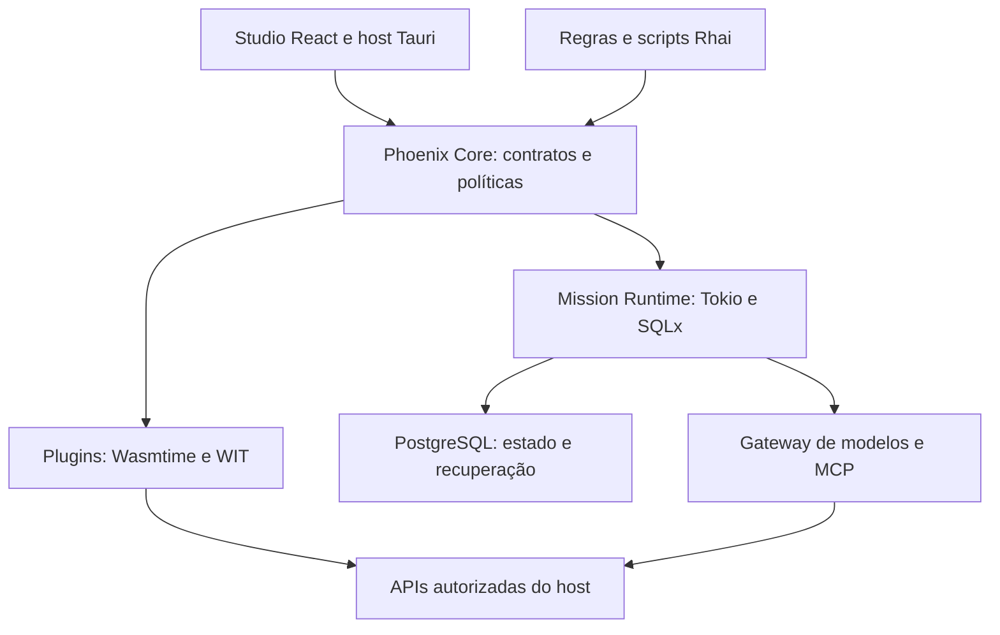

# Projetos Rust no GitHub para o Phoenix

**Pesquisa e verificação documental:** 09/10/2026  
**Resultado:** 68 repositórios únicos, organizados em oito áreas.  
**Escopo:** bibliotecas, ferramentas, runtimes e produtos com implementação Rust relevante, incluindo integrações com componentes nativos de outras linguagens.

## 1. Recomendação principal

O caminho inicial recomendado é um núcleo Phoenix próprio, apoiado em Tokio, Serde, serde_json, UUID, JSON Schema, petgraph e SQLx/PostgreSQL; Studio React hospedado por Tauri; plugins executados por Wasmtime; scripts simples em Rhai; e um gateway de modelos com rust-genai ou Rig, além de MCP pelo SDK oficial Rust.

A finalidade desta seleção é reduzir trabalho de infraestrutura e fornecer referências concretas para os motores do Phoenix. A integração proposta mantém a identidade, a representação intermediária, as regras de negócio e o ciclo de execução sob controle do projeto.

### Primeiras decisões de arquitetura

| Área | Seleção sugerida | Motivo no Phoenix |
| --- | --- | --- |
| Concorrência e I/O | [Tokio](https://github.com/tokio-rs/tokio) | Base dos workers e chamadas assíncronas. |
| Contratos PHX | [Serde](https://github.com/serde-rs/serde), [serde_json](https://github.com/serde-rs/json), [jsonschema](https://github.com/Stranger6667/jsonschema) | Estruturas tipadas, formato JSON e validação estrutural separados. |
| Identidade e dependências | [uuid](https://github.com/uuid-rs/uuid) e [petgraph](https://github.com/petgraph/petgraph) | UUIDv7 persistente e grafo de dependências com associação explícita aos IDs. |
| PostgreSQL | [SQLx](https://github.com/transact-rs/sqlx) | Acesso SQL, pools e transações no backend. |
| API e host | [Axum](https://github.com/tokio-rs/axum) e [Tauri](https://github.com/tauri-apps/tauri) | API do núcleo e host desktop para a interface React. |
| Plugins | [Wasmtime](https://github.com/bytecodealliance/wasmtime), [wit-bindgen](https://github.com/bytecodealliance/wit-bindgen) e [wasm-tools](https://github.com/bytecodealliance/wasm-tools) | Execução, contratos de chamadas e inspeção dos artefatos WASM. |
| Linguagem facilitadora | [Rhai](https://github.com/rhaiscript/rhai); [Pest](https://github.com/pest-parser/pest) quando houver gramática própria | Começar por eventos e regras simples; definir uma linguagem Phoenix em etapa própria. |
| Modelos de IA | [rust-genai](https://github.com/jeremychone/rust-genai) ou [Rig](https://github.com/0xPlaygrounds/rig) | Cliente mais estreito para gateway próprio, ou abstrações mais amplas de agentes. |
| Ferramentas MCP | [rust-sdk / rmcp](https://github.com/modelcontextprotocol/rust-sdk) | Cliente e servidor MCP atrás do mesmo controle de comandos Phoenix. |
| Operação | [tracing](https://github.com/tokio-rs/tracing), [Clap](https://github.com/clap-rs/clap) e [notify](https://github.com/notify-rs/notify) | Diagnóstico, CLI e atualização de fontes/manifestos. |
| Referência Flash | [Ruffle](https://github.com/ruffle-rs/ruffle) | Estudar conteúdo SWF, eventos, timeline e separação entre execução e renderização. |
| Referências de automação | [Windmill](https://github.com/windmill-labs/windmill), [z8run](https://github.com/z8run/z8run), [IronFlow](https://github.com/skitsanos/ironflow) e [ZeroClaw](https://github.com/zeroclaw-labs/zeroclaw) | Examinar workers, fluxos, scripts, canais e ferramentas. |

Essas são recomendações arquiteturais desta análise. O catálogo abaixo documenta o que as fontes afirmam e o limite relevante de cada escolha.

## 2. Diretrizes Phoenix consideradas

A seleção considera núcleo em Rust, execução nativa e web/WASM, PostgreSQL como armazenamento principal, UUIDv7 para identidade e PHX JSON/Phoenix IR como contratos do projeto. Considera também plugins com manifesto JSON, semver, dependências e permissões; Studio/Designer; motores de componentes, eventos, comandos, comportamento, estado, reatividade, timeline, cenas e mídia; e o PhoenixClaw para agentes e automação.

A linguagem voltada ao usuário deve simplificar a programação, com inspiração em WLanguage/Python e conceitos úteis de Flash/ActionScript. O núcleo Rust pode expor comandos simples sem exigir que usuários finais entendam ownership, lifetimes ou a toolchain Rust.

Para o módulo SQL, a fronteira proposta é explícita: parser e adaptadores de dialeto geram uma representação intermediária neutra; os renderizadores recebem essa representação. A análise de SQL permanece fora da camada visual.

O microkernel aqui é o núcleo de uma aplicação executada sobre o sistema operacional. Seu trabalho é organizar contratos, plugins, estado e políticas.

## 3. Método e legenda

A pesquisa usou repositórios dos mantenedores, README, arquivos de licença/Cargo e documentação oficial. Foram verificados finalidade, encaixe arquitetural, interfaces, restrições de plataforma e sinais concretos de migração ou arquivamento. Endereços redirecionados foram ajustados quando identificados.

Popularidade e estrelas não foram usadas como prova de qualidade. As prioridades representam utilidade para o Phoenix, considerando escopo e custo de integração. Esta entrega é documental: não houve instalação, compilação, benchmark ou execução dos projetos.

### Prioridades

| Código | Significado |
| --- | --- |
| P0 | Priorizar na primeira definição do núcleo ou no estudo que orienta essa definição. |
| P1 | Avaliar/adotar quando o módulo correspondente entrar em implementação. |
| P2 | Manter como alternativa posterior, laboratório ou referência histórica. |

### Papel sugerido

| Papel | Significado |
| --- | --- |
| Integrar | Candidato concreto a uma dependência ou ferramenta do projeto; integração ainda proposta. |
| Avaliar | Fazer prova de conceito antes de decidir. |
| Alternativa | Escolha que pode competir com outra solução da mesma função. |
| Referência | Estudar arquitetura e comportamento; adoção de código exige decisão própria. |

P0 e papel devem ser lidos juntos: Ruffle é P0 como referência; Tauri é P0 como integração proposta. Uma biblioteca P0 não implica compatibilidade já testada com todas as outras.

As licenças registradas se referem ao componente ou escopo indicado. Expressões com “OU” representam alternativas confirmadas pela fonte; quando apenas a presença de arquivos foi confirmada, a entrada conserva essa ressalva. Licenças de modelos, assets, bibliotecas nativas e edições comerciais continuam distintas.

## 4. Mapa dos 68 projetos

| Área | Quantidade |
| --- | ---: |
| Núcleo, contratos e PostgreSQL | 9 |
| Plugins WebAssembly | 4 |
| Linguagens, parsing e transformação de código | 13 |
| Studio e interfaces | 7 |
| Gráficos, mídia e integração desktop | 8 |
| IA, MCP, busca e contexto | 12 |
| Automação e workflows | 3 |
| Armazenamento, operação e qualidade | 12 |
| **Total** | **68** |

## 4.1. Núcleo, contratos e PostgreSQL

### R001 — tokio-rs/tokio

**GitHub:** [tokio-rs/tokio](https://github.com/tokio-rs/tokio)  
**Prioridade:** P0 · **Papel:** Integração proposta  
**Licença:** MIT.

**O que oferece:** Runtime Rust para I/O assíncrona, com escalonamento de tarefas, rede e integração com mecanismos de eventos do sistema operacional.

**Aplicação no Phoenix — proposta:** Base do Runtime/PAL e dos workers do PhoenixClaw. Permite coordenar chamadas de modelos, ferramentas, temporizadores e canais sem bloquear a execução principal.

**Limite decisivo:** É infraestrutura de concorrência dentro do processo; não implementa persistência de missões, lease, fencing ou recuperação distribuída. Operações bloqueantes e trabalho pesado precisam de execução apropriada fora das tarefas assíncronas comuns.

**Fontes:** [README](https://github.com/tokio-rs/tokio/blob/master/README.md).

### R002 — tokio-rs/axum

**GitHub:** [tokio-rs/axum](https://github.com/tokio-rs/axum)  
**Prioridade:** P0 · **Papel:** Integração proposta  
**Licença:** MIT.

**O que oferece:** Biblioteca Rust de roteamento e tratamento HTTP, com extractors tipados, respostas e integração ao ecossistema Tower de serviços e middleware.

**Aplicação no Phoenix — proposta:** Base para a API do Phoenix, gateway local, comunicação com o Studio e endpoints de administração de agentes, tarefas e plugins.

**Limite decisivo:** A branch principal antecipa mudanças incompatíveis em relação à série publicada; fixar uma release e sua documentação. Autenticação, autorização e regras do domínio continuam no aplicativo.

**Fontes:** [Repositório](https://github.com/tokio-rs/axum).

### R003 — serde-rs/serde

**GitHub:** [serde-rs/serde](https://github.com/serde-rs/serde)  
**Prioridade:** P0 · **Papel:** Integração proposta  
**Licença:** MIT OU Apache-2.0.

**O que oferece:** Framework Rust para serialização e desserialização de estruturas, independente do formato de transporte ou armazenamento.

**Aplicação no Phoenix — proposta:** Base dos contratos tipados de agentes, componentes, comandos, eventos, manifests e configuração. Permite que o PHX JSON seja convertido para estruturas internas verificáveis sem contaminar os módulos com detalhes de leitura.

**Limite decisivo:** Desserializar um tipo não comprova validade de negócio, compatibilidade entre versões nem integridade das referências UUIDv7. Versionamento, validação semântica e migrações dos contratos precisam ser projetados pelo Phoenix.

**Fontes:** [Repositório](https://github.com/serde-rs/serde).

### R004 — serde-rs/json

**GitHub:** [serde-rs/json](https://github.com/serde-rs/json)  
**Prioridade:** P0 · **Papel:** Integração proposta  
**Licença:** MIT OU Apache-2.0.

**O que oferece:** Implementação JSON do ecossistema Serde, com leitura e escrita de estruturas tipadas, valores dinâmicos e construção de documentos JSON.

**Aplicação no Phoenix — proposta:** Componente direto para a Phoenix IR, manifests, configuração do microkernel e intercâmbio entre Studio e Runtime. Tipos explícitos favorecem contratos estáveis; valores dinâmicos atendem extensões controladas.

**Limite decisivo:** JSON válido não é configuração executável válida. O Phoenix deve definir limites de entrada, semântica, versões e migrações; parsear um documento não autoriza executar os comandos descritos nele.

**Fontes:** [Repositório](https://github.com/serde-rs/json).

### R005 — uuid-rs/uuid

**GitHub:** [uuid-rs/uuid](https://github.com/uuid-rs/uuid)  
**Prioridade:** P0 · **Papel:** Integração proposta  
**Licença:** MIT OU Apache-2.0.

**O que oferece:** Biblioteca Rust para gerar, interpretar e representar UUIDs, incluindo a versão 7 baseada em timestamp.

**Aplicação no Phoenix — proposta:** Implementa a diretriz de identidade UUIDv7 para objetos, templates, instâncias, agentes e evidências. Centralizar sua utilização em um serviço pequeno do núcleo facilita validação e rastreamento.

**Limite decisivo:** UUIDv7 não garante uma ordem causal ou total entre máquinas com relógios diferentes. Persistir também sequência/versão quando a regra exigir ordenação; unicidade do identificador não substitui idempotência nem bloqueio de tarefas.

**Fontes:** [README](https://github.com/uuid-rs/uuid/blob/main/README.md) · [Documentação oficial](https://docs.rs/uuid/latest/uuid/struct.Uuid.html).

### R006 — Stranger6667/jsonschema

**GitHub:** [Stranger6667/jsonschema](https://github.com/Stranger6667/jsonschema)  
**Prioridade:** P0 · **Papel:** Integração proposta  
**Licença:** MIT.

**O que oferece:** Validador JSON Schema em Rust, com validadores reutilizáveis, palavras-chave e formatos personalizados, resolução de referências e suporte a WebAssembly.

**Aplicação no Phoenix — proposta:** Validar PHX JSON, manifests de plugins, ferramentas e configuração antes de construir o grafo de execução. Ajuda o Studio a apresentar erros estruturados e consistentes.

**Limite decisivo:** JSON Schema não substitui regras semânticas, dependências entre objetos ou migrações. A resolução HTTP/arquivo é configurável e deve ser restrita para schemas de plugins recebidos de terceiros.

**Fontes:** [Repositório](https://github.com/Stranger6667/jsonschema).

### R007 — petgraph/petgraph

**GitHub:** [petgraph/petgraph](https://github.com/petgraph/petgraph)  
**Prioridade:** P0 · **Papel:** Integração proposta  
**Licença:** MIT OU Apache-2.0.

**O que oferece:** Estruturas de grafos e algoritmos em Rust, com grafos direcionados/não direcionados e suporte a dados nos nós e arestas.

**Aplicação no Phoenix — proposta:** Base do Dependency Graph, validação de ciclos, ordenação de tarefas e planejamento de componentes/recursos. O grafo interno deve conservar uma associação explícita com os UUIDv7 persistidos pelo Phoenix.

**Limite decisivo:** Não fornece o escalonador durável nem o renderer visual. A branch de desenvolvimento está migrando de arquitetura; avaliar a release estável e não persistir índices internos como identidade permanente.

**Fontes:** [README](https://github.com/petgraph/petgraph/blob/master/README.md) · [Repositório](https://github.com/petgraph/petgraph).

### R008 — transact-rs/sqlx

**GitHub:** [transact-rs/sqlx](https://github.com/transact-rs/sqlx)  
**Prioridade:** P0 · **Papel:** Integração proposta  
**Licença:** MIT OU Apache-2.0.

**O que oferece:** Toolkit SQL assíncrono Rust, com pools, transações e macros que permitem verificar consultas na compilação usando metadados apropriados.

**Aplicação no Phoenix — proposta:** Candidato central para o acesso PostgreSQL do Phoenix: estado de missões, configuração, auditoria e workers transacionais. O endereço launchbadge/sqlx passou a apontar para esta organização.

**Limite decisivo:** As macros não substituem migrations, RLS, índices e testes concorrentes. PostgreSQL/MySQL têm drivers Rust; o driver SQLite depende de libsqlite3 em C. Evitar transformar SQLx em dependência do frontend WASM.

**Fontes:** [Repositório](https://github.com/transact-rs/sqlx).

### R009 — apache/datafusion-sqlparser-rs

**GitHub:** [apache/datafusion-sqlparser-rs](https://github.com/apache/datafusion-sqlparser-rs)  
**Prioridade:** P1 · **Papel:** Integração proposta  
**Licença:** Apache-2.0.

**O que oferece:** Lexer e parser SQL extensível em Rust, com dialetos, AST e recursos opcionais de serialização e visita à árvore.

**Aplicação no Phoenix — proposta:** Referência direta para o módulo SQL do Phoenix e importadores de schema: cada adaptador converte a AST para o modelo intermediário neutro do Phoenix, consumido pelos renderers.

**Limite decisivo:** Parsing não verifica toda a semântica do banco, e a cobertura varia por dialeto. Preservar o isolamento: parser sem componentes visuais; renderers sem parsing. Localização exata de todos os trechos ainda é trabalho em progresso.

**Fontes:** [Repositório](https://github.com/apache/datafusion-sqlparser-rs).

## 4.2. Plugins WebAssembly

### R010 — bytecodealliance/wasmtime

**GitHub:** [bytecodealliance/wasmtime](https://github.com/bytecodealliance/wasmtime)  
**Prioridade:** P0 · **Papel:** Integração proposta  
**Licença:** Apache-2.0 WITH LLVM-exception.

**O que oferece:** Runtime WebAssembly em Rust para executar módulos e componentes, integrar funções do aplicativo hospedeiro e disponibilizar interfaces WASI conforme a configuração.

**Aplicação no Phoenix — proposta:** ser o executor de plugins do Phoenix, atrás de uma interface própria, com contratos versionados, permissões derivadas do manifesto JSON, limites de memória e evidências de execução associadas ao UUIDv7.

**Limite decisivo:** Isolamento de memória não substitui autorização das funções do host. Fuel e interrupções por época precisam de configuração; chamadas bloqueantes ao host exigem cancelamento próprio. Fixar versões e validar os limites.

**Fontes:** [Repositório](https://github.com/bytecodealliance/wasmtime) · [Licença](https://github.com/bytecodealliance/wasmtime/blob/main/LICENSE) · [Documentação oficial](https://docs.wasmtime.dev/api/wasmtime/struct.Config.html).

### R011 — bytecodealliance/wit-bindgen

**GitHub:** [bytecodealliance/wit-bindgen](https://github.com/bytecodealliance/wit-bindgen)  
**Prioridade:** P0 · **Papel:** Integração proposta  
**Licença:** Apache-2.0 OR Apache-2.0 WITH LLVM-exception OR MIT.

**O que oferece:** Geradores de bindings para programas compilados como componentes WebAssembly. Arquivos WIT descrevem tipos, importações, exportações e interfaces entre componentes.

**Aplicação no Phoenix — proposta:** formalizar o contrato entre Phoenix Core e plugins, gerando bindings de integração a partir de interfaces WIT. Manter UUIDv7, semver, permissões e dependências no manifesto Phoenix, separado do contrato de chamadas.

**Limite decisivo:** Não executa componentes: exige runtime. O README avisa que a CLI é instável e as publicações 0.x podem quebrar API; alinhar gerador, toolchain e runtime em versões verificadas.

**Fontes:** [Repositório](https://github.com/bytecodealliance/wit-bindgen).

### R012 — bytecodealliance/wasm-tools

**GitHub:** [bytecodealliance/wasm-tools](https://github.com/bytecodealliance/wasm-tools)  
**Prioridade:** P0 · **Papel:** Integração proposta  
**Licença:** Apache-2.0 OR Apache-2.0 WITH LLVM-exception OR MIT.

**O que oferece:** CLI e bibliotecas Rust para analisar, validar, inspecionar, transformar e criar componentes WebAssembly; o mesmo repositório contém wasmparser, wasm-encoder e ferramentas de testes.

**Aplicação no Phoenix — proposta:** compor o pipeline do Plugin Registry e do Phoenix Compiler: validar binários recebidos, inspecionar importações e interfaces WIT, registrar metadados e produzir diagnósticos antes da instalação.

**Limite decisivo:** Validação estrutural não comprova segurança funcional nem autoriza acesso ao host. As crates seguem versionamento diferente da CLI e várias são 0.x; limitar propostas WASM ao conjunto aceito pelo runtime escolhido.

**Fontes:** [Repositório](https://github.com/bytecodealliance/wasm-tools).

### R013 — extism/extism

**GitHub:** [extism/extism](https://github.com/extism/extism)  
**Prioridade:** P1 · **Papel:** Alternativa  
**Licença:** BSD-3-Clause.

**O que oferece:** Framework com runtime em Rust para carregar plugins WebAssembly, trocar dados, chamar funções e configurar limites, HTTP controlado pelo host e acesso a arquivos.

**Aplicação no Phoenix — proposta:** avaliar uma camada de plugins pronta para os primeiros conectores e transformadores Phoenix. Adaptar seu manifesto e API ao registro UUIDv7, às permissões e ao ciclo de instalação do microkernel.

**Limite decisivo:** Comparar com o uso direto de Wasmtime antes de escolher a abstração. Validar compatibilidade com os contratos WIT pretendidos e mapear explicitamente allowlists, memória e caminhos; o manifesto Extism não substitui a política Phoenix.

**Fontes:** [Repositório](https://github.com/extism/extism) · [Documentação oficial](https://extism.org/docs/concepts/manifest/).

## 4.3. Linguagens, parsing e transformação de código

### R014 — rhaiscript/rhai

**GitHub:** [rhaiscript/rhai](https://github.com/rhaiscript/rhai)  
**Prioridade:** P0 · **Papel:** Integração proposta  
**Licença:** MIT OR Apache-2.0.

**O que oferece:** Linguagem dinâmica embutível em Rust, com integração de funções e tipos nativos, sintaxe extensível, módulos, suporte WASM e controles de execução.

**Aplicação no Phoenix — proposta:** candidato inicial para regras, expressões, eventos e comportamentos da camada facilitadora. Expor comandos simples do Phoenix por APIs registradas, mantendo o usuário distante de ownership, lifetimes e outras complexidades de Rust.

**Limite decisivo:** A sintaxe de Rhai é própria; inspiração em WLanguage/Python exige desenho de linguagem e biblioteca. Limites de operações, recursão e dados devem ser configurados; funções nativas precisam respeitar as permissões do host.

**Fontes:** [Repositório](https://github.com/rhaiscript/rhai).

### R015 — rune-rs/rune

**GitHub:** [rune-rs/rune](https://github.com/rune-rs/rune)  
**Prioridade:** P1 · **Papel:** Alternativa  
**Licença:** MIT OR Apache-2.0.

**O que oferece:** Linguagem dinâmica embutível em Rust com máquina virtual baseada em pilha, integração nativa, funções assíncronas, estruturas, enums, pattern matching e hot reload.

**Aplicação no Phoenix — proposta:** alternativa ao Rhai quando scripts de agentes e workflows precisarem de programação assíncrona mais expressiva. Avaliar uma API Phoenix comum para que a escolha do interpretador não contamine os modelos JSON.

**Limite decisivo:** Hot reload não resolve automaticamente a migração do estado de uma missão. Definir módulos permitidos, orçamento de execução e compatibilidade da sintaxe antes de adotá-lo como linguagem pública.

**Fontes:** [Repositório](https://github.com/rune-rs/rune) · [Manifesto Cargo](https://docs.rs/crate/rune/latest/source/Cargo.toml) · [Documentação oficial](https://docs.rs/rune/latest/rune/).

### R016 — boa-dev/boa

**GitHub:** [boa-dev/boa](https://github.com/boa-dev/boa)  
**Prioridade:** P1 · **Papel:** Alternativa  
**Licença:** MIT OR Unlicense.

**O que oferece:** Motor JavaScript escrito em Rust, incluindo parser, representação sintática e execução embutível; o projeto também demonstra funcionamento em WebAssembly.

**Aplicação no Phoenix — proposta:** avaliar scripts JavaScript para eventos, expressões e adaptadores do Phoenix, com uma implementação majoritariamente dentro do ecossistema Rust. Pode servir como ponte para usuários familiarizados com JavaScript.

**Limite decisivo:** O README o descreve como experimental e sua conformidade ECMAScript é incompleta. Validar sintaxe, bibliotecas e APIs esperadas; não presumir ambiente de navegador ou Node.js. Impor limites e permissões na integração.

**Fontes:** [Repositório](https://github.com/boa-dev/boa).

### R017 — denoland/deno

**GitHub:** [denoland/deno](https://github.com/denoland/deno)  
**Prioridade:** P1 · **Papel:** Alternativa  
**Licença:** MIT no Deno e deno_core; dependências como V8 têm licenças próprias.

**O que oferece:** Runtime JavaScript/TypeScript baseado em Rust, Tokio e V8. A biblioteca deno_core oferece JsRuntime, event loop e registro de operações Rust acessíveis a JavaScript.

**Aplicação no Phoenix — proposta:** alternativa para execução de scripts avançados e conectores JavaScript dentro de workers Phoenix; estudar o desenho de operações e extensões. Contar Deno e suas crates como um único projeto.

**Limite decisivo:** deno_core isolado não inclui suporte TypeScript nem todas as funções da CLI. O host deve controlar capacidades. O repositório separado denoland/deno_core está arquivado; o pacote atual aponta para denoland/deno.

**Fontes:** [Repositório](https://github.com/denoland/deno) · [README](https://docs.rs/crate/deno_core/latest/source/README.md) · [Manifesto Cargo](https://docs.rs/crate/deno_core/latest/source/Cargo.toml) · [Releases / estado do repositório](https://github.com/denoland/deno_core/releases).

### R018 — DelSkayn/rquickjs

**GitHub:** [DelSkayn/rquickjs](https://github.com/DelSkayn/rquickjs)  
**Prioridade:** P1 · **Papel:** Alternativa  
**Licença:** MIT nos bindings; verificar também avisos do motor e dependências.

**O que oferece:** Bindings Rust para QuickJS-NG, motor JavaScript implementado em C. Integra valores Rust/JS, Promises/Futures, classes e resolvedores personalizados de módulos.

**Aplicação no Phoenix — proposta:** alternativa a Boa e deno_core para incorporar JavaScript em conectores ou nós de automação Phoenix. Encapsular runtime e carregamento de módulos atrás de uma interface própria.

**Limite decisivo:** É integração Rust com motor C, não implementação integralmente Rust. Não presumir compatibilidade com Node.js. Restringir módulos e funções do host e medir memória, cancelamento e cobertura JavaScript com os scripts reais.

**Fontes:** [Repositório](https://github.com/DelSkayn/rquickjs).

### R019 — pest-parser/pest

**GitHub:** [pest-parser/pest](https://github.com/pest-parser/pest)  
**Prioridade:** P1 · **Papel:** Integração proposta  
**Licença:** MIT OR Apache-2.0.

**O que oferece:** Gerador de parsers Rust a partir de gramáticas PEG em arquivos separados, com árvores de pares, posições no texto e diagnósticos de sintaxe.

**Aplicação no Phoenix — proposta:** Candidato para quando o Phoenix definir uma gramática própria: produzir a árvore sintática e convertê-la para Phoenix IR. No primeiro MVP, scripts Rhai podem ser chamados diretamente por nós PHX, sem uma etapa Pest obrigatória.

**Limite decisivo:** Reconhecer sintaxe não fornece tipagem, resolução de nomes ou execução. Esses estágios e a conversão para IR continuam sendo módulos Phoenix; separar cada gramática e testar ambiguidades e mensagens de erro.

**Fontes:** [Repositório](https://github.com/pest-parser/pest) · [Manifesto Cargo](https://docs.rs/crate/pest/latest/source/Cargo.toml).

### R020 — zesterer/chumsky

**GitHub:** [zesterer/chumsky](https://github.com/zesterer/chumsky)  
**Prioridade:** P2 · **Papel:** Referência  
**Licença:** MIT no repositório GitHub consultado.

**O que oferece:** Biblioteca Rust de parser combinators, com recuperação de erros, parsing de expressões, tratamento de spans e construção de árvores sintáticas parciais.

**Aplicação no Phoenix — proposta:** referência para a experiência de diagnóstico do Phoenix Studio e alternativa técnica para uma gramática que precise continuar analisando código incompleto enquanto o usuário edita.

**Limite decisivo:** O GitHub foi arquivado em 02/04/2026 e indica migração para https://codeberg.org/zesterer/chumsky. Para manutenção atual, acompanhar a origem informada; não tratar esse GitHub arquivado como canal ativo. Recursos marcados unstable não recebem garantias semver.

**Fontes:** [Repositório](https://github.com/zesterer/chumsky) · [Aviso de migração](https://github.com/zesterer/chumsky/issues/972).

### R021 — rust-analyzer/rowan

**GitHub:** [rust-analyzer/rowan](https://github.com/rust-analyzer/rowan)  
**Prioridade:** P1 · **Papel:** Avaliação  
**Licença:** MIT OR Apache-2.0.

**O que oferece:** Biblioteca Rust de árvores sintáticas sem perda de texto, usada na infraestrutura do rust-analyzer e adequada à representação de documentos de código.

**Aplicação no Phoenix — proposta:** preservar comentários, espaços e posições no editor Phoenix Studio, permitindo que diagnósticos e refatorações retornem ao trecho original. Manter a árvore de edição separada do Phoenix IR usado para executar ou gerar código.

**Limite decisivo:** É uma estrutura de árvore, não um parser nem compilador completo. Phoenix ainda precisa produzir os nós, implementar semântica e conservar o vínculo entre árvore, IR e arquivos.

**Fontes:** [README](https://github.com/rust-analyzer/rowan/blob/master/README.md) · [Manifesto Cargo](https://github.com/rust-analyzer/rowan/blob/master/Cargo.toml) · [Documentação oficial 3](https://rust-analyzer.github.io/book/contributing/syntax.html) · [Documentação oficial 4](https://docs.rs/rowan/latest/rowan/).

### R022 — oxc-project/oxc

**GitHub:** [oxc-project/oxc](https://github.com/oxc-project/oxc)  
**Prioridade:** P1 · **Papel:** Avaliação  
**Licença:** MIT; repositório também mantém THIRD-PARTY-LICENSE.

**O que oferece:** Coleção de ferramentas Rust para JavaScript e TypeScript: parser, transformações, minificação, resolução de módulos, lint e formatação.

**Aplicação no Phoenix — proposta:** analisar código JavaScript/TypeScript importado, gerar diagnósticos e processar JSX do frontend Phoenix. Avaliar seus parsers e transformações como adaptadores independentes antes de converter estruturas para Phoenix IR.

**Limite decisivo:** Oxc não converte automaticamente a aplicação para Rust nem executa workflows. Definir uma representação neutra própria e preservar os avisos de componentes externos; comparar com SWC antes de adotar ferramentas sobrepostas.

**Fontes:** [Repositório](https://github.com/oxc-project/oxc).

### R023 — swc-project/swc

**GitHub:** [swc-project/swc](https://github.com/swc-project/swc)  
**Prioridade:** P1 · **Papel:** Alternativa  
**Licença:** Apache-2.0.

**O que oferece:** Plataforma escrita em Rust para compilar e transformar JavaScript e TypeScript, oferecida como bibliotecas Rust e ferramentas acessíveis por JavaScript.

**Aplicação no Phoenix — proposta:** alternativa ao Oxc para parsing e transformações de código web, geração de JavaScript e preparação de frontend. Encapsular transformações específicas em adaptadores do módulo de importação e conversão de código do Phoenix.

**Limite decisivo:** Compilar TypeScript/JavaScript aqui não significa traduzir para Rust ou WebAssembly. Alinhar as versões das crates e validar a semântica das transformações; não assumir conversão direta de ActionScript sem um frontend específico.

**Fontes:** [Repositório](https://github.com/swc-project/swc).

### R024 — RustPython/RustPython

**GitHub:** [RustPython/RustPython](https://github.com/RustPython/RustPython)  
**Prioridade:** P2 · **Papel:** Avaliação  
**Licença:** MIT no código; CC-BY-4.0 no logotipo.

**O que oferece:** Implementação do interpretador Python em Rust, com exemplos de incorporação em aplicativos Rust e compilação para WebAssembly/WASI.

**Aplicação no Phoenix — proposta:** laboratório para disponibilizar scripting Python e estudar parser, bytecode e máquina virtual no módulo de importação e conversão de código do Phoenix. Útil para comparar a linguagem facilitadora com uma linguagem conhecida sem exigir programação direta em Rust.

**Limite decisivo:** O README declara que o projeto ainda não está totalmente pronto para produção. Validar compatibilidade das bibliotecas necessárias e comportamento dos scripts. Interpretar Python em Rust não equivale a converter Python para código Rust.

**Fontes:** [Repositório](https://github.com/RustPython/RustPython).

### R025 — astral-sh/ruff

**GitHub:** [astral-sh/ruff](https://github.com/astral-sh/ruff)  
**Prioridade:** P1 · **Papel:** Integração proposta  
**Licença:** MIT.

**O que oferece:** Analisador estático e formatador de Python escrito em Rust, com regras de lint, correções automáticas, configuração por projeto e integrações de editor.

**Aplicação no Phoenix — proposta:** etapa de diagnóstico e normalização do código Python recebido pelo módulo de importação e conversão de código do Phoenix e ferramenta de qualidade para scripts escritos por agentes. Registrar versão, opções e resultado junto das evidências de conversão.

**Limite decisivo:** Ruff não é transpiler Python→Rust nem prova equivalência funcional. Preferir interfaces documentadas de CLI/editor e revisar correções automáticas antes de usá-las em fontes que serão migradas.

**Fontes:** [Repositório](https://github.com/astral-sh/ruff).

### R026 — immunant/c2rust

**GitHub:** [immunant/c2rust](https://github.com/immunant/c2rust)  
**Prioridade:** P1 · **Papel:** Avaliação  
**Licença:** BSD-3-Clause; c2rust-ast-printer inclui avisos de código Apache-2.0/MIT.

**O que oferece:** Conjunto de ferramentas para migrar código C99 para Rust, com transpiler, etapas de refatoração e recursos para comparar a execução original e traduzida.

**Aplicação no Phoenix — proposta:** adaptador especializado do módulo de importação e conversão de código do Phoenix para entrada C, usando os comandos reais de compilação e registrando limitações. Aproveitar como referência de preservação de comportamento e migração em etapas.

**Limite decisivo:** O resultado inicial é Rust unsafe e não idiomático; requer revisão e testes. Não é conversor geral de C++. Algumas ferramentas auxiliares dependem de uma versão nightly fixada, embora o transpiler principal compile em stable.

**Fontes:** [Repositório](https://github.com/immunant/c2rust) · [Licença](https://github.com/immunant/c2rust/blob/master/LICENSE).

## 4.4. Studio e interfaces

### R027 — tauri-apps/tauri

**GitHub:** [tauri-apps/tauri](https://github.com/tauri-apps/tauri)  
**Prioridade:** P0 · **Papel:** Integração proposta  
**Licença:** MIT ou MIT/Apache-2.0, conforme o componente; logotipo tem licença distinta.

**O que oferece:** Framework com núcleo Rust, janelas nativas, WebView do sistema, instaladores e comunicação entre frontend e backend. Aceita interfaces compiladas para HTML, CSS e JavaScript, portanto comporta o Studio React já previsto.

**Aplicação no Phoenix — proposta:** Primeira escolha para o Desktop Host. Expor comandos Phoenix e eventos por contratos versionados; manter o modelo PHX JSON e o runtime fora dos componentes visuais. Suas capabilities permitem controlar acesso por janela e plataforma.

**Limite decisivo:** Tauri usa motores WebView externos, não um navegador inteiramente Rust. Capabilities exigem configuração e não isolam código Rust malicioso; comandos personalizados precisam de restrições explícitas.

**Fontes:** [Repositório](https://github.com/tauri-apps/tauri) · [Capabilities](https://v2.tauri.app/security/capabilities/).

### R028 — tauri-apps/wry

**GitHub:** [tauri-apps/wry](https://github.com/tauri-apps/wry)  
**Prioridade:** P1 · **Papel:** Referência  
**Licença:** MIT ou Apache-2.0.

**O que oferece:** Biblioteca Rust de baixo nível para integrar WebViews a janelas e event loops. Abstrai WebView2, WKWebView e WebKitGTK; é uma das peças utilizadas pelo Tauri.

**Aplicação no Phoenix — proposta:** Referência para uma futura PAL do Phoenix quando houver necessidade comprovada de controlar hospedagem, janelas filhas ou integração com renderização própria. Com Tauri atendendo o host, a dependência direta seria opcional.

**Limite decisivo:** Não é um motor HTML independente. No Linux, o caminho por handle de janela e WebViews filhas tem limitações X11; o README orienta integração GTK para Wayland. O host precisa administrar event loop e dependências nativas.

**Fontes:** [Repositório](https://github.com/tauri-apps/wry).

### R029 — emilk/egui

**GitHub:** [emilk/egui](https://github.com/emilk/egui)  
**Prioridade:** P1 · **Papel:** Avaliação  
**Licença:** MIT ou Apache-2.0; fontes incorporadas têm licenças próprias.

**O que oferece:** GUI de modo imediato escrita em Rust. O framework eframe, no mesmo repositório, fornece integração de entrada e renderização para aplicações nativas e web/WASM, com widgets, painéis e desenho personalizado.

**Aplicação no Phoenix — proposta:** Avaliar para inspetores de objetos, depuração de agentes, visualização da IR e ferramentas internas do motor. Pode consumir os mesmos dados Phoenix sem exigir uma troca do Studio React.

**Limite decisivo:** IDs de widgets não substituem UUIDv7 persistentes dos objetos. O projeto avisa sobre mudanças de API; interfaces extensas demandam cuidado com layout e virtualização. O visual nativo de cada sistema não é objetivo do projeto.

**Fontes:** [Repositório](https://github.com/emilk/egui).

### R030 — iced-rs/iced

**GitHub:** [iced-rs/iced](https://github.com/iced-rs/iced)  
**Prioridade:** P2 · **Papel:** Alternativa  
**Licença:** MIT.

**O que oferece:** Toolkit Rust inspirado na arquitetura Elm, separando estado, mensagens, atualização e construção da interface. Inclui widgets, ações assíncronas, renderização por wgpu e alternativa por software.

**Aplicação no Phoenix — proposta:** Referência útil para organizar a relação State–Event–View do Phoenix e alternativa para utilitários nativos, instalador ou uma edição específica do Studio. A API tipada pode permanecer atrás de componentes e comandos simples do Phoenix.

**Limite decisivo:** O próprio README classifica o software como experimental. Declarar suporte à web não comprova paridade de todos os recursos. Adotá-lo como interface principal exigiria uma implementação distinta da base React já planejada.

**Fontes:** [Repositório](https://github.com/iced-rs/iced).

### R031 — slint-ui/slint

**GitHub:** [slint-ui/slint](https://github.com/slint-ui/slint)  
**Prioridade:** P2 · **Papel:** Referência  
**Licença:** Framework: GPLv3, Slint Royalty-free License ou comercial, à escolha; documentação e exemplos: MIT.

**O que oferece:** Toolkit declarativo implementado em Rust, com linguagem .slint para a interface e conexões a lógica Rust, C++, JavaScript ou Python. A separação entre descrição visual e execução é relevante ao Designer.

**Aplicação no Phoenix — proposta:** Estudar a linguagem declarativa, ferramentas e vínculo de propriedades como referências para componentes e templates Phoenix. Pode ser alternativa para aplicações nativas específicas.

**Limite decisivo:** A licença royalty-free exige atribuição, exclui sistemas embarcados e proíbe distribuir aplicações que exponham APIs do Slint. Essa última condição merece atenção em um construtor como Phoenix. Framework, exemplos e documentação têm termos distintos.

**Fontes:** [Repositório](https://github.com/slint-ui/slint) · [Licença](https://github.com/slint-ui/slint/blob/master/LICENSE.md) · [FAQ de licenciamento](https://github.com/slint-ui/slint/blob/master/FAQ.md).

### R032 — lapce/floem

**GitHub:** [lapce/floem](https://github.com/lapce/floem)  
**Prioridade:** P2 · **Papel:** Referência  
**Licença:** MIT.

**O que oferece:** Biblioteca nativa Rust com reatividade fina, signals, árvore visual persistente, layout Flexbox/Grid, listas virtuais, inspetor e animações. O README descreve renderização GPU e fallback por CPU.

**Aplicação no Phoenix — proposta:** Estudar os vínculos reativos, invalidação de propriedades e ferramentas de inspeção para o Reactive Core e o Designer. Também é alternativa para um utilitário nativo que consuma o mesmo modelo PHX.

**Limite decisivo:** Ainda está amadurecendo rumo à versão 1 e prevê quebras de API. O suporte anunciado concentra-se em Windows, macOS e Linux. Não pressupor a mesma entrega web/WASM do Studio React nem todos os backends como puramente Rust.

**Fontes:** [Repositório](https://github.com/lapce/floem).

### R033 — DioxusLabs/dioxus

**GitHub:** [DioxusLabs/dioxus](https://github.com/DioxusLabs/dioxus)  
**Prioridade:** P2 · **Papel:** Alternativa  
**Licença:** MIT ou Apache-2.0.

**O que oferece:** Framework de aplicações Rust para web, desktop e mobile, com componentes, signals, funções no servidor e ferramentas de atualização durante o desenvolvimento. Na web renderiza no DOM por WASM; no desktop pode utilizar WebView.

**Aplicação no Phoenix — proposta:** Alternativa para avaliar caso exista decisão futura de escrever também a interface em Rust. Sua organização de componentes e estado pode inspirar o Phoenix sem mudar a escolha atual de React.

**Limite decisivo:** Renderer nativo baseado em WGPU e hot-patching de código são apresentados como experimentais. Compartilhar uma linguagem não elimina diferenças entre plataformas; adotar Dioxus implica custo de migração da interface.

**Fontes:** [Repositório](https://github.com/DioxusLabs/dioxus).

## 4.5. Gráficos, mídia e integração desktop

### R034 — gfx-rs/wgpu

**GitHub:** [gfx-rs/wgpu](https://github.com/gfx-rs/wgpu)  
**Prioridade:** P1 · **Papel:** Avaliação  
**Licença:** MIT ou Apache-2.0.

**O que oferece:** API gráfica em Rust baseada no modelo WebGPU, com backends nativos Vulkan, Metal, D3D12 e OpenGL, e execução web/WASM via WebGPU ou WebGL2. É infraestrutura de renderização, não editor visual pronto.

**Aplicação no Phoenix — proposta:** Candidato para a camada gráfica do Scene/Media Runtime, superfícies do Designer e efeitos que precisem funcionar no navegador e no desktop. A PAL deve expor capacidades gráficas e manter shaders separados da IR de negócio.

**Limite decisivo:** Recursos disponíveis variam entre GPU, backend e navegador; WebGL2 é suporte de melhor esforço. A aplicação precisa consultar limites, oferecer fallback e homologar os dispositivos pretendidos, sem presumir paridade automática.

**Fontes:** [Repositório](https://github.com/gfx-rs/wgpu) · [Manifesto Cargo](https://github.com/gfx-rs/wgpu/blob/trunk/Cargo.toml).

### R035 — linebender/vello

**GitHub:** [linebender/vello](https://github.com/linebender/vello)  
**Prioridade:** P1 · **Papel:** Avaliação  
**Licença:** MIT ou Apache-2.0; arquivos de assets podem ter licenças próprias.

**O que oferece:** Família de renderizadores vetoriais 2D em Rust para formas, texto, imagens e gradientes. O repositório distingue Vello CPU, Vello GPU e o renderizador original baseado em compute shaders.

**Aplicação no Phoenix — proposta:** Avaliar como backend de desenho do canvas do Designer e de cenas 2D, mantendo os objetos PHX e a lógica de interação independentes. O backend CPU interessa para renderização previsível e máquinas sem GPU adequada.

**Limite decisivo:** A maturidade varia: o README considera CPU mais maduro e o renderer original de compute experimental. Não confundir Vello com engine de animação, editor SVG ou suporte uniforme em todo navegador.

**Fontes:** [Repositório](https://github.com/linebender/vello).

### R036 — bevyengine/bevy

**GitHub:** [bevyengine/bevy](https://github.com/bevyengine/bevy)  
**Prioridade:** P1 · **Papel:** Referência  
**Licença:** MIT ou Apache-2.0 no código principal; alguns componentes e assets têm termos adicionais.

**O que oferece:** Engine modular de aplicações e jogos 2D/3D em Rust, organizada em Entity Component System, sistemas e execução orientada por dados. Oferece uma referência concreta de composição de funcionalidades por plugins.

**Aplicação no Phoenix — proposta:** Estudar Scene Runtime, componentes, ciclo de atualização e dependências entre sistemas. Um módulo gráfico isolado poderia usar Bevy; o microkernel Phoenix não precisa assumir a arquitetura inteira da engine.

**Limite decisivo:** O projeto avisa sobre funcionalidades incompletas e mudanças incompatíveis frequentes. IDs internos de entidades não substituem identidade UUIDv7 persistente. Um ECS também não fornece, sozinho, workflow durável, recuperação de agentes ou transações PostgreSQL.

**Fontes:** [Repositório](https://github.com/bevyengine/bevy).

### R037 — ruffle-rs/ruffle

**GitHub:** [ruffle-rs/ruffle](https://github.com/ruffle-rs/ruffle)  
**Prioridade:** P0 · **Papel:** Referência  
**Licença:** MIT ou Apache-2.0; dependências listadas em LICENSE.md.

**O que oferece:** Emulador de Flash Player escrito em Rust, com execução desktop e web/WASM. Separa leitura de SWF/bytecode, máquinas virtuais do Flash, renderizadores e backends de vídeo; suporta ActionScript 1, 2 e 3 com limitações.

**Aplicação no Phoenix — proposta:** Uma das referências mais alinhadas à inspiração Flash/ActionScript: estudar reprodução, eventos e separação entre conteúdo e execução para o Timeline/Scene Engine. Uma avaliação de compatibilidade SWF poderia ficar em plugin próprio.

**Limite decisivo:** Ruffle emula conteúdo SWF; não é um conversor geral de ActionScript para código-fonte Rust. A compatibilidade ainda é incompleta e precisa ser medida com os arquivos reais do usuário.

**Fontes:** [Repositório](https://github.com/ruffle-rs/ruffle).

### R038 — notify-rs/notify

**GitHub:** [notify-rs/notify](https://github.com/notify-rs/notify)  
**Prioridade:** P0 · **Papel:** Integração proposta  
**Licença:** notify: CC0-1.0; notify-types, debouncers e file-id: MIT ou Apache-2.0.

**O que oferece:** Workspace Rust para observar mudanças em arquivos e diretórios, com notificações nativas e backend de consulta periódica. Oferece componentes para agrupar eventos e serialização opcional.

**Aplicação no Phoenix — proposta:** Integrar ao Source Registry e ao Studio para atualizar templates, skills, manifestos e arquivos do projeto quando mudarem. Os eventos podem acionar revalidação e reconstrução incremental, com debounce para evitar execuções duplicadas.

**Limite decisivo:** Notificações de arquivos não formam um log confiável: NFS/WSL, diretórios grandes e diferentes editores podem perder ou variar eventos. Reconciliar pelo estado dos arquivos e usar PollWatcher quando o backend nativo não atender.

**Fontes:** [Repositório](https://github.com/notify-rs/notify) · [Documentação oficial](https://docs.rs/notify/latest/notify/).

### R039 — enigo-rs/enigo

**GitHub:** [enigo-rs/enigo](https://github.com/enigo-rs/enigo)  
**Prioridade:** P1 · **Papel:** Avaliação  
**Licença:** MIT.

**O que oferece:** Biblioteca Rust para simular teclado e mouse por APIs do sistema. Disponibiliza comandos serializáveis por Serde e backends específicos para Windows, macOS e Linux, incluindo opções Wayland/libei.

**Aplicação no Phoenix — proposta:** Avaliar como adaptador nativo do Desktop Host para comandos autorizados de interação. A camada Phoenix deve receber ações declarativas, conferir a janela de destino e registrar execução e resultado com UUIDv7.

**Limite decisivo:** O projeto alerta sobre bugs nas opções Wayland/libei e API ainda em evolução. macOS exige permissão do usuário; no Windows, UIPI restringe processos de menor privilégio. Não funciona como automação irrestrita dentro do sandbox de um navegador.

**Fontes:** [Repositório 1](https://github.com/enigo-rs/enigo) · [Manifesto Cargo](https://github.com/enigo-rs/enigo/blob/main/Cargo.toml) · [Repositório 3](https://github.com/enigo-rs/enigo/blob/main/Permissions.md) · [Documentação oficial](https://docs.rs/enigo/latest/enigo/).

### R040 — nashaofu/xcap

**GitHub:** [nashaofu/xcap](https://github.com/nashaofu/xcap)  
**Prioridade:** P1 · **Papel:** Avaliação  
**Licença:** Apache-2.0.

**O que oferece:** Biblioteca de captura de telas e janelas escrita em Rust, utilizando recursos nativos dos sistemas. O repositório também contém suporte a gravação e uma matriz de implementação por plataforma.

**Aplicação no Phoenix — proposta:** Avaliar para o serviço de evidências visuais do PhoenixClaw: capturar uma etapa autorizada, enviar a imagem ao módulo OCR/visão e associar evidência, tarefa e agente por UUIDv7. Pode complementar o adaptador de entrada.

**Limite decisivo:** A matriz marca Wayland com suporte limitado em cenários específicos, gravação de janela por desenvolver e gravação geral como WIP. Não tratar a descrição cross-platform como garantia de paridade; há dependências nativas no Linux.

**Fontes:** [Repositório](https://github.com/nashaofu/xcap).

### R041 — pdeljanov/Symphonia

**GitHub:** [pdeljanov/Symphonia](https://github.com/pdeljanov/Symphonia)  
**Prioridade:** P1 · **Papel:** Avaliação  
**Licença:** MPL-2.0.

**O que oferece:** Biblioteca de demuxação de contêineres, leitura de metadados e decodificação de áudio inteiramente em Rust. Suporta formatos como WAV, FLAC, MP3, AAC, OGG e MP4, com capacidades selecionadas por features.

**Aplicação no Phoenix — proposta:** Avaliar para importar áudio no Media Engine, extrair amostras para formas de onda e preparar conteúdo para processamento. Manter decodificação, reprodução no dispositivo e sincronização da timeline em interfaces separadas.

**Limite decisivo:** Não fornece um editor ou decodificador universal de vídeo. A API WASM pronta aparece como planejada no README; suporte efetivo varia por codec. MPL-2.0 e termos dos formatos precisam ser considerados na distribuição do módulo.

**Fontes:** [Repositório](https://github.com/pdeljanov/Symphonia).

## 4.6. IA, MCP, busca e contexto

### R042 — jeremychone/rust-genai

**GitHub:** [jeremychone/rust-genai](https://github.com/jeremychone/rust-genai)  
**Prioridade:** P0 · **Papel:** Avaliação  
**Licença:** MIT / Apache-2.0; ambos os arquivos presentes no repositório.

**O que oferece:** Cliente Rust com interface comum para múltiplos provedores, usando protocolos nativos quando disponíveis. Inclui Ollama, streaming, ferramentas, conteúdo estruturado, configuração de endpoints e autenticação.

**Aplicação no Phoenix — proposta:** Primeiro candidato ao Provider Gateway quando a orquestração, a memória e o Mission Runtime permanecerem no Phoenix. Permite manter modelos locais via Ollama e provedores remotos atrás de um contrato próprio.

**Limite decisivo:** É um cliente de modelos. A integração deve definir política, persistência, cancelamento e tratamento dos efeitos das ferramentas. Comparar com Rig antes de escolher uma abstração; usar documentação da release adotada.

**Fontes:** [Repositório](https://github.com/jeremychone/rust-genai) · [Documentação oficial](https://docs.rs/genai/latest/genai/).

### R043 — 0xPlaygrounds/rig

**GitHub:** [0xPlaygrounds/rig](https://github.com/0xPlaygrounds/rig)  
**Prioridade:** P0 · **Papel:** Alternativa  
**Licença:** MIT.

**O que oferece:** Biblioteca Rust para aplicações com LLMs: agentes, ferramentas, streaming, embeddings, contratos de memória e integrações com bancos vetoriais. O README separa os contratos portáteis de rig-core da orquestração em rig-agent e documenta gravação/replay de efeitos.

**Aplicação no Phoenix — proposta:** Alternativa ao rust-genai quando compensar aproveitar abstrações prontas de agentes, ferramentas e memória. Preservar PHX JSON, políticas e o Mission Runtime próprios.

**Limite decisivo:** O projeto avisa que ocorrerão mudanças incompatíveis. O suporte Browser-WASM não inclui WASI, e rig-rmcp/MCP é nativo. SDK de agentes não equivale, por si só, a coordenação distribuída com lease e fencing.

**Fontes:** [Repositório](https://github.com/0xPlaygrounds/rig).

### R044 — modelcontextprotocol/rust-sdk

**GitHub:** [modelcontextprotocol/rust-sdk](https://github.com/modelcontextprotocol/rust-sdk)  
**Prioridade:** P0 · **Papel:** Integração proposta  
**Licença:** Apache-2.0 para contribuições novas/relicenciadas; contribuições antigas sem consentimento permanecem MIT. Documentação, exceto especificações: CC-BY-4.0.

**O que oferece:** SDK Rust oficial do Model Context Protocol, com crates rmcp e rmcp-macros. Implementa cliente e servidor, ferramentas, recursos, prompts, transportes stdio e Streamable HTTP, negociação de capacidades e cancelamento.

**Aplicação no Phoenix — proposta:** Base prioritária para expor plugins Phoenix como servidores MCP e consumir ferramentas externas por um gateway controlado. Convém manter permissões, orçamento e evidências UUIDv7 no host.

**Limite decisivo:** A licença atual está em transição e não deve ser resumida como simplesmente MIT ou MIT OU Apache. Protocolos/SDK evoluem: fixar versão e testar compatibilidade. Cancelamento de transporte não garante reversão de efeitos já executados.

**Fontes:** [Repositório](https://github.com/modelcontextprotocol/rust-sdk) · [Licença](https://github.com/modelcontextprotocol/rust-sdk/blob/main/LICENSE).

### R045 — huggingface/candle

**GitHub:** [huggingface/candle](https://github.com/huggingface/candle)  
**Prioridade:** P1 · **Papel:** Avaliação  
**Licença:** MIT / Apache-2.0; ambos os arquivos presentes no repositório.

**O que oferece:** Framework de aprendizado de máquina escrito em Rust, com tensores, redes neurais e implementações de modelos de linguagem, áudio e visão. Oferece execução CPU/GPU e exemplos para WebAssembly.

**Aplicação no Phoenix — proposta:** Útil ao Runtime/PAL para incorporar modelos locais específicos, embeddings, classificação e transcrição sem exigir um serviço Python para toda inferência. Deve entrar como backend opcional, depois de medir a vantagem sobre Ollama/servidor externo.

**Limite decisivo:** É infraestrutura de modelos, não um catálogo universal pronto. Compatibilidade de operadores, pesos e aceleração varia; a licença do código não licencia automaticamente os modelos baixados. CUDA/Metal e navegador exigem builds e ensaios distintos.

**Fontes:** [Repositório](https://github.com/huggingface/candle) · [Documentação oficial](https://docs.rs/candle-core/latest/candle_core/).

### R046 — tracel-ai/burn

**GitHub:** [tracel-ai/burn](https://github.com/tracel-ai/burn)  
**Prioridade:** P2 · **Papel:** Avaliação  
**Licença:** MIT / Apache-2.0.

**O que oferece:** Biblioteca de tensores e framework de deep learning Rust, com treinamento, inferência, autodiferenciação e diferentes backends de CPU/GPU. O ecossistema inclui CubeCL e importação ONNX.

**Aplicação no Phoenix — proposta:** Bom candidato ao Research Core e ao laboratório de evolução Rust: modelos próprios, experimentos de visão, classificação e benchmarks de execução nativa/WebGPU. Adotar conforme uma necessidade concreta de treinamento, não como dependência obrigatória do microkernel.

**Limite decisivo:** O próprio README informa desenvolvimento ativo com mudanças incompatíveis. Backends e formatos de checkpoint têm matrizes/migrações específicas. Comparar uma versão publicada e os dispositivos reais do Phoenix, sem generalizar benchmarks do projeto.

**Fontes:** [Repositório](https://github.com/tracel-ai/burn).

### R047 — EricLBuehler/mistral.rs

**GitHub:** [EricLBuehler/mistral.rs](https://github.com/EricLBuehler/mistral.rs)  
**Prioridade:** P1 · **Papel:** Alternativa  
**Licença:** MIT.

**O que oferece:** Motor de inferência com CLI, servidor e SDK Rust. Documenta modelos multimodais, quantização, carregamento de formatos como GGUF, métricas e interfaces compatíveis com APIs de modelos.

**Aplicação no Phoenix — proposta:** Alternativa a avaliar junto ao Ollama no Provider Gateway do PhoenixClaw, sobretudo quando for útil embutir inferência ou controlar quantização e distribuição entre dispositivos. Serve também de referência para gerenciar modelos e sessões.

**Limite decisivo:** Não é um projeto oficial da Mistral AI. Compatibilidade depende da arquitetura do modelo, formato e hardware. As medições do README são do mantenedor; não foram reproduzidas no ambiente Phoenix.

**Fontes:** [Repositório](https://github.com/ericlbuehler/mistral.rs).

### R048 — floneum/kalosm

**GitHub:** [floneum/kalosm](https://github.com/floneum/kalosm)  
**Prioridade:** P2 · **Papel:** Avaliação  
**Licença:** MIT/Apache-2.0 na crate publicada consultada; conferir os componentes e a revisão adotada.

**O que oferece:** Ecossistema Rust para modelos de texto, áudio e imagem, geração estruturada e coleta de contexto. O README inclui extração de TXT, HTML, DOCX, Markdown e PDF, divisão em trechos, busca e transcrição.

**Aplicação no Phoenix — proposta:** Referência útil para o Context Compiler, Source Registry e Media Engine: ingestão de documentos, seleção de trechos e respostas ajustadas a um schema. O endereço antigo floneum/floneum redireciona ao repositório atual.

**Limite decisivo:** O README atual alerta que Fusor, backend local está em estágio inicial e não pronto para produção. Não confundir exemplos da crate publicada com a implementação de main; verificar qualidade de extração e cobertura de formatos.

**Fontes:** [README](https://github.com/floneum/kalosm/blob/main/README.md) · [Manifesto Cargo](https://docs.rs/crate/kalosm/latest/source/Cargo.toml) · [Repositório](https://github.com/floneum/kalosm) · [Documentação da crate publicada](https://docs.rs/kalosm/latest/kalosm/).

### R049 — pykeio/ort

**GitHub:** [pykeio/ort](https://github.com/pykeio/ort)  
**Prioridade:** P1 · **Papel:** Avaliação  
**Licença:** MIT / Apache-2.0.

**O que oferece:** Interface Rust para executar e, em determinadas configurações, treinar modelos ONNX com aceleração por hardware. O backend principal envolve o ONNX Runtime da Microsoft; existem alternativas de backend documentadas.

**Aplicação no Phoenix — proposta:** Candidato para plugins de OCR, visão, embeddings, classificação e áudio que já possuam modelos ONNX adequados. Centralizar sessões e seleção de dispositivo evita que cada plugin implemente sua própria ponte de inferência.

**Limite decisivo:** É principalmente um binding/wrapper do ONNX Runtime, não uma implementação integralmente Rust. A documentação consultada está em uma série release candidate; biblioteca nativa, versão e execution providers precisam combinar com cada alvo.

**Fontes:** [Repositório](https://github.com/pykeio/ort) · [Documentação oficial](https://docs.rs/ort/latest/ort/).

### R050 — robertknight/ocrs

**GitHub:** [robertknight/ocrs](https://github.com/robertknight/ocrs)  
**Prioridade:** P2 · **Papel:** Avaliação  
**Licença:** MIT / Apache-2.0.

**O que oferece:** Biblioteca e CLI Rust para extrair texto de imagens. Usa modelos executados pelo RTen, gera texto e informações de layout em JSON e foi projetada para diferentes plataformas, incluindo WebAssembly.

**Aplicação no Phoenix — proposta:** Boa referência para um plugin OCR local e para transformar capturas de tela em evidências pesquisáveis ligadas a UUIDv7. O layout JSON ajuda a relacionar palavras e linhas às regiões de uma interface.

**Limite decisivo:** O projeto se declara early preview e alerta para mais erros que OCRs comerciais. Reconhece atualmente o alfabeto latino; isso não equivale a garantia de precisão em português, acentos, tabelas ou documentos fiscais. Avaliar com amostras reais.

**Fontes:** [Repositório](https://github.com/robertknight/ocrs).

### R051 — tazz4843/whisper-rs

**GitHub:** [tazz4843/whisper-rs](https://github.com/tazz4843/whisper-rs)  
**Prioridade:** P2 · **Papel:** Referência  
**Licença:** Unlicense no binding; whisper.cpp e modelos possuem suas próprias licenças.

**O que oferece:** Bindings Rust para o motor C/C++ whisper.cpp, com exemplos de transcrição, segmentos e timestamps. A página lista opções de aceleração como CUDA, Metal e Vulkan.

**Aplicação no Phoenix — proposta:** Material útil para estudar o plugin de reconhecimento de fala do Phoenix e sua integração com áudio local. Para adoção, consultar a continuação mantida indicada pelo próprio autor no Codeberg, em vez de fixar o espelho antigo.

**Limite decisivo:** O GitHub foi arquivado em 30/07/2025 e não receberá novas atualizações; o README informa migração para Codeberg. A presença de código Rust não elimina compilação e dependências C/C++. Não listar como projeto GitHub atualmente ativo.

**Fontes:** [Repositório](https://github.com/tazz4843/whisper-rs).

### R052 — quickwit-oss/tantivy

**GitHub:** [quickwit-oss/tantivy](https://github.com/quickwit-oss/tantivy)  
**Prioridade:** P1 · **Papel:** Avaliação  
**Licença:** MIT.

**O que oferece:** Biblioteca Rust de busca em texto completo, inspirada no Lucene. Inclui ranking BM25, indexação incremental, consultas por frase, filtros, facetas e campos JSON.

**Aplicação no Phoenix — proposta:** Candidato a índice derivado para código, documentação, históricos de tarefas e evidências do Memory/Context Engine. Combinar busca lexical com embeddings pode melhorar a recuperação de nomes, identificadores e trechos exatos, mantendo PostgreSQL como fonte principal.

**Limite decisivo:** É uma biblioteca, não um serviço distribuído pronto nem banco transacional. O Phoenix deve cuidar de reconstrução, sincronização, isolamento de permissões e exclusões do índice. Avaliar primeiro se a busca nativa do PostgreSQL já atende ao volume inicial.

**Fontes:** [Repositório](https://github.com/quickwit-oss/tantivy).

### R053 — zeroclaw-labs/zeroclaw

**GitHub:** [zeroclaw-labs/zeroclaw](https://github.com/zeroclaw-labs/zeroclaw)  
**Prioridade:** P1 · **Papel:** Referência  
**Licença:** MIT / Apache-2.0.

**O que oferece:** Runtime de assistente em um binário Rust, com provedores de modelos, canais, ferramentas, memória e gateway. Documenta integração com Ollama e ferramentas MCP, além de separação por crates.

**Aplicação no Phoenix — proposta:** Boa referência para o PhoenixClaw nos adaptadores de canais, ciclo de execução do agente, políticas e registro de ferramentas. Comparar seus limites entre gateway, runtime e memória ao desenho dos módulos correspondentes do Phoenix.

**Limite decisivo:** É um produto completo com escolhas próprias, inclusive memória SQLite documentada; não há razão automática para substituir o PostgreSQL planejado. Recursos e adjetivos do README não constituem auditoria de segurança nem validação de todas as plataformas ou execução distribuída.

**Fontes:** [Repositório](https://github.com/zeroclaw-labs/zeroclaw).

## 4.7. Automação e workflows

### R054 — windmill-labs/windmill

**GitHub:** [windmill-labs/windmill](https://github.com/windmill-labs/windmill)  
**Prioridade:** P1 · **Papel:** Referência  
**Licença:** Build sem enterprise: AGPL-3.0; há arquivos Apache-2.0. Binários/imagens oficiais Community também contêm código proprietário e termos adicionais.

**O que oferece:** Plataforma com backend Rust, PostgreSQL, workers e frontend Svelte. Converte scripts em tarefas, APIs, interfaces e workflows; documenta fila em PostgreSQL, isolamento e detecção de jobs sem heartbeat.

**Aplicação no Phoenix — proposta:** Referência forte para o Mission Runtime e a camada de automação visual: agendamento, execução de scripts, acompanhamento, recuperação e gestão de recursos. Um serviço separado também pode executar automações internas durante a construção do Phoenix.

**Limite decisivo:** Não incorporar a Community oficial em produto comercial como se fosse permissiva. O código compilado sem enterprise e as distribuições oficiais têm regras distintas. Heartbeats não comprovam lease, fencing e efeitos idempotentes exigidos pelo Phoenix.

**Fontes:** [Repositório](https://github.com/windmill-labs/windmill).

### R055 — z8run/z8run

**GitHub:** [z8run/z8run](https://github.com/z8run/z8run)  
**Prioridade:** P2 · **Papel:** Referência  
**Licença:** Apache-2.0 / MIT, conforme README.

**O que oferece:** Motor visual Rust com frontend React. O README descreve DAGs com portas tipadas, sincronização WebSocket, persistência SQLite/PostgreSQL e plugins WASM em sandbox Wasmtime.

**Aplicação no Phoenix — proposta:** O encaixe arquitetural é direto para estudar o Designer e o Event/Command/Behavior Engine do Phoenix: separação entre grafo, armazenamento, API e execução de plugins. A validação de flow.json é particularmente útil como referência para PHX JSON.

**Limite decisivo:** A pesquisa confirmou documentação e estrutura declarada, sem compilar nem executar o projeto. Não tomar sua tabela comercial de comparação como benchmark independente. Validar persistência de execuções, permissões WASM e recuperação de falhas antes de considerá-lo base do produto.

**Fontes:** [README](https://github.com/z8run/z8run/blob/main/README.md) · [Repositório](https://github.com/z8run/z8run).

### R056 — skitsanos/ironflow

**GitHub:** [skitsanos/ironflow](https://github.com/skitsanos/ironflow)  
**Prioridade:** P2 · **Papel:** Referência  
**Licença:** MIT, conforme README.

**O que oferece:** Motor de workflows em Rust definidos por Lua, com grafo de dependências, execução paralela, condições, tentativas e API REST. A descrição inclui persistência de estado substituível e tarefas de ETL, integração e documentos.

**Aplicação no Phoenix — proposta:** Referência para oferecer uma linguagem simples sobre um executor Rust, preservando a proposta facilitadora inspirada em WLanguage/Python. Estudar contratos de tarefas e dependências sem obrigar usuários finais a escrever Rust.

**Limite decisivo:** A interface web somente para leitura aparece como candidata futura no roadmap; não é um editor visual entregue. Não confundir este dono com outros projetos chamados IronFlow. Determinismo de orquestração não implica exatamente um efeito externo.

**Fontes:** [Repositório](https://github.com/skitsanos/ironflow).

## 4.8. Armazenamento, operação e qualidade

### R057 — apache/datafusion

**GitHub:** [apache/datafusion](https://github.com/apache/datafusion)  
**Prioridade:** P2 · **Papel:** Avaliação  
**Licença:** Apache-2.0.

**O que oferece:** Motor extensível de consultas escrito em Rust, utilizando Apache Arrow como representação de dados em memória.

**Aplicação no Phoenix — proposta:** Candidato posterior para análises sobre arquivos, históricos e grandes conjuntos de dados no Research Core, ferramentas de ETL e relatórios Phoenix. Permite estudar planejamento e execução analítica sem construir todo o motor.

**Limite decisivo:** É uma camada analítica opcional, não substituto automático do PostgreSQL transacional nem requisito do microkernel. Introduzi-lo somente quando uma carga mensurável justificar custo de integração, memória e dependências.

**Fontes:** [Repositório](https://github.com/apache/datafusion).

### R058 — apache/opendal

**GitHub:** [apache/opendal](https://github.com/apache/opendal)  
**Prioridade:** P1 · **Papel:** Integração proposta  
**Licença:** Apache-2.0.

**O que oferece:** Camada Rust de acesso unificado a sistemas de arquivos e diferentes serviços de armazenamento, com backends e camadas de retry, timeout e observabilidade.

**Aplicação no Phoenix — proposta:** Adaptador do Source Registry e do repositório de artefatos: evidências, documentos, mídia e backups podem compartilhar contratos, enquanto o destino muda conforme o ambiente.

**Limite decisivo:** A API comum não torna todos os backends equivalentes em consistência, operações ou atomicidade. O Phoenix deve consultar capacidades e manter seus próprios manifests, checksums, permissões e política de retenção.

**Fontes:** [Repositório](https://github.com/apache/opendal).

### R059 — nats-io/nats.rs

**GitHub:** [nats-io/nats.rs](https://github.com/nats-io/nats.rs)  
**Prioridade:** P1 · **Papel:** Avaliação  
**Licença:** Apache-2.0.

**O que oferece:** Cliente Rust oficial do NATS; async-nats usa Tokio e oferece Core NATS, APIs JetStream, consumidores, chave-valor e Object Store.

**Aplicação no Phoenix — proposta:** Candidato para distribuir eventos e comandos quando o PhoenixClaw evoluir para múltiplos serviços ou máquinas, mantendo os contratos do Event Bus independentes do transporte.

**Limite decisivo:** Requer servidor e operação próprios. Entrega de mensagens não implementa o Mission Runtime: idempotência, lease, fencing, autorização, cancelamento e recuperação de efeitos continuam precisando de contratos e persistência no Phoenix.

**Fontes:** [Repositório](https://github.com/nats-io/nats.rs).

### R060 — cedar-policy/cedar

**GitHub:** [cedar-policy/cedar](https://github.com/cedar-policy/cedar)  
**Prioridade:** P1 · **Papel:** Avaliação  
**Licença:** Apache-2.0.

**O que oferece:** Implementação Rust da linguagem Cedar e de seu motor de autorização, com políticas separadas da aplicação e suporte a modelos como RBAC e ABAC.

**Aplicação no Phoenix — proposta:** Avaliar para decisões sobre agentes, ferramentas, recursos, ambientes e ações. Um adaptador pode traduzir entidades Phoenix e devolver decisões auditáveis ao gateway.

**Limite decisivo:** Cedar decide se uma ação é permitida; não isola processo, rede ou sistema de arquivos. O host precisa aplicar a decisão e os limites por mecanismos de sandbox e controle de capacidades.

**Fontes:** [Repositório](https://github.com/cedar-policy/cedar).

### R061 — GitoxideLabs/gitoxide

**GitHub:** [GitoxideLabs/gitoxide](https://github.com/GitoxideLabs/gitoxide)  
**Prioridade:** P1 · **Papel:** Avaliação  
**Licença:** MIT OU Apache-2.0.

**O que oferece:** Implementação de Git em Rust composta por crates; gix é a entrada principal para incorporar operações de repositório.

**Aplicação no Phoenix — proposta:** Candidato para o Versionador, histórico de templates, inspeção de alterações e sincronização de projetos no Studio, reduzindo acoplamento de operações comuns a comandos de shell.

**Limite decisivo:** Não presumir equivalência completa com toda a CLI do Git. O README diferencia crates estabilizadas, candidatas e funcionalidades possivelmente incompletas; verificar as operações exigidas e preservar um fallback explícito quando necessário.

**Fontes:** [Repositório](https://github.com/GitoxideLabs/gitoxide).

### R062 — tokio-rs/tracing

**GitHub:** [tokio-rs/tracing](https://github.com/tokio-rs/tracing)  
**Prioridade:** P0 · **Papel:** Integração proposta  
**Licença:** MIT.

**O que oferece:** Instrumentação Rust baseada em eventos e spans, adequada ao acompanhamento de operações concorrentes e assíncronas.

**Aplicação no Phoenix — proposta:** Correlacionar missão, agente, tarefa, ferramenta e evidência com UUIDv7; diagnosticar latência, falhas e transições de execução nos workers, provedores e gateway.

**Limite decisivo:** Telemetria técnica não substitui uma trilha de auditoria durável. Definir campos, filtragem e retenção; evitar registrar credenciais e conteúdo desnecessário. A instrumentação deve respeitar o ciclo das futures para não produzir spans incorretos.

**Fontes:** [Repositório](https://github.com/tokio-rs/tracing).

### R063 — clap-rs/clap

**GitHub:** [clap-rs/clap](https://github.com/clap-rs/clap)  
**Prioridade:** P0 · **Papel:** Integração proposta  
**Licença:** MIT OU Apache-2.0.

**O que oferece:** Parser de argumentos Rust com definição declarativa ou programática de comandos e subcomandos.

**Aplicação no Phoenix — proposta:** Organizar uma CLI Phoenix com help, listagem, validação de arquivos, instalação e execução de tarefas via JSON. A CLI pode compartilhar os serviços de aplicação usados pela API e pelo Studio.

**Limite decisivo:** Clap trata argumentos, não executa a lógica dos comandos nem define o contrato de saída JSON. Manter autorização, validação e códigos de erro no núcleo para evitar diferenças entre interfaces.

**Fontes:** [Repositório](https://github.com/clap-rs/clap).

### R064 — ratatui/ratatui

**GitHub:** [ratatui/ratatui](https://github.com/ratatui/ratatui)  
**Prioridade:** P1 · **Papel:** Integração proposta  
**Licença:** MIT.

**O que oferece:** Biblioteca Rust de interfaces de terminal com widgets, composição de layout e múltiplos backends. Disponibiliza tabelas, painéis e outros elementos para montar aplicações interativas dentro de um terminal.

**Aplicação no Phoenix — proposta:** Integrar ao CLI Phoenix para acompanhar agentes, filas, orçamento, logs e instalação no servidor. A interface deve consumir as mesmas APIs e comandos JSON do host web/desktop, sem replicar a lógica de negócio.

**Limite decisivo:** Ratatui é uma biblioteca de interface, não shell, emulador de terminal nem executor de processos. O Phoenix continua responsável por runtime, permissões, cancelamento e persistência; suporte visual depende do terminal e backend escolhidos.

**Fontes:** [Documentação oficial](https://docs.rs/ratatui/latest/ratatui/) · [Licença](https://docs.rs/crate/ratatui/latest/source/LICENSE).

### R065 — tokio-rs/loom

**GitHub:** [tokio-rs/loom](https://github.com/tokio-rs/loom)  
**Prioridade:** P1 · **Papel:** Integração proposta  
**Licença:** MIT.

**O que oferece:** Ferramenta Rust que explora permutações de execução para testar comportamento concorrente em modelos pequenos.

**Aplicação no Phoenix — proposta:** Útil para componentes críticos do Reactive Core e do Team Runtime: transições de estado, coordenação local de cancelamento e estruturas compartilhadas. Modelos focados podem revelar interleavings raros.

**Limite decisivo:** Loom cobre o código modelado e instrumentado com suas primitivas, dentro dos limites configurados. Não verifica automaticamente PostgreSQL, processos externos ou uma rede distribuída inteira; testes de integração e falhas reais continuam separados.

**Fontes:** [Repositório](https://github.com/tokio-rs/loom) · [Documentação oficial](https://docs.rs/loom/latest/loom/).

### R066 — proptest-rs/proptest

**GitHub:** [proptest-rs/proptest](https://github.com/proptest-rs/proptest)  
**Prioridade:** P1 · **Papel:** Integração proposta  
**Licença:** MIT OU Apache-2.0.

**O que oferece:** Biblioteca Rust que gera entradas de teste segundo estratégias e reduz exemplos que causam falhas para facilitar diagnóstico.

**Aplicação no Phoenix — proposta:** Aplicar ao parser, PHX JSON, migrações e grafos: round-trip de serialização, invariantes de identidade, rejeição de ciclos e preservação do significado nas conversões.

**Limite decisivo:** A qualidade depende das propriedades e geradores definidos. Testes que apenas repetem a implementação têm pouco valor; persistir casos mínimos de regressão e incluir entradas inválidas, limites e combinações representativas do domínio Phoenix.

**Fontes:** [Repositório](https://github.com/proptest-rs/proptest).

### R067 — nextest-rs/nextest

**GitHub:** [nextest-rs/nextest](https://github.com/nextest-rs/nextest)  
**Prioridade:** P1 · **Papel:** Integração proposta  
**Licença:** MIT OU Apache-2.0.

**O que oferece:** Executor de testes Rust acessível por cargo-nextest, acompanhado de bibliotecas de execução, metadados e filtros.

**Aplicação no Phoenix — proposta:** Ferramenta de QA para organizar suítes do workspace Phoenix e selecionar os testes relevantes de cada crate, feature e plataforma durante a evolução controlada de Rust.

**Limite decisivo:** Um executor não cria cobertura nem substitui ensaios E2E e homologação. Seus requisitos para compilar a ferramenta diferem dos requisitos para executar testes de um projeto; fixar a versão utilizada na integração contínua.

**Fontes:** [README](https://github.com/nextest-rs/nextest/blob/main/README.md).

### R068 — EmbarkStudios/cargo-deny

**GitHub:** [EmbarkStudios/cargo-deny](https://github.com/EmbarkStudios/cargo-deny)  
**Prioridade:** P1 · **Papel:** Integração proposta  
**Licença:** MIT OU Apache-2.0.

**O que oferece:** Ferramenta Cargo para verificar dependências: licenças aceitas, crates bloqueadas, versões duplicadas, fontes e avisos conhecidos de segurança.

**Aplicação no Phoenix — proposta:** Integrar ao Rust Evolution Watch e à entrada de dependências dos plugins. Uma política versionada permite revisar atualizações do ecossistema antes de promovê-las ao runtime distribuído.

**Limite decisivo:** As verificações dependem de metadados e bases de avisos disponíveis; resultado limpo não comprova ausência de vulnerabilidades nem avalia automaticamente licenças de modelos, assets e programas externos.

**Fontes:** [Repositório](https://github.com/EmbarkStudios/cargo-deny).

## 5. Como combinar as peças

### 5.1. Uma fronteira comum de comandos

Esta é uma proposta de organização, derivada do encaixe das bibliotecas:

O modelo PHX deve definir componentes, ações, referências e estado independentemente do SDK de IA, da biblioteca gráfica e do formato de uma engine externa. A lógica de autorização precisa ser aplicada no caminho efetivo de execução, incluindo chamadas de scripts e ferramentas.

Para plugins, o manifesto Phoenix conserva identidade UUIDv7, versão, dependências, permissões e metadados de instalação. WIT descreve o contrato tipado das chamadas. São documentos complementares: gerar bindings não resolve o registro de plugins ou a evolução dos manifests. Fontes: [wit-bindgen](https://github.com/bytecodealliance/wit-bindgen) e [manifestos Extism](https://extism.org/docs/concepts/manifest/).

### 5.2. Decisões que merecem uma escolha explícita

| Função | Caminho inicial | Alternativa ou etapa posterior |
| --- | --- | --- |
| Interface do Studio | React no host Tauri | Dioxus, Iced, Slint ou Floem, se houver decisão de implementar outra interface. |
| WebView | Abstração de Tauri | WRY direto para uma necessidade abaixo dessa abstração. |
| Plugins | Wasmtime com interfaces WIT | Extism, se sua camada pronta reduzir o trabalho sem limitar os contratos necessários. |
| Scripts | Nós PHX chamando Rhai por APIs controladas | Rune ou um motor JavaScript quando houver demanda concreta. |
| Sintaxe própria Phoenix | Definir semântica e IR primeiro | Pest para a gramática; Rowan para a árvore de edição. |
| JavaScript no backend | Introduzir somente se necessário | Escolher Boa, rquickjs ou deno_core conforme APIs e dependências. |
| Gateway de modelos | rust-genai com orquestração própria | Rig para aproveitar mais abstrações de agentes. |
| Inferência local | Endpoint Ollama via gateway | Candle, ort, mistral.rs ou outro backend conforme modelo e hardware; Burn para necessidades de ML/treinamento. |
| Busca | Começar pela base PostgreSQL prevista | Tantivy como índice textual derivado quando a carga justificar. |
| Gráficos | Canvas/UI inicial do Studio | wgpu como API gráfica, Vello para desenho 2D ou Bevy para uma engine de cenas mais ampla. |
| Distribuição | Workers e estado centralizados inicialmente | NATS quando existirem serviços ou máquinas que precisem desse transporte. |
| Análise de dados | PostgreSQL e consultas do produto | DataFusion para cargas analíticas específicas. |

A tabela descreve decisões recomendadas para o Phoenix; as capacidades e limitações dos produtos estão citadas em suas entradas.

Rhai já analisa e executa sua própria linguagem. Pest entra quando o Phoenix definir outra gramática; a pesquisa não pressupõe uma cadeia obrigatória Pest → Rhai → IR. Da mesma forma, uma interface React em WebView não exige instalar V8/Boa/QuickJS adicionalmente no backend.

### 5.3. Nativo e navegador

Wasmtime é a proposta para hospedar componentes/plugins no processo nativo. No navegador ou WebView, WASM é executado pelo ambiente web e suas importações disponíveis. O contrato Phoenix pode ser compartilhado, mas artefatos, adaptadores e capacidades precisam ser definidos por alvo. [Wasmtime](https://github.com/bytecodealliance/wasmtime), [Tauri](https://github.com/tauri-apps/tauri) e [wgpu](https://github.com/gfx-rs/wgpu) documentam as respectivas camadas.

No host Wasmtime, fuel e interrupções por época controlam execução WASM conforme configurados. Uma chamada que esteja bloqueada em código do host exige tratamento próprio de cancelamento. A documentação oficial descreve essa fronteira: [Wasmtime Config](https://docs.wasmtime.dev/api/wasmtime/struct.Config.html).

### 5.4. O trabalho que permanece no Phoenix

O Mission/Team Runtime deve definir transições persistidas, responsável pela tarefa, vencimento da concessão de execução (lease), heartbeat, cancelamento e recuperação. Um token de fencing deve permitir rejeitar operações de um worker antigo após reassumir a tarefa. A identidade do efeito e a regra de idempotência precisam existir antes de repetir uma ação externa.

Tokio fornece concorrência; petgraph fornece grafos; SQLx fornece acesso ao banco; NATS oferece transporte; SDKs de agentes organizam chamadas. O projeto precisa compor essas partes em contratos de domínio e testar falhas entre elas. Esta composição é uma proposta de engenharia da análise, não uma funcionalidade atribuída a qualquer biblioteca isolada.

Para o Studio, mantenha três representações com responsabilidades explícitas: texto e árvore de edição quando houver código; modelo PHX com semântica do projeto; e representação visual. O parser SQL entrega dados ao modelo intermediário e os renderers consomem esses dados. Essa separação facilita novos dialetos e interfaces.

## 6. Achados que mudam uma decisão de adoção

### 6.1. GitHub arquivado ou endereço alterado

| Projeto | Achado verificado | Consequência |
| --- | --- | --- |
| Chumsky | GitHub arquivado em 02/04/2026; mantenedor anunciou migração ao Codeberg. | A entrada GitHub é histórica; seguir o destino indicado para manutenção. |
| whisper-rs | GitHub arquivado em 30/07/2025; README indica Codeberg. | Conservar como referência histórica e verificar a continuação antes de adotar. |
| deno_core | Repositório separado arquivado; pacote atual aponta para denoland/deno. | Deno foi contado uma vez no catálogo. |
| SQLx | launchbadge/sqlx redireciona para transact-rs/sqlx. | Usar o endereço canônico atual. |
| Kalosm | floneum/floneum redireciona para floneum/kalosm. | Usar o repositório Kalosm atual; separar versão publicada de main. |

Fontes: [aviso Chumsky](https://github.com/zesterer/chumsky/issues/972), [whisper-rs](https://github.com/tazz4843/whisper-rs), [deno_core releases](https://github.com/denoland/deno_core/releases), [manifesto do pacote deno_core](https://docs.rs/crate/deno_core/latest/source/Cargo.toml), [SQLx](https://github.com/transact-rs/sqlx) e [Kalosm](https://github.com/floneum/kalosm).

Arquivamento do endereço GitHub e encerramento de um projeto são situações diferentes; as duas migrações acima têm destino informado pelo mantenedor.

### 6.2. Licenças e distribuição

| Projeto | Ponto a preservar |
| --- | --- |
| Windmill | O build aberto sem Enterprise usa AGPL-3.0, com escopos próprios em alguns arquivos; as distribuições oficiais Community contêm termos adicionais. Verificar o modo concreto de uso e distribuição. |
| Slint | GPLv3, Royalty-free ou comercial. A opção Royalty-free tem condições, inclusive restrição a aplicações que exponham APIs Slint, relevante para um construtor de aplicações. |
| SDK MCP Rust | Licença em transição: novas contribuições e as relicenciadas sob Apache-2.0; contribuições antigas sem consentimento permanecem MIT. Documentação tem regra própria. |
| Wasmtime | Apache-2.0 com exceção LLVM. |
| wit-bindgen / wasm-tools | Licença tripla declarada: Apache-2.0, Apache-2.0 WITH LLVM-exception ou MIT. |
| Symphonia | MPL-2.0 no código do projeto; observar dependências e formatos usados. |
| notify | Crate notify em CC0-1.0; tipos e debouncers indicados no workspace usam MIT/Apache-2.0. |

Fontes: [Windmill](https://github.com/windmill-labs/windmill), [FAQ Slint](https://github.com/slint-ui/slint/blob/master/FAQ.md), [LICENSE MCP](https://github.com/modelcontextprotocol/rust-sdk/blob/main/LICENSE), [LICENSE Wasmtime](https://github.com/bytecodealliance/wasmtime/blob/main/LICENSE), [wit-bindgen](https://github.com/bytecodealliance/wit-bindgen), [wasm-tools](https://github.com/bytecodealliance/wasm-tools), [Symphonia](https://github.com/pdeljanov/Symphonia) e [notify](https://github.com/notify-rs/notify).

### 6.3. Expectativas técnicas a ajustar

Ruffle emula SWF e as máquinas virtuais do Flash. Oxc/SWC processam JavaScript/TypeScript. Ruff analisa e formata Python. RustPython interpreta Python. Nenhuma dessas funções, por si só, entrega conversão geral de aplicações para Rust. C2Rust é uma ferramenta específica para migração de C, com saída inicial unsafe e não idiomática. As respectivas entradas detalham essas fronteiras.

O README do RustPython registra limitações de prontidão para produção; o Kalosm alerta que seu backend Fusor ainda está em estágio inicial. O Vello diferencia implementações com maturidade distinta. Esses avisos justificam provas de conceito específicas, sem concluir que todos os componentes ou usos têm o mesmo estado.

“Escrito em Rust” também não elimina bibliotecas externas: rquickjs envolve QuickJS-NG em C; deno_core utiliza V8; ort envolve ONNX Runtime; whisper-rs envolve whisper.cpp; Tauri hospeda WebViews do sistema. O custo de distribuição deve ser medido para os alvos pretendidos.

## 7. Sequência de avaliação sugerida

As etapas abaixo são uma proposta para avançar a pesquisa para implementação, sem estimativas artificiais de prazo.

| Etapa | Entrega concreta | Critério útil de aceitação |
| --- | --- | --- |
| 1. Contratos e persistência | Estruturas PHX versionadas, UUIDv7, validação JSON, grafo e armazenamento PostgreSQL. | Um arquivo válido é carregado, editado e salvo preservando identidade; referências inválidas recebem diagnóstico claro. |
| 2. Fluxo mínimo | API/CLI, um worker, tarefa persistida e um script Rhai autorizado. | Reinício controlado preserva o estado e permite explicar o destino de cada tarefa. |
| 3. Plugin isolado | Um componente WASM com contrato WIT, limites e chamadas do host. | Ações não concedidas são negadas; tempo e memória têm comportamento observado; cancelamento cobre chamadas do host. |
| 4. Studio | React/Tauri mostra componentes, estado e dependências usando o mesmo contrato. | Interface, CLI e API observam o mesmo objeto e aplicam as mesmas regras. |
| 5. PhoenixClaw | Um gateway de modelos, MCP, contexto e trilha de efeitos. | Uma tarefa gera plano, chama ferramenta permitida e registra resultado sem depender de estado transitório do SDK. |
| 6. Recuperação e distribuição | Regras de lease, heartbeat, fencing e repetição de efeitos; NATS apenas se necessário. | Um worker antigo não continua alterando a tarefa reassumida; efeitos repetidos seguem a política de idempotência. |
| 7. Mídia e linguagem própria | Captura/OCR/áudio, cenas e gramática Phoenix conforme uso real. | Amostras representativas funcionam nos sistemas alvo, com limites conhecidos de formato e dispositivo. |

Proptest e Loom são úteis quando verificam invariantes concretas; nextest organiza execução de testes; cargo-deny ajuda a revisar dependências. Eles complementam ensaios de integração, arquivos reais e simulação de falhas apropriados aos contratos do Phoenix.

## 8. Conteúdo dos arquivos

- **projetos_rust_para_phoenix_2026-10-09.md**: este relatório completo, com as 68 fichas, fontes, recomendações e limitações.
- **catalogo_rust_phoenix_2026-10-09.json**: índice estruturado dos 68 projetos, com área, prioridade, papel, licença e URLs para filtros e automações.
- **projetos_rust_para_phoenix_2026-10-09.zip**: reúne o Markdown e o catálogo JSON.

O material sobre alternativas ao n8n foi gerado separadamente em Markdown e ZIP, conforme a solicitação anterior.

