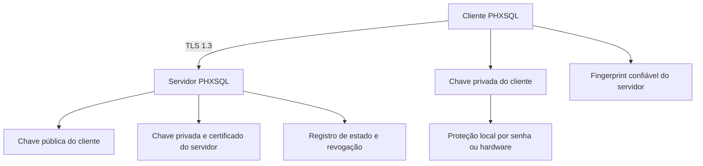
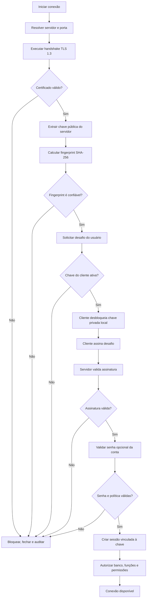
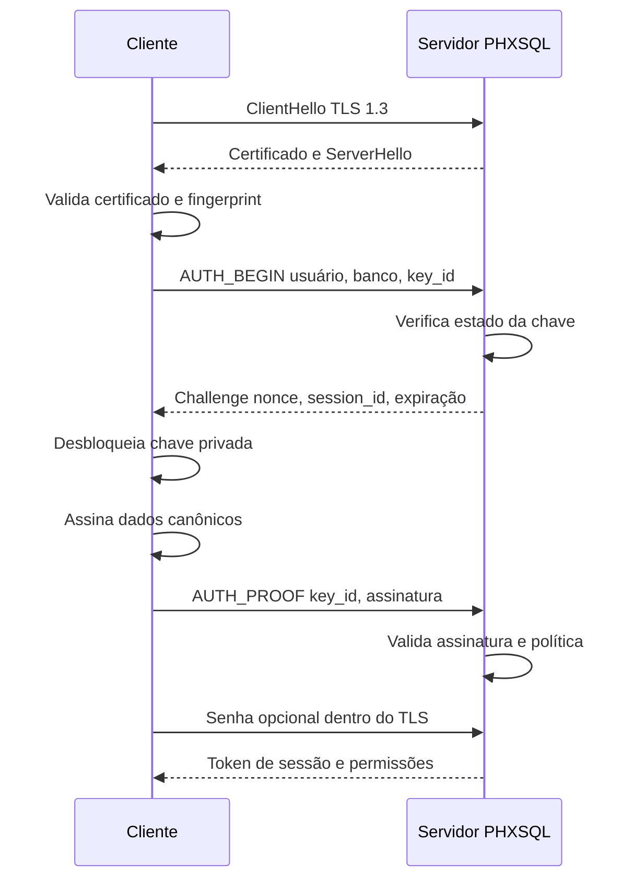

# Manual da Conexão Segura PHXSQL

**Documento:** especificação técnica da conexão segura do PHXSQL  
**Versão:** 1.0  
**Data:** 5 de setembro de 2026  
**Status:** proposta para implementação

---

## 1. Objetivo

Este documento especifica uma técnica de conexão segura para o PHXSQL usando:

- TLS 1.3 para confidencialidade e integridade do tráfego;
- autenticação do servidor por chave pública e fingerprint confiável;
- autenticação do cliente por desafio e assinatura digital;
- chave privada do cliente protegida por senha local;
- senha opcional da conta como fator adicional;
- revogação, suspensão, expiração e rotação de chaves;
- encerramento de sessões associadas a uma chave revogada;
- trilha de auditoria de eventos de segurança.

O objetivo é impedir espionagem, alteração do tráfego, falsificação do servidor, reutilização de autenticação capturada e acesso com credenciais incompletas.

> Regra central: nenhuma chave privada trafega pela rede. A senha da chave privada também não trafega. A senha da conta, quando utilizada, trafega somente dentro do canal TLS 1.3 autenticado.

---

## 2. Conceitos e terminologia

### 2.1 Chave pública não é senha pública

O termo correto é **chave pública**. Ela pode ser distribuída e serve para validar assinaturas ou participar da autenticação criptográfica. Ela não deve ser tratada como senha.

### 2.2 Dois pares de chaves independentes

O PHXSQL deve usar dois pares diferentes:

| Identidade | Chave privada | Chave pública | Finalidade |
|---|---|---|---|
| Servidor PHXSQL | Permanece no servidor | Apresentada ao cliente | O cliente confirma a identidade do servidor |
| Cliente Adriano | Permanece no cliente | Cadastrada no servidor | O servidor confirma a identidade do cliente |

Não reutilizar o mesmo par de chaves para servidor e cliente.

### 2.3 Fingerprint

Fingerprint é o resumo criptográfico da chave pública ou certificado. Exemplo:

```text
SHA256:AF:91:37:42:8B:5E:72:91:0C:...
```

O fingerprint confiável deve chegar ao cliente por uma fonte anterior e segura:

- instalado junto com o aplicativo;
- configuração administrativa assinada;
- política corporativa;
- certificado emitido por autoridade certificadora confiável;
- cadastro manual confirmado por canal independente.

O fingerprint não pode ser baixado pela mesma conexão ainda não autenticada e aceito automaticamente.

### 2.4 Senhas distintas

Podem existir duas senhas com funções diferentes:

| Senha | Onde atua | Trafega pela rede? |
|---|---|---:|
| `AccountPassword` | Autentica a conta do usuário | Sim, somente dentro do TLS |
| `PrivateKeyPassword` | Desbloqueia a chave privada local | Nunca |

No servidor, `AccountPassword` deve ser armazenada somente como hash Argon2id com salt único. A senha da chave privada não deve existir no servidor.

---

## 3. Modelo de segurança

### 3.1 Controles obrigatórios

1. TLS 1.3 obrigatório.
2. Certificado ou chave pública do servidor validada.
3. Pinning opcional do fingerprint do servidor.
4. Assinatura Ed25519 para autenticar o cliente.
5. Desafio aleatório, único, curto e com expiração.
6. Comparações de valores sensíveis em tempo constante.
7. Chave privada criptografada em repouso.
8. Argon2id para derivar/verificar senha de conta e proteger arquivos de chave, quando suportado pelo formato.
9. Nunca registrar senhas, chaves privadas, tokens ou desafios completos em logs.
10. Revogação verificada antes de autorizar a sessão.

### 3.2 Algoritmos recomendados

| Uso | Algoritmo recomendado |
|---|---|
| Transporte | TLS 1.3 |
| Assinatura do cliente | Ed25519 |
| Acordo de chave | X25519, preferencialmente fornecido pelo TLS |
| Hash/fingerprint | SHA-256 ou superior |
| Criptografia do `.pen` | AES-256-GCM ou ChaCha20-Poly1305 |
| Hash de senha | Argon2id |
| Aleatoriedade | CSPRNG do sistema operacional |

Não desenvolver algoritmos criptográficos próprios. Utilizar bibliotecas maduras e auditadas.

---

## 4. Arquitetura de confiança



### 4.1 Âncora de confiança

O elemento mais importante no cliente é:

```wlanguage
Conn.Security.TrustedServerFingerprint
```

Ele permite verificar se a chave apresentada pertence ao servidor esperado. Sem uma âncora confiável, a criptografia pode estar ativa, mas o cliente não sabe com certeza com quem está falando.

---

## 5. Fluxograma completo da conexão



### 5.1 Sequência de mensagens



---

## 6. Exemplo de conexão do cliente

```wlanguage
Conn is PhxSQLConnection

Conn.Server   = "db.wxsolucoes.com.br"
Conn.Port     = 5000
Conn.Database = "db_erp"
Conn.User     = "Adriano"

// Senha opcional da conta. Nunca usar número literal ou texto fixo no fonte.
Conn.Authentication.AccountPassword = Secret(
    EnvironmentVariable("PHXSQL_ACCOUNT_PASSWORD")
)

// Arquivo local. Não trafega pela rede.
Conn.Authentication.ClientPrivateKeyFile = [
    "C:\Phoenix\Keys\adriano-private.pem"
]

// Desbloqueia a chave privada local. Não trafega pela rede.
Conn.Authentication.PrivateKeyPassword = Secret(
    SecureCredential("PHXSQL_PRIVATE_KEY_PASSWORD")
)

Conn.Security.TLS.MinimumVersion = phxTLS13
Conn.Security.TLS.VerifyCertificate = True
Conn.Security.AuthenticationAlgorithm = phxEd25519

// Âncora instalada previamente por meio confiável.
Conn.Security.TrustedServerFingerprints = [
    "SHA256:FINGERPRINT_ATUAL",
    "SHA256:FINGERPRINT_NOVO_DURANTE_ROTACAO"
]

Conn.Timeout.Connection     = 10s
Conn.Timeout.Authentication = 10s
Conn.Timeout.Command        = 30s

IF Conn.OpenSecure() THEN
    Info("Conexão PHXSQL autenticada e criptografada")
ELSE
    Error(Conn.Error.Code, Conn.Error.Message)
END
```

### 6.1 Por que não usar `Conn.Send()` antes do TLS

Este desenho é inseguro:

```wlanguage
PublicKey = Conn.Send()
Conn.PublicKey = PublicKey
Conn.ValidateKey()
```

Um invasor poderia interceptar a chamada e devolver sua própria chave. O cliente estaria apenas validando que recebeu uma chave matematicamente válida, não que recebeu a chave do servidor legítimo.

O correto é obter o certificado durante o handshake TLS e comparar sua chave ou fingerprint com uma referência confiável.

### 6.2 API pública simplificada

Toda a complexidade deve ficar encapsulada:

```wlanguage
IF NOT Conn.OpenSecure() THEN
    Error(Conn.Error.Message)
    RETURN
END
```

Não é recomendável expor:

```wlanguage
Conn.Open(Conn.ValidateKey())
```

Essa forma mistura resultado de validação, estado do transporte e abertura da sessão. `OpenSecure()` deve executar as etapas na ordem correta e falhar de modo fechado.

---

## 7. Procedures necessárias no cliente

### 7.1 `OpenSecure`

```wlanguage
PROCEDURE PhxSQLConnection.OpenSecure() : boolean

ResetError()

IF NOT ValidateConfiguration() THEN
    RESULT False
END

IF NOT OpenTLS13() THEN
    RESULT False
END

IF NOT ValidateServerIdentity() THEN
    CloseTransport()
    RESULT False
END

IF NOT AuthenticateClient() THEN
    CloseTransport()
    RESULT False
END

IF Authentication.AccountPassword.IsDefined THEN
    IF NOT AuthenticateAccountPassword() THEN
        CloseTransport()
        RESULT False
    END
END

IF NOT AcceptSession() THEN
    CloseTransport()
    RESULT False
END

RESULT True
```

### 7.2 `ValidateConfiguration`

```wlanguage
PROCEDURE PhxSQLConnection.ValidateConfiguration() : boolean

IF Server = "" OR Port <= 0 OR Database = "" OR User = "" THEN
    SetError(PHX_INVALID_CONFIGURATION, "Configuração incompleta")
    RESULT False
END

IF Security.TrustedServerFingerprints.Count = 0 THEN
    SetError(PHX_TRUST_ANCHOR_MISSING, "Fingerprint confiável não configurado")
    RESULT False
END

IF NOT FileExist(Authentication.ClientPrivateKeyFile) THEN
    SetError(PHX_PRIVATE_KEY_NOT_FOUND, "Chave privada não encontrada")
    RESULT False
END

RESULT True
```

### 7.3 `OpenTLS13`

```wlanguage
PROCEDURE PhxSQLConnection.OpenTLS13() : boolean

Transport = TLS.Connect(
    Host: Server,
    Port: Port,
    MinimumVersion: TLS13,
    VerifyCertificate: True,
    SNI: Server
)

IF NOT Transport.IsConnected THEN
    SetError(PHX_TLS_FAILED, "Não foi possível estabelecer TLS 1.3")
    RESULT False
END

RESULT True
```

### 7.4 `ValidateServerIdentity`

```wlanguage
PROCEDURE PhxSQLConnection.ValidateServerIdentity() : boolean

ServerPublicKey is Buffer = Transport.PeerCertificate.PublicKeyDER
ReceivedFingerprint is Buffer = Crypto.SHA256(ServerPublicKey)

FOR EACH TrustedFingerprint OF Security.TrustedServerFingerprints
    IF Crypto.ConstantTimeEquals(
        ReceivedFingerprint,
        DecodeFingerprint(TrustedFingerprint)
    ) THEN
        RESULT True
    END
END

SetError(PHX_INVALID_SERVER_KEY, "Identidade do servidor não confirmada")
AuditLocal("SERVER_KEY_REJECTED", Server, ReceivedFingerprint)
RESULT False
```

### 7.5 `AuthenticateClient`

```wlanguage
PROCEDURE PhxSQLConnection.AuthenticateClient() : boolean

BeginResponse is PhxAuthBeginResponse = Protocol.SendAuthBegin(
    User: User,
    Database: Database,
    ClientKeyID: Authentication.ClientKeyID
)

IF NOT BeginResponse.Accepted THEN
    SetError(PHX_AUTH_DENIED, "Autenticação recusada")
    RESULT False
END

IF BeginResponse.ExpiresAt <= UTCNow() THEN
    SetError(PHX_CHALLENGE_EXPIRED, "Desafio expirado")
    RESULT False
END

PrivateKey is SecretKey = Crypto.OpenEncryptedPrivateKey(
    Authentication.ClientPrivateKeyFile,
    Authentication.PrivateKeyPassword
)

IF PrivateKey.IsInvalid THEN
    SetError(PHX_PRIVATE_KEY_LOCKED, "Não foi possível abrir a chave privada")
    RESULT False
END

SignedData is Buffer = EncodeAuthProofCanonical(
    ProtocolVersion: Protocol.Version,
    ServerName: Server,
    ServerFingerprint: Transport.PeerFingerprint,
    User: User,
    Database: Database,
    ClientKeyID: Authentication.ClientKeyID,
    SessionID: BeginResponse.SessionID,
    Nonce: BeginResponse.Nonce,
    IssuedAt: BeginResponse.IssuedAt,
    ExpiresAt: BeginResponse.ExpiresAt
)

Signature is Buffer = Crypto.SignEd25519(SignedData, PrivateKey)
Crypto.Destroy(PrivateKey)

AuthResult is PhxAuthResult = Protocol.SendAuthProof(
    ChallengeID: BeginResponse.ChallengeID,
    ClientKeyID: Authentication.ClientKeyID,
    Signature: Signature
)

Crypto.ZeroMemory(Signature)
Crypto.ZeroMemory(SignedData)

IF NOT AuthResult.Accepted THEN
    SetError(PHX_AUTH_DENIED, "Credencial inválida")
    RESULT False
END

RESULT True
```

### 7.6 `AuthenticateAccountPassword`

```wlanguage
PROCEDURE PhxSQLConnection.AuthenticateAccountPassword() : boolean

// Chamada permitida somente depois de TLS e servidor validados.
IF NOT Transport.IsTLS13 OR NOT ServerIdentityValidated THEN
    SetError(PHX_INSECURE_PASSWORD_FLOW, "Canal seguro não estabelecido")
    RESULT False
END

Response = Protocol.SendAccountPassword(
    Authentication.AccountPassword
)

RESULT Response.Accepted
```

### 7.7 `Close`

```wlanguage
PROCEDURE PhxSQLConnection.Close()

IF SessionToken.IsDefined THEN
    Protocol.SendLogout(SessionToken)
END

Crypto.ZeroMemory(SessionToken)
Authentication.PrivateKeyPassword.Clear()
Authentication.AccountPassword.Clear()
Transport.Close()
```

---

## 8. Configuração necessária no servidor

Exemplo conceitual:

```ini
[server]
host=db.wxsolucoes.com.br
port=5000
tls_minimum_version=1.3
tls_certificate=keys/server.crt
tls_private_key=keys/server-private.pem
tls_private_key_provider=TPM

[authentication]
challenge_ttl_seconds=30
maximum_attempts=5
lockout_seconds=900
require_client_signature=true
require_account_password=true

[user.Adriano]
enabled=true
databases=db_erp
roles=erp_admin
password_hash=argon2id:PARAMETROS:SALT:HASH

[user.Adriano.key.desktop-01]
algorithm=Ed25519
public_key_file=keys/users/adriano-desktop-01-public.pem
fingerprint=SHA256:CLIENT_KEY_FINGERPRINT
status=active
created_at=2026-09-05T00:00:00Z
expires_at=2027-09-05T00:00:00Z
```

Permissões dos arquivos privados do servidor devem ser restritas à conta do serviço PHXSQL. Em produção, preferir TPM, HSM ou provedor PKCS#11.

---

## 9. Procedures necessárias no servidor

### 9.1 `HandleTLSConnection`

```wlanguage
PROCEDURE HandleTLSConnection(Socket)

TLSConnection = TLS.Accept(
    Socket,
    Certificate: ServerConfig.Certificate,
    PrivateKeyProvider: ServerConfig.PrivateKeyProvider,
    MinimumVersion: TLS13
)

IF NOT TLSConnection.IsSecure THEN
    AuditSecurity("TLS_REJECTED", Socket.RemoteIP)
    Socket.Close()
    RETURN
END

HandleProtocol(TLSConnection)
```

### 9.2 `BeginAuthentication`

```wlanguage
PROCEDURE BeginAuthentication(Request, Connection) : PhxAuthBeginResponse

ApplyRateLimit(Connection.RemoteIP, Request.User)

User = Users.Find(Request.User)
Key  = Keys.Find(Request.User, Request.ClientKeyID)

// Resposta externa genérica para impedir enumeração de usuários.
IF User.NotFound OR Key.NotFound THEN
    AuditSecurity("UNKNOWN_CREDENTIAL", Request.User, Connection.RemoteIP)
    RESULT GenericAuthenticationDenied()
END

IF NOT ValidateKeyState(Key) THEN
    AuditSecurity("INACTIVE_KEY_ATTEMPT", Request.User, Key.ID)
    RESULT GenericAuthenticationDenied()
END

IF NOT User.HasDatabaseAccess(Request.Database) THEN
    AuditSecurity("DATABASE_ACCESS_DENIED", Request.User, Request.Database)
    RESULT GenericAuthenticationDenied()
END

Challenge is PhxChallenge
Challenge.ID        = RandomUUID()
Challenge.Nonce     = Crypto.RandomBytes(32)
Challenge.SessionID = RandomUUID()
Challenge.User      = Request.User
Challenge.Database  = Request.Database
Challenge.ClientKeyID = Request.ClientKeyID
Challenge.IssuedAt  = UTCNow()
Challenge.ExpiresAt = UTCNow() + 30s
Challenge.Status    = phxChallengePending

ChallengeStore.Insert(Challenge)
RESULT Challenge.ToPublicResponse()
```

### 9.3 `ValidateKeyState`

```wlanguage
PROCEDURE ValidateKeyState(Key) : boolean

IF Key.Status <> phxKeyActive THEN
    RESULT False
END

IF Key.NotBefore > UTCNow() THEN
    RESULT False
END

IF Key.ExpiresAt <= UTCNow() THEN
    RESULT False
END

IF RevocationCache.Contains(Key.Fingerprint) THEN
    RESULT False
END

RESULT True
```

### 9.4 `VerifyAuthenticationProof`

```wlanguage
PROCEDURE VerifyAuthenticationProof(Request, Connection) : PhxAuthResult

Challenge = ChallengeStore.TakeForUpdate(Request.ChallengeID)

IF Challenge.NotFound THEN
    RESULT GenericAuthenticationDenied()
END

// A mudança para consumed deve ser atômica.
IF Challenge.Status <> phxChallengePending THEN
    AuditSecurity("CHALLENGE_REPLAY", Request.ChallengeID)
    RESULT GenericAuthenticationDenied()
END

Challenge.Status = phxChallengeConsumed
ChallengeStore.Update(Challenge)

IF Challenge.ExpiresAt <= UTCNow() THEN
    AuditSecurity("EXPIRED_CHALLENGE", Challenge.ID)
    RESULT GenericAuthenticationDenied()
END

IF Challenge.ClientKeyID <> Request.ClientKeyID THEN
    RESULT GenericAuthenticationDenied()
END

Key = Keys.Find(Challenge.User, Challenge.ClientKeyID)

IF NOT ValidateKeyState(Key) THEN
    RESULT GenericAuthenticationDenied()
END

SignedData is Buffer = EncodeAuthProofCanonical(
    ProtocolVersion: Connection.ProtocolVersion,
    ServerName: ServerConfig.Host,
    ServerFingerprint: ServerConfig.Fingerprint,
    User: Challenge.User,
    Database: Challenge.Database,
    ClientKeyID: Challenge.ClientKeyID,
    SessionID: Challenge.SessionID,
    Nonce: Challenge.Nonce,
    IssuedAt: Challenge.IssuedAt,
    ExpiresAt: Challenge.ExpiresAt
)

IF NOT Crypto.VerifyEd25519(
    SignedData,
    Request.Signature,
    Key.PublicKey
) THEN
    RegisterAuthenticationFailure(Challenge.User, Connection.RemoteIP)
    RESULT GenericAuthenticationDenied()
END

Connection.PendingIdentity = Challenge.User
Connection.PendingDatabase = Challenge.Database
Connection.AuthenticatedKeyID = Key.ID

RESULT SignatureAccepted()
```

### 9.5 `VerifyAccountPassword`

```wlanguage
PROCEDURE VerifyAccountPassword(Connection, ReceivedSecret) : boolean

IF NOT Connection.IsTLS13 OR Connection.PendingIdentity = "" THEN
    RESULT False
END

User = Users.Find(Connection.PendingIdentity)

IsValid is boolean = Password.VerifyArgon2id(
    ReceivedSecret,
    User.PasswordHash
)

ReceivedSecret.Clear()

IF NOT IsValid THEN
    RegisterAuthenticationFailure(User.Login, Connection.RemoteIP)
    RESULT False
END

RESULT True
```

### 9.6 `CreateAuthorizedSession`

```wlanguage
PROCEDURE CreateAuthorizedSession(Connection) : PhxSession

IF NOT Connection.ClientSignatureValidated THEN
    Error("Assinatura do cliente não validada")
END

IF ServerConfig.RequireAccountPassword AND NOT Connection.PasswordValidated THEN
    Error("Senha da conta não validada")
END

Key = Keys.FindByID(Connection.AuthenticatedKeyID)

IF NOT ValidateKeyState(Key) THEN
    Error("Chave inativa")
END

Session is PhxSession
Session.ID          = RandomUUID()
Session.Token       = Crypto.RandomBytes(32)
Session.User        = Connection.PendingIdentity
Session.Database    = Connection.PendingDatabase
Session.ClientKeyID = Key.ID
Session.CreatedAt   = UTCNow()
Session.ExpiresAt   = UTCNow() + ServerConfig.SessionTTL
Session.Status      = phxSessionActive

SessionStore.Insert(Session)
AuditSecurity("SESSION_CREATED", Session.User, Session.ID, Key.ID)

RESULT Session
```

### 9.7 `AuthorizeCommand`

Toda consulta deve validar sessão e autorização. Autenticação bem-sucedida não significa acesso irrestrito.

```wlanguage
PROCEDURE AuthorizeCommand(SessionToken, RequiredPermission) : boolean

Session = SessionStore.FindByTokenHash(
    Crypto.SHA256(SessionToken)
)

IF Session.NotFound OR Session.Status <> phxSessionActive THEN
    RESULT False
END

IF Session.ExpiresAt <= UTCNow() THEN
    TerminateSession(Session.ID, "expired")
    RESULT False
END

Key = Keys.FindByID(Session.ClientKeyID)

IF NOT ValidateKeyState(Key) THEN
    TerminateSession(Session.ID, "key_inactive")
    RESULT False
END

RESULT Authorization.HasPermission(
    Session.User,
    Session.Database,
    RequiredPermission
)
```

---

## 10. Revogação de chaves

### 10.1 Estados

| Estado | Conecta? | Pode voltar a funcionar? |
|---|---:|---:|
| `pending` | Não | Sim, após aprovação |
| `active` | Sim | Já está ativa |
| `suspended` | Não | Sim |
| `expired` | Não | Somente por renovação controlada |
| `revoked` | Nunca | Não |
| `replaced` | Não | Não; usar a chave substituta |

### 10.2 Procedure de revogação

```wlanguage
PROCEDURE RevokeClientKey(KeyID, Reason, Administrator)

TransactionStart()

Key = Keys.TakeForUpdate(KeyID)

IF Key.NotFound THEN
    TransactionRollback()
    Error("Chave não encontrada")
END

IF Key.Status = phxKeyRevoked THEN
    TransactionCommit()
    RETURN
END

Key.Status      = phxKeyRevoked
Key.RevokedAt   = UTCNow()
Key.RevokedBy   = Administrator
Key.RevokeReason = Reason
Keys.Update(Key)

Sessions.TerminateByKey(Key.ID, "key_revoked")
TransactionCommit()

RevocationCache.Add(Key.Fingerprint)
Cluster.Publish("KEY_REVOKED", Key.ID, Key.Fingerprint)

AuditSecurity(
    "KEY_REVOKED",
    Key.User,
    Key.ID,
    Administrator,
    Reason
)
```

Uma chave revogada deve bloquear novas conexões e encerrar imediatamente as sessões existentes vinculadas a ela.

### 10.3 Revogação em cluster

Em um cluster PHXSQL:

1. persistir a revogação em transação;
2. publicar o evento para todos os nós;
3. invalidar caches locais;
4. encerrar sessões em todos os nós;
5. confirmar propagação;
6. gerar alerta se algum nó não responder.

O banco persistente é a autoridade. O cache serve apenas para acelerar a consulta.

---

## 11. Rotação da chave do servidor

Para evitar interrupção, o cliente pode aceitar temporariamente dois fingerprints:

```wlanguage
Conn.Security.TrustedServerFingerprints = [
    "SHA256:FINGERPRINT_ATUAL",
    "SHA256:FINGERPRINT_NOVO"
]
```

Procedimento:

1. gerar novo par de chaves do servidor;
2. distribuir o novo fingerprint por canal confiável;
3. configurar clientes para aceitar o atual e o novo;
4. ativar a nova chave no servidor;
5. acompanhar conexões ainda presas ao fingerprint antigo;
6. remover o fingerprint antigo dos clientes;
7. revogar a chave antiga;
8. registrar toda a operação em auditoria.

Nunca enviar o novo fingerprint exclusivamente pela conexão cuja identidade está sendo substituída sem assinatura de atualização por uma chave administrativa confiável.

---

## 12. Rotação da chave do cliente

```wlanguage
PROCEDURE RotateClientKey(User, OldKeyID, NewPublicKey)

RequireRecentStrongAuthentication(User)

NewKeyID = RegisterPendingKey(User, NewPublicKey)
Challenge = CreateKeyOwnershipChallenge(User, NewKeyID)

// O cliente deve provar que possui a nova chave privada.
IF NOT VerifyNewKeyOwnership(Challenge) THEN
    RejectPendingKey(NewKeyID)
    RESULT False
END

ActivateKey(NewKeyID)
MarkKeyReplaced(OldKeyID, NewKeyID)
Sessions.TerminateByKey(OldKeyID, "key_replaced")

RESULT True
```

A nova chave não deve ser ativada apenas porque uma chave pública foi enviada. O cliente deve provar posse da chave privada correspondente.

---

## 13. Proteção da chave privada no cliente

Ordem de preferência:

1. TPM, Secure Enclave, Android Keystore ou HSM/token;
2. cofre criptográfico do sistema operacional;
3. arquivo PEM criptografado com senha forte;
4. arquivo comum apenas em ambiente de desenvolvimento isolado.

Requisitos:

- permissões mínimas de arquivo;
- impedir exportação quando o hardware permitir;
- apagar buffers sensíveis da memória após o uso;
- nunca copiar a chave para logs, clipboard ou mensagens de erro;
- não embutir a senha no executável;
- bloquear ou aumentar o atraso após tentativas inválidas;
- manter backup seguro e controlado somente quando a política permitir.

---

## 14. Proteção do arquivo `.pen`

A autenticação da conexão não cifra automaticamente o banco armazenado em disco. O arquivo `.pen` precisa de proteção própria.

```wlanguage
Database.File = "C:\Phoenix\Data\db_erp.pen"
Database.Encryption.Algorithm = phxAES256GCM
Database.Encryption.MasterKeyProvider = phxOSKeyStore
Database.Encryption.PageAuthentication = True
Database.Open()
```

Recomendado:

- chave mestra externa ao `.pen`;
- chave de dados exclusiva por banco;
- criptografia autenticada por página ou bloco;
- nonce nunca reutilizado com a mesma chave;
- cabeçalho autenticado;
- rotação por envelope encryption;
- WAL e backups também criptografados;
- checksums para detectar corrupção não maliciosa;
- recuperação testada após falha de energia.

---

## 15. Formato das mensagens de autenticação

Exemplo conceitual:

```text
AUTH_BEGIN
  protocol_version
  user
  database
  client_key_id

AUTH_CHALLENGE
  challenge_id
  nonce
  session_id
  issued_at
  expires_at
  server_fingerprint

AUTH_PROOF
  challenge_id
  client_key_id
  signature

AUTH_RESULT
  accepted
  session_token
  session_expires_at
  permissions_version
```

Os dados assinados devem usar codificação canônica, com campos, tipos, tamanhos e ordem definidos. Não concatenar textos ambíguos.

Exemplo seguro:

```text
PHXSQL-AUTH-V1 ||
length(server_name) || server_name ||
length(user) || user ||
length(database) || database ||
client_key_id || session_id || nonce || issued_at || expires_at
```

---

## 16. Proteções contra ataques

| Ataque | Proteção exigida |
|---|---|
| Interceptação do tráfego | TLS 1.3 |
| Servidor falso | Certificado validado e fingerprint confiável |
| Repetição de assinatura | Nonce único, expiração e consumo atômico |
| Roubo somente da senha | Exigir posse da chave privada |
| Roubo somente do arquivo da chave | Chave criptografada e senha separada |
| Enumeração de usuários | Respostas externas genéricas e tempo semelhante |
| Força bruta | Rate limit, atraso progressivo, bloqueio e auditoria |
| Chave roubada | Revogação e encerramento de sessões |
| Downgrade | TLS 1.3 mínimo e versão do protocolo assinada |
| Troca de banco/usuário | Assinar servidor, usuário e banco no desafio |
| Vazamento de memória | buffers secretos, zeroização e vida curta |
| SQL Injection após login | queries parametrizadas e autorização por operação |

---

## 17. Política de erros

Externamente, evitar revelar se o usuário, senha ou chave existe:

```text
PHX_AUTH_DENIED: credencial inválida
```

Internamente, a auditoria pode registrar códigos específicos sem incluir segredos:

```text
UNKNOWN_USER
UNKNOWN_KEY
KEY_REVOKED
KEY_EXPIRED
SIGNATURE_INVALID
PASSWORD_INVALID
CHALLENGE_EXPIRED
CHALLENGE_REPLAY
SERVER_FINGERPRINT_MISMATCH
RATE_LIMITED
```

---

## 18. Auditoria

Registrar:

- data e hora UTC;
- identificador do evento;
- usuário declarado;
- identificador e fingerprint abreviado da chave;
- IP e identificação do cliente;
- nó do cluster;
- resultado;
- motivo interno;
- identificador de correlação;
- administrador responsável por revogação ou rotação.

Nunca registrar:

- senha;
- chave privada;
- token de sessão completo;
- conteúdo integral do desafio;
- assinatura quando isso não for necessário;
- dados SQL sensíveis.

Logs de segurança devem ser protegidos contra alteração e enviados para armazenamento central quando possível.

---

## 19. Sessões

Cada sessão deve ficar vinculada a:

- usuário;
- banco autorizado;
- chave que realizou a autenticação;
- versão da política de permissões;
- horário de criação e expiração;
- dispositivo ou identificação do cliente;
- canal TLS atual.

Não usar token de sessão fora do TLS. Armazenar no servidor apenas o hash do token quando tecnicamente viável. Renovação de sessão deve verificar novamente o estado da chave.

Eventos que encerram a sessão:

- chave revogada, suspensa, expirada ou substituída;
- usuário desativado;
- permissão removida;
- senha alterada, conforme política;
- timeout;
- encerramento administrativo;
- anomalia de segurança.

---

## 20. Checklist de implementação

### Cliente

- [ ] TLS 1.3 obrigatório.
- [ ] Validação de hostname e certificado.
- [ ] Fingerprint confiável previamente instalado.
- [ ] Comparação em tempo constante.
- [ ] Chave privada nunca enviada.
- [ ] Senha da chave obtida de fonte segura.
- [ ] Desafio assinado de forma canônica.
- [ ] Buffers secretos apagados após uso.
- [ ] Sem fallback silencioso para modo inseguro.
- [ ] Mensagem clara quando a chave do servidor mudar.

### Servidor

- [ ] Chave privada protegida por TPM/HSM ou permissões restritas.
- [ ] Chave pública individual por cliente/dispositivo.
- [ ] Desafio com CSPRNG e pelo menos 256 bits.
- [ ] Expiração curta do desafio.
- [ ] Consumo atômico e único do desafio.
- [ ] Estado da chave verificado antes e depois da assinatura.
- [ ] Senha armazenada com Argon2id.
- [ ] Rate limit por IP, usuário e chave.
- [ ] Revogação encerra sessões abertas.
- [ ] Auditoria sem dados secretos.
- [ ] Permissões verificadas em cada operação.

### Operação

- [ ] Processo documentado para emissão de chaves.
- [ ] Canal confiável para distribuir fingerprints.
- [ ] Rotação testada sem indisponibilidade.
- [ ] Revogação propagada para todo o cluster.
- [ ] Backup protegido das chaves autorizadas.
- [ ] Plano para perda, roubo e comprometimento.
- [ ] Testes periódicos de restauração e recuperação.

---

## 21. Testes mínimos

1. Conexão normal com chave e senha válidas.
2. Servidor apresenta certificado inválido.
3. Servidor apresenta fingerprint diferente.
4. Chave do cliente desconhecida.
5. Chave suspensa.
6. Chave expirada.
7. Chave revogada.
8. Senha da chave privada incorreta.
9. Senha da conta incorreta.
10. Assinatura alterada.
11. Reutilização do mesmo desafio.
12. Desafio expirado.
13. Alteração do usuário, banco ou servidor após assinatura.
14. Cinco tentativas consecutivas inválidas.
15. Revogação durante uma sessão ativa.
16. Rotação da chave do servidor com dois fingerprints.
17. Reinício do servidor durante autenticação.
18. Queda de rede após criação da sessão.
19. Dois nós tentando consumir o mesmo desafio.
20. Verificação de ausência de segredos nos logs.

---

## 22. Nível de segurança esperado

Quando todos os controles obrigatórios forem implementados corretamente, a arquitetura oferece nível de segurança alto para conexão de banco de dados.

Avaliação prática:

| Implementação | Avaliação indicativa |
|---|---:|
| Chaves e senha sem TLS/fingerprint confiável | Baixa a média |
| TLS 1.3 e certificado, sem autenticação forte do cliente | Média a alta |
| TLS 1.3, fingerprint, desafio e chave privada criptografada | Alta |
| Tudo acima com TPM/HSM, revogação imediata e auditoria | Muito alta |

Essa avaliação não substitui modelagem formal de ameaças, revisão criptográfica, teste de invasão e auditoria independente.

---

## 23. Decisão arquitetural recomendada

A conexão PHXSQL deve expor uma API simples:

```wlanguage
IF Conn.OpenSecure() THEN
    Info("Conexão autenticada")
ELSE
    Error(Conn.Error.Code, Conn.Error.Message)
END
```

Internamente, o PHXSQL deve obrigatoriamente:

1. criar TLS 1.3;
2. validar certificado e fingerprint do servidor;
3. confirmar que a chave do cliente está ativa;
4. emitir desafio único;
5. validar assinatura Ed25519;
6. validar senha opcional dentro do TLS;
7. criar sessão vinculada à chave;
8. verificar autorização a cada operação;
9. bloquear e encerrar sessões de chaves revogadas;
10. auditar todos os eventos relevantes.

Esse desenho mantém a facilidade de uso desejada no terminal sem transferir para o desenvolvedor da aplicação a responsabilidade de executar manualmente etapas criptográficas sensíveis.

---

## 24. Referências técnicas

- IETF RFC 8446 — The Transport Layer Security Protocol Version 1.3: https://www.rfc-editor.org/rfc/rfc8446
- IETF RFC 9325 — Recommendations for Secure Use of TLS and DTLS: https://www.rfc-editor.org/rfc/rfc9325
- RFC 8032 — Edwards-Curve Digital Signature Algorithm EdDSA: https://www.rfc-editor.org/rfc/rfc8032
- RFC 9106 — Argon2 Memory-Hard Function for Password Hashing: https://www.rfc-editor.org/rfc/rfc9106
- NIST SP 800-57 — Recommendation for Key Management: https://csrc.nist.gov/publications/detail/sp/800-57-part-1/rev-5/final
- OWASP Transport Layer Security Cheat Sheet: https://cheatsheetseries.owasp.org/cheatsheets/Transport_Layer_Security_Cheat_Sheet.html
- OWASP Password Storage Cheat Sheet: https://cheatsheetseries.owasp.org/cheatsheets/Password_Storage_Cheat_Sheet.html

---

## 25. Resumo final

A técnica é segura quando a chave pública apresentada pelo servidor é comparada com um fingerprint confiável já conhecido pelo cliente. A chave privada do cliente permanece local e é desbloqueada por uma senha que nunca trafega. O servidor guarda a chave pública do cliente e valida uma assinatura sobre um desafio descartável.

Uma chave revogada jamais pode autenticar uma nova conexão. Se houver uma sessão aberta vinculada a ela, a sessão deve ser encerrada imediatamente. TLS 1.3 continua obrigatório porque autenticação assimétrica isolada não fornece toda a confidencialidade e integridade necessárias ao tráfego SQL.
