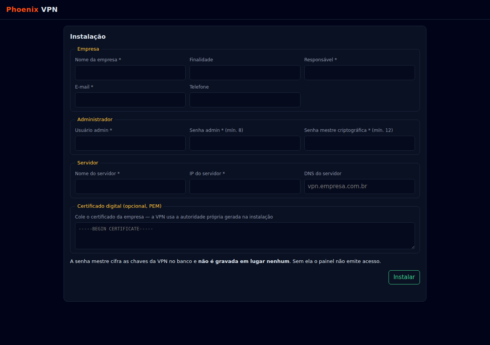
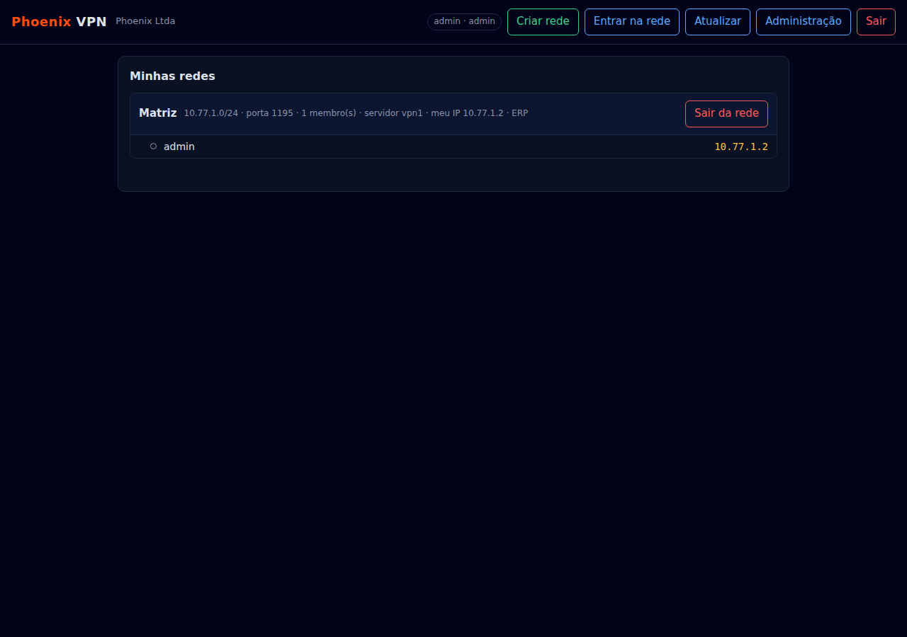

# phxvpn — desenho, provas e o que falta

Rodada de 23/09/2026. Código em `phxvpn/src/`, testes em `src/*` e
`tests/postgres_real.rs`.

## Estado

Contagem das caixas abaixo (`grep -c '^- \[x\]'` / `'^- \[ \]'`).

### Feito

- [x] Cliente PostgreSQL de fio v3 com SCRAM-SHA-256 e protocolo estendido (parâmetro nunca vira SQL)
- [x] Esquema `phx_*` com toda FK `ON DELETE RESTRICT` (não se apaga rede com membro — provado contra o PostgreSQL 16)
- [x] AC Ed25519 própria; certificado de servidor (`serverAuth`) e de membro (`clientAuth`)
- [x] Cofre da senha mestre: chaves da AC, dos servidores e `tls-crypt` seladas no banco; a senha mestre não é gravada
- [x] Instalação com os 12 campos (empresa, finalidade, responsável, e-mail, telefone, admin, senha admin, senha mestre, servidor nome/IP/DNS, certificado)
- [x] Criar rede (sub-rede /24 e porta próprias) e entrar na rede (IP fixo, perfil `.ovpn` com tudo embutido)
- [x] Tela web (instalar, login, redes com membros e IP, administração de usuários e servidores)
- [x] Linha de comando `phxvpn entrar` / `criar-rede`, senha só por ambiente ou terminal
- [x] Supervisor opcional que sobe um `openvpn` por rede (`--openvpn`)
- [x] P2P: aperto `Noise_IKpsk2_25519_ChaChaPoly_SHA256` conferido byte a byte contra o vetor oficial (cacophony), no MESMO motor Noise do PhxSql
- [x] Segurança C1: JSON com teto de aninhamento (128) — o corpo de 262.000 `[` não derruba mais o processo
- [x] P2P: transporte UDP (contador explícito, janela de 2.048 contra repetição, refazer aos 120 s, morrer aos 180 s / 2^60, par surdo refaz aos 15 s)
- [x] P2P: placa virtual TUN no Linux por FFI ao `ioctl` — sem `iproute2`
- [x] P2P: `phxvpn p2p chave` e `phxvpn p2p ligar` — **ping entre dois computadores pelo túnel, provado**
- [x] P2P: servidor intermediário (`phxvpn repasse`) e modos `direto` / `repasse` / `auto` — provado numa topologia de CGNAT
- [x] P2P: `p2p criar` / `p2p convidar` / `p2p entrar` — convite cifrado com a senha da rede, ficha de uso único, malha que se aprende pela lista de pares dentro do túnel
- [x] P2P no Windows: placa TAP-Windows6 em modo TUN só com APIs do sistema; `p2p placa` cria o adaptador pelo `tapctl.exe` do OpenVPN
- [x] Programa de mesa (`phxvpn mesa`, `phxvpnw.exe` sem console): janela no estilo Radmin — criar, entrar por convite, convidar, ligar/desligar, membros com estado
- [x] Programa de mesa: ping e chat por membro (dentro do túnel) e «lembrar a senha» (DPAPI no Windows)
- [x] Programa de mesa: ícone na bandeja (Windows, `phxvpnw.exe --bandeja`) e «abrir com o sistema» (registro `Run` no Windows, autostart XDG no Linux)
- [x] Servidor intermediário com contas de usuário e senha (`phxvpn repasse conta`, `--contas`)
- [x] Console `phxvpncmd` (ou `phxvpn cmd`), estilo prompt do MS-DOS: modos Painel, P2P e Ferramentas; lote por arquivo (`/entrada:`) e linha única (`/comando:`)
- [x] Segurança A1: revogação real — série no CN, reentrada revoga o perfil anterior, CRL Ed25519 no `crl-verify`, admin/dono remove membro
- [x] Segurança A2/A3: tentativas limitadas (login, IP, usuário+rede); PBKDF2 fora da trava com semáforo; hash fictício contra enumeração
- [x] Segurança A4 (mínimo): painel só escuta fora do loopback com `--aceito-sem-tls`; CLI/console recusam painel remoto sem `PHXVPN_ACEITO_SEM_TLS=1`
- [x] Segurança A5: `Host` conferido (DNS rebinding), POST só com JSON (CSRF), código de instalação de uso único
- [x] Segurança A6: cliente PG recusa senha em claro, exige o SCRAM provado antes do «autenticado», teto de iterações
- [x] Segurança M1, M2, M4, M5, M6, M7: teto de conexões e prazo total por pedido; segredo nasce 0600 e diretório 0700; senhas saem do ambiente; login só `[a-z0-9._-]`; cota de 3 redes por usuário; conexão do PG refeita e trava envenenada não derruba
- [x] USB pela rede (USB/IP, porta 3240): compartilhar e usar no Linux só com `std` + sysfs; usar no Windows pelo usbip-win2; interopera com o `usbip` de referência
- [x] **Túnel OpenVPN de verdade provado** (2.6.19, `prova-openvpn.sh`): PostgreSQL → painel → dois membros em netns, TLS 1.3/Ed25519, ping entre membros, removido barrado
- [x] Segurança M3: OpenVPN troca para o usuário próprio `phxvpn-ovpn` (antes `nobody`) depois de abrir a placa; `tls-crypt-v2` com uma chave por membro e a série dentro — removido barrado ANTES do TLS
- [x] Arquivos que o OpenVPN relê (`crl.pem`, `ccd/`) gravados por troca atômica — nunca lidos pela metade
- [x] P2P: `mac1`/cookie contra inundação de INICIO — lixo recusado em 1,85 µs em vez de 198 µs (107×); sob carga, só com cookie e 5/s por origem
- [x] USB na janela do programa de mesa: compartilhar, ver o dos membros, usar e soltar — exercitado com duas janelas e o túnel P2P de verdade
- [x] Segurança no Windows: arquivos com chave e pastas de dados só do dono (DACL protegida, uma entrada, posta ANTES do segredo) — provado no essencial sob o Wine; a prova estrita está no `prova-windows.ps1` (passo 3b)
- [x] Serviço do sistema no Linux (`phxvpn servico instalar painel|repasse|p2p`), segredos como credencial CIFRADA do systemd, nunca texto puro
- [x] Pacotes por roteiro (`empacotar.sh`): `.deb`, `.msi` e `.zip` — instalados e removidos de verdade (`dpkg`, `msiexec` do Wine)
- [x] Serviço do Windows (SCM por FFI, reinício em 5 s, registro em arquivo), segredos em DPAPI da máquina num arquivo só de SYSTEM e Administradores
- [x] Interface responsiva (CSS grid + flexbox + container queries) na janela e no painel — rolagem lateral zero medida em 390, 820, 1280, 1920 e 3440 px
- [x] Segurança C2: sorteio falha fechado (descritor único; `BCryptGenRandom` no Windows) — nunca mais mistura previsível
- [x] Auto-atualização: `phxvpn atualizar [--manifesto URL] [--verificar]` — manifesto JSON assinado Ed25519 (chave publica embutida, `CHAVE_PUBLICA_PADRAO`), SHA-256 do binário conferido, downgrade recusado, troca atômica (Linux: `rename` no mesmo binário em uso; Windows: renomeia o `.exe` em uso para `.old` e escreve o novo, limpo no próximo arranque). `phxvpn atualizar-assinar` e `atualizar-gerar-chave` para quem publica; `publicar-atualizacao.sh` monta os binários pelo `cargo build --release` (mesmo caminho do `empacotar.sh`) e assina. Checagem periódica opcional (`PHXVPN_ATUALIZAR_MANIFESTO` no ambiente) no `painel` e na `mesa` — só avisa, nunca aplica sozinha
- [x] Serviço "cliente" (`phxvpn servico instalar cliente --perfil rede.ovpn`): o modo cliente do OpenVPN (entrar na rede de OUTRO servidor) agora sobe com a máquina, antes do login — o gap de "connect before logon" do OpenVPN Connect. Reaproveita a MESMA função que `phxvpn entrar --conectar` já usava (`rodar_openvpn_cliente`), não uma segunda cópia
- [x] MFA (TOTP, RFC 6238) no login do painel e na conexão OpenVPN: usuário + senha + código por `auth-user-pass-verify` (adiado) e `static-challenge`, exigido por rede — **provado com o `openvpn` 2.6.19** (`provas/mfa/`)
- [x] P2P: rol de membros ASSINADO (Ed25519 do dono, versão monotônica, anti-rollback) — `p2p remover` derruba o túnel do removido com todos, provado em três `netns`; rede criada antes continua com a confiança transitiva
- [x] P2P: descoberta na LAN — anúncio broadcast cifrado com chave da PSK, sem nome de rede nem chave em claro; dois membros sem endereço nem repasse se acham em 459 ms (release, `netns`)
- [x] P2P: perfuração de NAT mediada pelo repasse (modo `auto`) — com dois NATs, o ping migra ao caminho direto em ~2 s e o repasse carrega **0** datagrama de dados; NAT simétrico ou sondas bloqueadas seguem pelo repasse
- [x] P2P: fio TCP até o repasse (`--tcp`, quadro de 2 bytes como o OpenVPN) e por proxy HTTP `CONNECT` (`--proxy`); o `auto` cai de UDP para TCP sem confirmação em 10 s — provado com UDP bloqueado por iptables e com só o proxy alcançando o repasse
- [x] P2P: o `auto` **volta** do TCP ao UDP quando o UDP volta (sonda autenticada, 3 ecos seguidos, recuo 30 s → 5 min, recuo dobrado se cair logo depois de voltar) — provado em netns com ping contínuo pela troca
- [x] Modo servidor OpenVPN em TCP: rede com `proto tcp-server` (porta 443 escolhida pelo administrador) e perfil com `proto tcp-client` e `http-proxy` opcional — provado com o `openvpn` 2.6.19 real, UDP bloqueado e só o proxy alcançando o servidor
- [x] Três recursos que só existiam por CLI/API foram para a tela (24/09/2026): programa de mesa com **Remover membro** (só o DONO vê o botão), campo de **proxy HTTP** ao ligar rede P2P, e painel web com escolha de **protocolo UDP/TCP** ao criar rede e **proxy HTTP** ao baixar o perfil — ver a seção dedicada abaixo
- [x] P2P: **farol** — um membro alcançável, marcado no rol assinado pelo dono e com o consentimento dele, faz o papel do repasse (registro, apresentação 10/11, relé cifrado) sem nenhum `phxvpn repasse`; provado em `netns` com NAT simétrico (20/20 pelo relé, 0 byte em claro no `tcpdump` do farol, membro fora do rol 0/5, sem o farol 0/20) e com dois faróis (o que carrega cai; volta pelo outro em 15,2 s) — ver «P2P: farol»
- [x] Seis recursos foram para a tela (24/09/2026, o gancho de «um motor só»): painel web com **trocar a própria senha** (`/api/senha`, exige a senha atual e o código do autenticador de quem tem), **desativar/reativar usuário** (`/api/usuarios/ativo`, botão vermelho/verde) e **remover membro de rede** (`/api/redes/remover`); programa de mesa com **marcar/desmarcar farol** (`/api/farol`, mesmo motor de `phxvpn p2p farol` — o dono autoriza no rol com endereço, o próprio membro só consente localmente) e **selo discreto de farol** na linha do membro (o campo já existia em `situacao()`); e a **marca nova** — `/logo-128.png`/`/logo-32.png`, PNGs reduzidos (26 KiB e 2,3 KiB) do `marca/png/fenix-vpn-2000.png` de 4,4 MB, nunca o original embutido, servidos por rota própria no painel e na mesa (`web.rs`), com o SVG mantido para os outros usos. Nenhuma confirmação de exclusão usa `confirm()` do navegador — todas são diálogo dentro da página. Provado exercitando (Chromium, painel com PostgreSQL real; mesa com uma rede semeada pelo `cargo run --example semear_farol`, o mesmo atalho do teste de `mesa.rs`), capturas em `docs/previa/27` a `30` (390 e 1280 px, 0 erro de console)
- [x] P2P: **difusão** — broadcast (`x.x.x.255`, `255.255.255.255`) e multicast (`224/4`) da placa vão cifrados a todos os pares com sessão, com teto por nó de origem (200 pacotes/s, 256 KiB/s, MTU) na saída E na entrada; só replica o que tem origem no próprio IP (sem laço); desliga por rede (`--sem-difusao`). Provado em três `netns`: 20/20 de cada destino nos dois receptores, SSDP acha os dois, desligada 0, rajada de 1000 → 200 — ver «P2P: difusão»
- [x] Modo servidor: **redes alcançáveis** — LAN da empresa atrás do servidor (`push "route"`, NAT ou rota de volta, tabela `ip phxvpn` própria com guarda do isolamento — a guarda fica sempre que há rede, com ou sem rota) e filial atrás de um membro (`iroute`); só o admin inclui — provado com o `openvpn` 2.6.19 em netns, nft e iptables (`provas/rotas/`) — ver «Modo servidor: redes alcançáveis»
- [x] Modo servidor: **túnel total** com o pacote inteiro (`redirect-gateway def1 ipv6` [+ `block-local`], `ifconfig-ipv6` fictício + `block-ipv6`, `block-outside-dns` empurrado, DNS pela VPN obrigatório, NAT de saída só para a internet) e **DNS da rede** (DNS da empresa empurrado, ou resolvedor embutido com `membro.rede.phx` e repasse) — provado com o `openvpn` 2.6.19 em netns, nft e iptables (`provas/tunel-total/`) — ver «Modo servidor: túnel total e DNS da rede»
- [x] Modo servidor: **alcance** — endereços alternativos (`remote` a mais, `remote-random` opcional, espera de 10 s por endereço), **queda UDP→TCP** numa rede UDP (blocos `<connection>` no perfil, ponte TCP→UDP no supervisor — mesmo IP fixo, sem segundo `openvpn`), **`port-share`** da porta TCP com um HTTPS (na ponte e na rede TCP), e proxy do membro **HTTP ou SOCKS com usuário e senha** (arquivo 0600 ou perguntado ao conectar, nunca no perfil) — provado com o `openvpn` 2.6.19 em netns (`provas/servidor-alcance/`) — ver «Modo servidor: alcance»

### Falta

- [ ] Programa de mesa: ver o ícone da bandeja num Windows real (no Wine ele é registrado, mas não aparece na área de trabalho virtual) e bandeja no Linux (pede D-Bus)
- [ ] Usar o certificado digital da empresa (A1/RSA) como AC — hoje ele é guardado só como identificação
- [ ] P2P farol: fio TCP/proxy até o farol (hoje só UDP — o farol não abre porta TCP), endereço por nome (hoje IP literal, porque vai assinado), `--farol` no console (hoje `phxvpncmd` não tem o comando; a janela de mesa marca/tira desde 24/09/2026, ver acima), e troca de farol mais rápida que os 15 s do par surdo
- [ ] P2P: delegar o rol a administradores (hoje só quem criou a rede inclui e remove; com ele fora do ar, ninguém entra nem sai — ver «Rol assinado»)
- [ ] P2P: perfuração atrás de NAT Linux **sem** filtro na wan (a primeira sonda aceita vira dona da porta; ver a seção da perfuração) e de NAT simétrico — hoje ficam no repasse
- [ ] Segurança A4 (inteiro): TLS no próprio painel — choque com a pétrea de zero dependência; hoje, proxy com TLS na frente
- [ ] P2P difusão: nó **Windows não ORIGINA** broadcast/multicast — o TAP-Windows6 em modo TUN não entrega esses quadros ao programa (`txpath.c`); originar pede o TAP em modo Ethernet. Receber deve funcionar, **não provado** numa máquina real. E multicast IPv6 fica classificado mas não replica enquanto o túnel P2P não leva IPv6
- [ ] P2P no Windows: **prova numa máquina real** com OpenVPN (driver TAP e `netsh` — o roteiro `prova-windows.ps1` está pronto)
- [ ] USB: **prova com dispositivo real** (este contêiner não tem USB nem os módulos `usbip-host`/`vhci-hcd`)
- [ ] macOS, Android e iOS (OpenVPN e WireGuard têm; achado da validação de 24/09)
- [ ] Auditoria de segurança externa (OpenVPN teve em 2017, o WireGuard tem verificação formal; aqui só revisão interna)
- [ ] RADIUS / Active Directory no painel — **decisão de produto do dono** (Access Server, Windows e strongSwan têm; o MFA por TOTP já entrou)
- [ ] MFA: serviço «cliente» antes do logon com rede que exige código (hoje recusado na instalação — não há quem digite); verificador no Windows (o soquete local é só Unix; lá o verificador recusa tudo); recuperar o `mfa.chave` perdido
- [ ] Windows ARM64: **medido, falta só o linker.** `rustup target add aarch64-pc-windows-gnullvm` baixa o `rust-std` e `cargo check --target aarch64-pc-windows-gnullvm` passa limpo (o código não tem nada arquitetura-específico) — mas `cargo build` para o mesmo alvo para em `error: linker aarch64-w64-mingw32-clang not found`. O Ubuntu deste contêiner empacota `gcc-mingw-w64-*` só para `x86_64` e `i686` (`apt-cache search mingw`, zero resultado para `aarch64`); a cadeia que falta é o `llvm-mingw` (clang + `aarch64-w64-mingw32` runtime), que não vem por `apt` — só baixando um toolchain de fora, o que esta rodada não fez por ser rede+binário de terceiro fora do gerenciador de pacotes do sistema, não uma crate Rust. `aarch64-pc-windows-msvc` nem chega a esse ponto: pede o Windows SDK/MSVC, que não existe aqui de jeito nenhum sem instalador da Microsoft. Não entrou no `empacotar.sh` por não linkar
- [ ] P2P no Windows / serviço "cliente": prova numa máquina Windows REAL continua faltando (mesmo limite já registrado para o P2P — o Wine não tem o driver TAP); o serviço "cliente" foi só testado no Linux (`cargo test`) e no `--mostrar` (unidade gerada, sem instalar de fato)

#### Lacunas contra o fonte do OpenVPN 2.6.19 (as 23 «falta e vale»)

Da matriz em `docs/propostas/lacunas-openvpn-fonte-2026-09-24.md` (classe
**c**), na ordem dela. Marcado só o que tem prova real e portões verdes.

- [x] Broadcast IPv4 entre membros — P2P (ver «P2P: difusão»)
- [x] Multicast entre membros — P2P (ver «P2P: difusão»)
- [ ] Broadcast IPv4 entre membros — modo servidor (pede `dev tap` + `server-bridge`; o DCO não faz TAP)
- [x] LAN da empresa atrás do servidor (ver «Modo servidor: redes alcançáveis»)
- [x] LAN atrás de um membro / site-to-site (`iroute`; ver «Modo servidor: redes alcançáveis»)
- [ ] Idem no P2P (faixa por par, tipo `AllowedIPs`)
- [x] Túnel total (`redirect-gateway def1`) — com o pacote inteiro: `block-outside-dns`, `block-ipv6`, `block-local` e NAT (ver «Modo servidor: túnel total e DNS da rede»; `block-ipv6` e `block-outside-dns` **gerados, não provados em tráfego** — kernel sem IPv6 aqui, e o segundo é só Windows)
- [x] DNS empurrado + nomes dos membros (resolvedor embutido `membro.rede.phx`, só no modo servidor; o P2P não tem)
- [ ] IPv6 dentro do túnel (`server-ipv6`; o P2P é só IPv4 por dentro)
- [ ] **Transporte IPv6 por fora — P2P e repasse:** o código entrou (soquete IPv6 ao lado do IPv4, `src/soquete.rs`), com os testes da escolha do soquete e do endereço mapeado; **falta a prova em rede IPv6** — o kernel deste contêiner arranca com `ipv6.disable=1` e `socket(AF_INET6)` dá `EAFNOSUPPORT` até dentro de netns. Os dois testes de ida e volta por `::1` estão `#[ignore]` com o motivo; rodam com `cargo test -- --ignored` numa máquina com IPv6
- [x] MTU do P2P pelo repasse/farol: medido (fragmento descartado → TCP 0,0 Mbit/s pelo relé); placa em 1.384 → 641,7 Mbit/s e 0 fragmento (ver «Operação»)
- [x] `explicit-exit-notify 1` no perfil do membro (só UDP) — o membro some da lista em **10,4 s** (antes **131,1 s**), ver «Ciclo do OpenVPN e IPv6 por fora»
- [x] Reinício do servidor com aviso: SIGTERM + prazo + `explicit-exit-notify 1` no servidor (só UDP; **Linux** — no Windows segue o `TerminateProcess`, ver a seção)
- [x] `remote` múltiplos / failover de servidor — principal morto → alternativo em **9,5 / 10,1 / 9,5 s** (ver «Modo servidor: alcance»)
- [x] Queda UDP→TCP no modo servidor — ponte TCP→UDP no supervisor em vez de dois processos (a 2.7 tem multi-soquete); UDP bloqueado → TCP em **10,3 / 10,1 / 9,7 s**, mesmo IP fixo
- [x] `port-share` (TCP dividindo porta com HTTPS) — na ponte da queda e na rede TCP (esta, só fora do Windows)
- [x] Log do OpenVPN com teto: o supervisor lê a saída por pipe e gira `openvpn.log` a 10 MB, guardando 3
- [ ] `tls-groups` híbrido pós-quântico (depende do OpenSSL 3.5 nos dois lados)
- [x] `mlock` (chave fora do swap): `mlockall` com `MCL_ONFAULT` no painel, no nó e no repasse, e `mlock` no OpenVPN só quando ele consegue subir o limite (ver «Operação»). Windows: registrado, sem `VirtualLock`
- [x] `http-proxy` com usuário e senha / `socks-proxy` — credencial em arquivo 0600 (linha de comando) ou perguntada ao conectar; SOCKS só em TCP (UDP pelo SOCKS não provado)
- [ ] Certificado em cartão/repositório do Windows (`pkcs11-*`, `cryptoapicert`)
- [ ] `multihome`
- [ ] 2.7: `PUSH_UPDATE` (mudar rota/DNS sem reconectar)

## Portas e o controle de cada uma

| Porta | Quem abre | Controle |
|---|---|---|
| TCP 8470 | `phxvpn painel` | usuário + senha (PBKDF2), tentativas limitadas, `Host`/JSON/código de instalação |
| TCP 127.0.0.1:sorteada | `phxvpn mesa` | só a própria máquina + ficha da sessão (32 bytes por abertura) |
| UDP 51820 | nó P2P | chave do membro (Noise IK) + senha da rede (PSK) + ficha de convite para entrar |
| UDP 51821 | `phxvpn repasse` | **usuário + senha** com `--contas` (sem, fica aberto e avisa) |
| TCP 443 (só com `--tcp 443`) | `phxvpn repasse` | o MESMO controle do UDP (mesmo `tratar_de`); conexão anônima: 145 bytes, 5 s, no máximo 64; total 1.024 |
| UDP 1195+ | OpenVPN (modo servidor) | certificado da AC + CRL + `ccd-exclusive` + `tls-crypt`; rede com MFA: + usuário, senha e código |
| TCP 443 (rede criada com `protocolo: tcp`) | OpenVPN (modo servidor) | o mesmo; `tls-crypt-v2` barra antes do TLS também em TCP |
| soquete `dados/verificar.sock` | `phxvpn painel` (Unix) | arquivo 0660 do grupo `phxvpn-ovpn` + `SO_PEERCRED` (root, o painel, `phxvpn-ovpn`); 32 perguntas de uma vez, 2 s para o pedido chegar; tentativa reservada antes do PBKDF2 |
| soquete `dados/gerencia/<rede>.sock` | OpenVPN (gerência, Unix) | pasta 0700 do dono do painel + `management-client-user` (o usuário do painel): o OpenVPN cria o soquete com `umask(0)`, aberto a todos por padrão |

### Contas do servidor intermediário

```text
servidor:  phxvpn repasse conta --usuario filial-a --contas contas.txt   (pede a senha)
           phxvpn repasse --contas contas.txt
nó:        phxvpn p2p criar ... --modo auto --repasse CHAVE@HOST:51821 --repasse-usuario filial-a
           phxvpn p2p ligar --rede ...        (pede a senha da rede e a do intermediário)
janela:    Ligar → «Servidor intermediário: usuário / senha» (só quando a rede o usa)
```

A senha nunca viaja nem fica no servidor: o nó deriva a credencial
`PBKDF2(senha, "phxvpn-repasse:"+usuário)` uma vez e prova por HMAC em cada
REGISTRO; o arquivo de contas guarda só a credencial (0600). A conferência
por HMAC vem **antes** do Diffie-Hellman — quem não tem conta não custa DH —
e os erros contam no mesmo limitador do painel, por usuário e por IP.

**Prova (24/09/2026, topologia de CGNAT, A e B só se alcançam pelo
intermediário):** sem conta 0/3; senha errada 0/3; senha certa **3/3**;
senha em claro no arquivo de contas: 0 ocorrências. RED: sem a conferência,
`contas_exigem_usuario_e_senha` reprova («sem conta registrou»).

## Segurança: a revisão de 23/09/2026 e o que fechou

Revisão adversária (papel SEC): 2 críticos, 6 altos, 7 médios, 7 baixos.
Fechados com prova, medida contra o painel rodando (24/09/2026):

| Achado | Ataque | Antes | Agora (medido) |
|---|---|---|---|
| C1 | 262.000 `[` num POST sem login | processo abortado | 400; JSON com teto de 128 níveis |
| C2 | esgotar descritores antes de sortear chave | bytes previsíveis | pânico, nunca byte previsível |
| A5 | site faz `fetch` `no-cors` para instalar | instalava | **415** |
| A5 | DNS rebinding (`Host: atacante.com`) | atendia | **421** |
| A5 | instalar sem o código do terminal | instalava | **403**; código vale uma vez |
| A2 | força bruta no login | sem limite | **429** a partir da 6ª falha (login ou IP), dobrando até 15 min |
| A2 | enumeração por tempo | 1 ms × 430 ms | existe 449–464 ms × não existe 440–447 ms |
| A2 | 10 logins paralelos param o painel | todas as rotas esperavam | `/api/estado` em 2,5–7,6 ms |
| A1 | notebook roubado; «sair» e «entrar» de novo | perfil velho voltava a valer | perfil velho **revoked** na CRL (OpenSSL) e sem `ccd/` |
| A6 | servidor PG falso pede senha em claro / pula a prova | entregava / aceitava | recusado; teto de iterações do SCRAM |
| M1 | slowloris (1 byte a cada 2 s) | thread presa por horas | **408** em 10 s de prazo total |

Defeito achado na própria medição: o hash fictício era calculado na primeira
tentativa de usuário inexistente, **dentro** da trava — o `/api/estado`
esperou 441 ms atrás de 10 logins. Agora é calculado ao ligar o painel.

RED: sem revogar na reentrada, o teste de ponta a ponta reprova («o ccd do
perfil velho tinha de sumir»); sem o `mac` do REGISTRO, o repasse desvia
tráfego. Limites que continuam: sessão já estabelecida com certificado
revogado só cai na próxima renegociação do OpenVPN (padrão 1 h); o painel
ainda é HTTP (A4 inteiro).

## Modos de uso

| Modo | Comando | Quando |
|---|---|---|
| **Servidor** | `phxvpn painel` + OpenVPN | Empresa com servidor próprio; cadastro no PostgreSQL; tudo passa pelo servidor |
| **P2P direto** | `phxvpn p2p ligar --modo direto` | Sem servidor nenhum: LAN, IP público, IPv6 (soquete próprio desde 24/09/2026 — **sem prova em rede IPv6**, ver «Ciclo do OpenVPN e IPv6 por fora») ou NAT benigno |
| **P2P repasse** | `--modo repasse --repasse CHAVE@HOST:PORTA` | CGNAT dos dois lados: passa pelo nosso servidor intermediário, que só carrega pacote cifrado |
| **P2P auto** | `--modo auto --repasse …` | Tenta direto; sem resposta em 2 tentativas (~10 s), vai pelo intermediário — e, já por ele, perfura o NAT e migra ao direto quando der (`--sem-perfuracao` desliga) |

Prova (24/09/2026, três `ip netns`; A e B só alcançam o intermediário, sem
rota entre si): direto 0/4 (esperado); repasse 4/4, 0,64 ms, 0 ocorrência do
texto enviado no fio do intermediário; auto 30/30, primeira resposta 10,5 s
depois de ligar. RED: sem conferir o `mac` do REGISTRO, um terceiro desvia o
tráfego de outro nó.

Na primeira medição do auto eu li o `icmp_seq=1` como «respondeu no primeiro
segundo». Não tinha respondido: o ping imprime a sequência original da
resposta que chega atrasada, e o nó guarda os pacotes na fila até o aperto
fechar. Medido com `ping -D` e o relógio de quando o nó foi ligado, são 10,5 s.

## Convite P2P (sem servidor)

```text
A:  phxvpn p2p criar --rede Matriz --ip 10.78.0.1/24
A:  phxvpn p2p convidar --rede Matriz --endereco 203.0.113.5:51820   -> phxvpn1.TWF0cml6.… (417 caracteres)
B:  phxvpn p2p entrar phxvpn1.TWF0cml6.…      (pede a senha da rede)
A, B:  phxvpn p2p ligar --rede Matriz
```

O código é cifrado com uma chave tirada da senha da rede (XChaCha20-Poly1305,
nome da rede como dado associado): sem a senha não abre, e um byte trocado
derruba a etiqueta. Dentro vai quem convida, o IP reservado e uma **ficha de
uso único**; o nó de quem convidou admite a chave desconhecida que apresentar
a ficha, e a ficha morre. Depois, cada nó manda a lista de pares por dentro
do túnel, e a malha se completa sozinha.

**Prova (24/09/2026, quatro `ip netns` numa LAN virtual):** B e C entraram
por convites de A; **B pinga C** sem nunca ter recebido o endereço de C
(primeira resposta 5,6 s depois de ligar os três); senha errada: «senha da
rede errada, ou convite adulterado»; convite gerado com A **já ligado** admite
D; o mesmo código com outra chave (D2) é recusado; convites abertos depois do
uso: 0. Os três arquivos `.p2p` nascem 0600.

Três defeitos achados nessa prova, nenhum pelos testes que já existiam:
1. A lista de pares só ia no reenvio de 30 s: o terceiro membro ficava até
   30 s recusado pelo segundo. Agora quem aprende par novo avisa a malha no
   próximo segundo.
2. O nó ligado guardava a rede em memória e **não via convite feito depois**
   — e, ao regravar, o apagava. Agora os convites são do disco.
3. Consertado o 2, a regravação **ressuscitava a ficha já usada**; o segundo
   uso só foi barrado por acaso (IP ocupado). Agora o nó lembra as fichas que
   consumiu. RED: sem esse filtro, `ficha_de_convite_admite_uma_vez_e_nao_ressuscita`
   reprova.

Limites: `convidar` com a rede ligada não trava o arquivo contra gravação
simultânea (janela de milissegundos). A lista de pares deixou de ser a porta
de entrada numa rede nova — ver «Rol assinado» abaixo; numa rede criada antes
dele, um membro (que já tem a senha) ainda pode apresentar outros.

## P2P: rol assinado e descoberta na LAN (24/09/2026)

Código: `src/rol.rs` (formato e conferência), `src/descoberta.rs` (anúncio),
`src/p2p_rol.rs` (os ganchos no nó, filho de `p2p` como a perfuração). Prova:
`provas/rol-descoberta/` (`rodar.sh` em `netns`, `red.py`, `resultados.json`,
`red.json`).

### Rol assinado

**O problema.** A senha da rede (PSK) era ao mesmo tempo a condição de fechar
aperto e a de ser membro: quem tinha a senha apresentava quem quisesse pela
lista de pares, e **remover não existia** — o removido voltava pelo primeiro
membro que ainda o conhecesse.

**O desenho.**
- Quem cria a rede é o **dono**. A chave Ed25519 dele **não é um segredo novo
  em disco**: sai por HKDF da identidade X25519 (`p2p.chave`) e do nome da
  rede. Mesmo arquivo, mesma proteção (0600 / DACL / DPAPI); a X25519 nunca
  assina e a Ed25519 nunca faz DH.
- O **rol** é `versão + (chave X25519, IP virtual, apelido opcional)` de cada
  membro, assinado pelo dono. O IP entra amarrado à chave: o roteamento pela
  chave depende disso.
- A versão é `max(anterior + 1, agora em segundos)`. O relógio só ajuda (rede
  recriada com o mesmo nome e a mesma identidade nasce acima da antiga); o
  `+ 1` é que garante subir.
- **Aceitar**: assinatura do dono **desta** rede (o nome entra na conta),
  **antes** de olhar a versão — senão um rol forjado de versão alta passaria à
  frente. Versão igual ou menor que a aceita: recusado (**anti-rollback**), e
  quem mandou o velho recebe o nosso no próximo tique.
- **Admitir aperto**: em rede assinada, estar na lista não basta — a chave tem
  de estar no rol aceito. A lista de pares passa a só **ensinar endereço** de
  quem já está no rol; não apresenta ninguém.
- **Entrar**: o convite leva a pública do dono. `convidar` só roda no dono. A
  ficha chega no INICIO do convidado (com o apelido); o nó do dono o admite,
  assina o rol novo com ele dentro e o espalha — o rol vai **antes** da lista
  de pares em cada envio (na ordem contrária o endereço do membro novo só
  chegava no reenvio de 30 s: medido, B→C em **30,2 s**; depois, **11 ms**).
- **Sair**: `p2p remover --rede R --ip 10.78.0.3` (só no dono) grava o rol
  novo no arquivo; o nó ligado o relê em até 2 s, tira o membro da malha (as
  sessões com ele morrem junto) e o manda a todos. Quem recebe faz o mesmo.

**Formato** (binário, porque o que se assina tem de ter uma forma só):

```text
"phxvpn-rol-v1" | u16 len(rede) | rede | u64 versao | u16 n |
  n x ( X25519 32 | IPv4 4 | u8 len(nome) | nome ) | Ed25519 64
```

A mesma sequência vai no túnel (controle `0x00 'R'`) e no arquivo da rede.

**Mudança de formato, entrando cedo:**
- `<rede>.p2p` ganhou `dono` (hex), `rol` (hex da sequência acima),
  `descoberta` (padrão `true`) e `apelido`. Arquivo sem `dono` = rede de
  antes: tudo como era (teste `rede_sem_dono_aprende_par_pela_lista_como_antes`).
- O convite ganhou `dono`: **417 → 519 caracteres**, medido no mesmo comando.
- O INICIO com ficha pode levar o apelido (até 32 bytes) depois da ficha:
  até 196 bytes.

**Decidido aqui, com a hipótese que morreu.** Delegar o rol a administradores
assinados pelo dono foi avaliado e **recusado nesta rodada**: com dois
assinantes, dois rois de versão N+1 nascem ao mesmo tempo, e a malha passaria
a precisar de desempate e de fusão — o problema de replicação inteiro para
redes de dezenas de membros. Com um só, a versão é uma sequência e «mais novo»
não tem ambiguidade.

**Limites que valem saber:**
- **Dono fora do ar:** ninguém entra nem sai. A malha continua funcionando com
  o último rol; perder a identidade do dono congela o rol — a saída é criar a
  rede de novo.
- **Removido é esquecido pela malha, não pelo disco dele:** a remoção chega a
  cada membro pela malha. Um membro que estava fora do ar ainda aceita o
  removido até falar com qualquer membro atualizado (o rol velho dele é
  substituído no primeiro aperto com alguém que tenha o novo).
- **Tamanho:** rol de ~35 membros com apelido já passa de um datagrama de
  1.420 bytes e depende de fragmentação IP — o mesmo que a lista de pares já
  fazia.

### Descoberta na LAN

- **Anúncio** a cada 5 s, **200 bytes fixos**, no mesmo soquete do túnel e
  para a porta da rede: `XChaCha20-Poly1305(HKDF(PSK, "anuncio"),
  carimbo em ms | chave X25519 | zeros)`. Quem não tem a senha vê bytes
  sorteados de tamanho fixo; medido no fio da prova: **0** ocorrências do nome
  da rede. A etiqueta Poly1305 autentica cabeçalho e conteúdo — um HMAC ao
  lado conferiria a mesma coisa duas vezes.
- **Resposta** é o INICIO do Noise que o nó já mandaria, no endereço de onde o
  anúncio veio — só para par **conhecido** (e no rol, em rede assinada) e
  **sem sessão viva**.
- **Contra amplificador:** a resposta (≤ 196 bytes) nunca passa do pedido
  (200; teste `resposta_nunca_maior_que_o_pedido`); anúncio sem a senha não
  provoca nada; teto de 50 anúncios abertos por segundo e de 4 por IP de origem,
  **antes** de abrir o selo; o INICIO já tem teto próprio (um a cada 5 s por
  par).
- **Contra repetição:** carimbo dentro de ±300 s e estritamente crescente por
  chave — anúncio gravado e reenviado de outro IP não muda o endereço de
  ninguém.
- **Desligada custa zero:** `--sem-descoberta` (em `criar`, `entrar` ou
  `ligar`) ou `"descoberta": false` no arquivo; o interruptor é a primeira
  linha que o anúncio encontra (RED: sem ele, o selo se abre).
- **Para onde vai:** o broadcast dirigido de cada interface (Linux,
  `getifaddrs`, calculado como `endereço | !máscara`) e o `255.255.255.255`.
  Dois defeitos medidos na prova: o limitado **sozinho** dá «Network is
  unreachable» numa LAN sem rota padrão (a LAN que esta descoberta existe
  para cobrir); e o `ifa_broadaddr` de uma interface configurada sem `brd`
  vem com o **próprio endereço** — o anúncio ia para `.4` em vez de `.255`.
- **Limite:** acha quem usa a **mesma porta UDP** (padrão 51820); relógios
  com mais de 5 min de diferença não se acham pela LAN (o carimbo é recusado).

### Provas

| Prova (`netns`, release) | Resultado |
|---|---|
| (a) A (dono), B, C por convite; antes | A→B 1.475 ms (subida), A→C 12 ms, B→C 11 ms |
| (a) `p2p remover --ip 10.78.0.3` | C→A e C→B: sem resposta; A→B 11 ms, B→A 10 ms |
| (a) C religado (sessão do zero) | C→A e C→B: sem resposta |
| (b) D, E na mesma bridge, convite **sem** endereço, sem repasse | E→D em **459 ms** |
| (b) o mesmo com `--sem-descoberta` | sem resposta em 20 s |
| (b) o fio (`tcpdump` na bridge) | 2 anúncios de 200 B; nome da rede em claro: **0** |

**RED** (`red.py` tira uma conferência por vez; 8 de 8 acusadas, e 9 de 9
testes passam com o fonte de volta): assinatura do rol, versão do rol, rol na
admissão do aperto, lista que injeta par, remoção da malha, carimbo repetido
do anúncio, janela do carimbo e o interruptor da descoberta. Sem cada uma, o
teste que a guarda reprova.

## P2P no Windows

`src/tun_windows.rs`: o adaptador sai do registro (`ComponentId=tap0901`), abre
`\\.\Global\{GUID}.tap` com `FILE_FLAG_OVERLAPPED`, `CONFIG_TUN` (0x220028) e
`SET_MEDIA_STATUS` (0x220018) por `DeviceIoControl`, endereço e MTU pelo
`netsh`. Uma vez, como administrador: `phxvpn p2p placa` (usa o `tapctl.exe`
que o OpenVPN instalou). As partes puras (códigos de IOCTL, `CONFIG_TUN`,
UTF-16) moram em `src/tap.rs` para se testarem em qualquer sistema.

**O que está provado (24/09/2026):**

| Prova | Resultado |
|---|---|
| Link real para `x86_64-pc-windows-gnu` (MinGW) | `phxvpn.exe` 2,47 MB, `phxvpncmd.exe` 2,42 MB |
| DLLs importadas | só do Windows: ADVAPI32, KERNEL32, bcrypt, bcryptprimitives, WS2_32, USERENV, msvcrt, ntdll, api-ms-win-core-synch — **nenhuma nossa** |
| `phxvpncmd.exe … AUTOTESTE` sob Wine | 4/4 OK (vetores oficiais) |
| Suíte do phxvpn compilada para Windows, sob Wine | **56/56** (inclui P2P por UDP real, repasse e convite) |
| Suíte do `phxsql-core` compilada para Windows, sob Wine | **379/379** — o `BCryptGenRandom` do conserto C2 roda de verdade |
| `p2p placa` sem OpenVPN | erro dito: «tapctl.exe nao encontrado: instale o OpenVPN 2.6+…» |

**O que NÃO está provado:** o driver TAP, o `netsh` e o túnel num Windows
real — o Wine não tem o driver. O `prova-windows.ps1` faz essa prova em cinco
passos (autoteste, placa, convite, ligar, ping), como administrador.

## Programa de mesa

`phxvpn mesa` (no Windows também `phxvpnw.exe`, subsistema GUI: dois cliques,
sem console). A janela lista as redes P2P deste computador; cada rede tem a
lâmpada (ligada/desligada), **Convidar** e **Ligar/Desligar**, e embaixo os
membros com bolinha de conectado, IP (clique copia), chave e caminho
(direto/repasse). Redes e identidade ficam em `%APPDATA%\phxvpn` ou
`~/.config/phxvpn`.

**Desenho (papel J):** a tela é servida só em `127.0.0.1`, numa porta
sorteada, e aberta como janela de aplicativo (`--app=`) do Edge, que todo
Windows 10/11 tem, ou do Chromium no Linux; sem eles, o navegador padrão.
Morreram: janela Win32 nativa (só Windows, milhares de linhas) e GTK
(biblioteca externa, choca com a pétrea). **Guarda:** além das do `web.rs`,
toda rota pede a **ficha da sessão** — 32 bytes sorteados a cada abertura,
que chegam à janela no fragmento da URL (`#f=`), que não vai ao servidor nem
ao Referer, e somem da barra de endereço depois de lidos.

**Um motor só:** criar, convidar, entrar e ligar chamam o `comandos.rs` —
o mesmo de `phxvpn p2p …` e do `phxvpncmd`; e o transporte HTTP (tetos,
prazo, `Host`, JSON) saiu do painel para o `web.rs`, usado pelos dois.

**Prova (24/09/2026):** duas janelas, cada uma num `ip netns`, operadas no
Chromium: A cria «Matriz», gera o convite pela janela e liga; B cola o
código (senha errada: «senha da rede errada, ou convite adulterado»), entra
e liga; **B vê A conectado** (bolinha verde, «direto 192.0.2.1:51820»);
ping de B a A pelo túnel 3/3; **Desligar** pela janela apaga a placa
(`Device "phx0" does not exist`). O nó ganhou desligar de verdade: a placa é
lida com `poll` (Linux) ou `WaitForSingleObject` + `CancelIoEx` (Windows),
em fatias de 0,5 s. `phxvpnw.exe`: `Subsystem 2 (Windows GUI)`.

Defeito achado ao exercitar: o rodapé mostrava texto de terminal («convide
com p2p convidar» e o caminho do arquivo). A janela agora fala a língua dela.

### Ping, chat e senha lembrada

**Ping** e **Chat** aparecem em cada membro conectado. Os dois são mensagens de
controle **dentro do túnel cifrado**: o ping mede a ida e volta pelo próprio
túnel, sem socket bruto de ICMP; o chat é texto UTF-8 de até 1.000 bytes, com
uma caixa de 200 mensagens por rede e aviso de «não lida» no botão.

**Lembrar a senha** guarda o segredo **derivado** (a PSK da rede e a
credencial do intermediário), nunca a senha. No Windows vai pela DPAPI
(`CryptProtectData`): só o mesmo usuário do Windows abre. No Linux, XChaCha
com uma chave local 0600, e o limite fica dito: protege contra copiarem só o
arquivo, não contra quem entra na conta do usuário. «Esquecer senha» apaga.

**Prova (24/09/2026, duas janelas em `ip netns`, Chromium):** ping de B em A
**0,3 ms**; chat nos dois sentidos, com «Chat (1)» de não lida; A liga com
«lembrar», desliga e **religa sem diálogo de senha**; «Esquecer» apaga o
arquivo; 0 erro de console. O teste do `lembrar` compilado para Windows rodou
sob o Wine: a DPAPI executou.

Dois defeitos achados nessa prova:
1. O `desligar` tirava a rede da lista antes de o nó parar: a janela dizia
   «desligada» com a porta UDP presa, e religar dava «Address already in use».
   Com par conectado, parar leva 989 ms. Agora a rede fica como «desligando»
   até o fim.
2. A lista era redesenhada inteira a cada 2 s, o que pode engolir um clique.
   Agora só redesenha quando algo muda. Esse era o primeiro palpite para o
   defeito 1, e estava errado: está registrado na cognição.

### Bandeja e «abrir com o sistema»

**Bandeja (Windows):** `phxvpnw.exe` põe um ícone ao lado do relógio, pintado em
código (círculo no vermelhão da marca, sem arquivo de recurso); duplo clique
abre a janela, o botão direito mostra «Abrir phxvpn / Sair». FFI a `user32`,
`shell32`, `gdi32`. **Abrir com o sistema** (Configuração, na janela): no
Windows, o valor `phxvpn` em `HKCU\…\CurrentVersion\Run` →
`phxvpnw.exe --bandeja` (sobe só na bandeja); no Linux,
`~/.config/autostart/phxvpn.desktop`. Só a conta do usuário, nada que peça
administrador.

**Prova (24/09/2026):** sob o Wine, o teste liga, lê e apaga o valor no
registro do Windows; a estrutura `NOTIFYICONDATAW` tem os 976 bytes do
Windows; o `phxvpnw.exe --bandeja` rodando numa área de trabalho virtual
(Xvfb) fica vivo no laço de mensagens, e o rastro do próprio Wine
(`WINEDEBUG=+systray`) mostra `Shell_NotifyIconW cbSize=976`, `add_icon
id=0x1` e `show_icon id=0x1`. **Não visto:** o ícone não apareceu na barra da
área de trabalho virtual do Wine 9; a prova visual e o clique no menu ficam
para um Windows real. Linux: a janela liga e desliga o autostart (o arquivo
nasce e some), 0 erro de console. Bandeja no Linux: não há (pede D-Bus, que é
biblioteca de fora).

Defeito achado ao capturar: **o texto da janela estava todo sem acento**
(«Configuracao», «codigo», «intermediario») — a lei da casa é identificador sem
acento, **texto de interface com acento**. Corrigido na janela e nas frases do
servidor que aparecem no rodapé; as prévias foram todas refeitas.

Prévias de todas as telas em `docs/previa/` (janela: redes, criar, ligar com
conta, entrar, conectado, convite; painel: instalação e redes; console).

## Console `phxvpncmd`

No molde do `vpncmd` do SoftEther: escolhe-se o modo e cada modo tem seus
comandos, com parâmetros no jeito do DOS (`/nome:valor`, sem diferença de
caixa).

```text
phxvpncmd                                      menu: 1 Painel, 2 P2P, 3 Ferramentas
phxvpncmd /modo:painel /painel:http://host:8470
phxvpncmd /modo:ferramentas /comando:"AUTOTESTE"      uma linha e sai
phxvpncmd /modo:painel /entrada:rotina.txt            lote: o .bat do phxvpn
```

| Modo | Comandos |
|---|---|
| Painel | `CONECTAR`, `LOGIN`, `LOGOUT`, `ESTADO`, `REDES`, `MEMBROS`, `CRIARREDE`, `ENTRARREDE`, `SAIRREDE`, `USUARIOS`, `USUARIONOVO`, `SERVIDORES`, `SERVIDORNOVO`, `DESTRANCAR` |
| P2P | `CHAVE`, `LIGAR` (túnel em segundo plano, volta ao prompt), `PARES` |
| Ferramentas | `AUTOTESTE` (Noise contra vetor cacophony, SCRAM contra RFC 7677, cofre, certificado), `BANCADA`, `GERARCHAVE` |
| Todos | `MODO`, `AJUDA`/`?`, `CLS`, `VERSAO`, `SAIR` |

**Um motor só:** o console não tem regra própria. Cada comando chama
`comandos.rs`, o mesmo código do `phxvpn` de linha de comando, e as duas
portas diferem só em como leem as opções (`--nome valor` × `/nome:valor`).
O lote **para no primeiro erro** com arquivo e linha (`rotina.txt:2: ...`),
e o código de saída é 1: lote que segue depois de falha faz estrago.

**Limites (os mesmos do `phxsqlcmd`):** sem histórico, sem setas, e a senha
digitada aparece na tela. Esconder o eco pede o terminal em modo cru, que é
uma crate. Para não digitar senha: `PHXVPN_SENHA`, `PHXVPN_SENHA_REDE`,
`PHXVPN_SENHA_MESTRE`, `PHXVPN_SENHA_NOVA`.

**Prova (24/09/2026):** rotina de implantação por lote contra o painel real
com PostgreSQL (login, estado, usuário novo, rede nova com perfil em 0600,
usuários, redes, membros, servidor novo), código de saída 0; lote com erro
parou na linha 2 com código 1; `LIGAR` + `PARES` pelo console em topologia
de CGNAT pelo repasse, com ping 3/3. `BANCADA` nesta máquina: cifra a 2.582
Mbit/s num núcleo e aperto completo em 1,14 ms. Compila para Windows
(`cargo check --target x86_64-pc-windows-gnu`, 0 aviso); não rodado lá.

## Modo servidor com o OpenVPN de verdade (24/09/2026)

`sudo ./prova-openvpn.sh` refaz tudo numa máquina Linux: PostgreSQL
descartável com SCRAM → `phxvpn painel --openvpn` → instalar → criar rede →
dois membros em netns com o `openvpn` 2.6.19 → ping → remover um → reconectar.

| Medido | Resultado |
|---|---|
| Canal de controle | TLS 1.3, `TLS_AES_256_GCM_SHA384`, certificado Ed25519 da nossa AC, troca X25519 |
| Canal de dados | AES-256-GCM |
| Membro → servidor / membro → membro | 0,6 ms / 0,8 ms, 0% de perda |
| Processo do servidor | `UID set to nobody`, `GID set to nogroup` |
| Membro removido reconectando | recusado **antes do TLS**: `TLS CRYPT V2 VERIFY SCRIPT ERROR` |

**tls-crypt-v2.** Com a v1, todo membro tem a mesma chave, e quem sai continua
podendo fazer o servidor abrir um TLS (a CRL só o barra depois). Agora cada
membro leva a própria chave, embrulhada pela do servidor, com `serie:<hex>`
dentro. O `openvpn` pergunta ao `phxvpn ovpn-v2-verificar`, e a série revogada
não passa. O verificador falha fechado: sem lista, sem metadados ou com a
série revogada, recusa.

Hipóteses do J:
- **Gerar o embrulho com AES escrito aqui: morreu.** O núcleo já recusou AES
  em software, por vazar tempo.
- **Deixar o próprio `openvpn` gerar: venceu.** O modo servidor já o exige.

Sem `openvpn` no PATH, a rede nasce com a v1 e o painel avisa. A CRL continua
valendo como segunda barreira.

**O aviso `CRL: cannot read CRL from file`.** Aparece a cada releitura da CRL,
seguido de `loaded 1 CRLs`. Três hipóteses, medidas num servidor isolado:
- **H1, leitura no meio da gravação: morreu** — o aviso sai mesmo só com
  `touch`;
- **H3, a nossa codificação: morreu** — o aviso sai igual com a CRL regravada
  pelo `openssl crl`;
- **H2, peculiaridade do OpenVPN ao recarregar: venceu.** É inofensiva: a
  revogação vale (`certificate revoked` no registro).

H1 caiu como causa, mas mostrou um risco real: o painel regravava o `crl.pem`
truncando o próprio arquivo, e um `openvpn` que o lesse pela metade ficaria
sem CRL. Agora o painel grava num temporário e renomeia; no Windows, que não
renomeia por cima de arquivo aberto, tenta de novo por até 1 s e, se não
der, dá erro. O teste falha com a gravação antiga (RED).

## Modo servidor: redes alcançáveis — LAN da empresa e filial (24/09/2026)

Itens 4 e 9 de `docs/propostas/lacunas-openvpn-fonte-2026-09-24.md`. Código
em `src/rotas.rs`; ganchos em `painel.rs` (conf, `ccd/`, recusa ao tirar
membro) e `http.rs` (três rotas). Por rede, o **administrador** inclui:

| Onde fica a rede | O que o painel escreve | Volta |
|---|---|---|
| Atrás do servidor, **NAT** (padrão) | `push "route <lan>"` + `ip_forward` + tabela `ip phxvpn` (`masquerade`) | a LAN vê o IP do servidor; nada a configurar nela |
| Atrás do servidor, **rota de volta** | o mesmo, sem `masquerade` | o roteador da empresa leva `10.77.N.0/24` ao servidor; a LAN vê o IP do membro |
| Atrás de um **membro** (filial) | `iroute` + `push-remove "route <lan>"` no `ccd/` dele, `route` + `push "route"` no conf | pelo túnel; o roteador da filial encaminha (é dele) |

**API** (JSON, sessão): `POST /api/redes/rotas` `{rede_id}` lista;
`/api/redes/rotas/incluir` `{rede_id, cidr, volta: "nat"|"rota" | membro:
login, codigo}`; `/api/redes/rotas/remover` `{rede_id, cidr}`. Tela: cartão
da rede, «Redes alcançáveis pela VPN», verde inclui, vermelho remove.

**Decisões, com a hipótese que morreu:**
- **«Admin ou dono inclui»: morreu.** Qualquer usuário é dono de até 3 redes
  (`REDES_POR_USUARIO`); rota com NAT para a LAN é acesso à LAN inteira da
  empresa. Incluir é **só do admin** (e pede o código de quem tem
  autenticador); **remover** é do admin ou do dono — estreitar pode.
- **Firewall: nftables primeiro, iptables se não houver** (`PHXVPN_FIREWALL=
  nft|iptables` força; a prova usa para exercitar os dois). Tabela própria
  `ip phxvpn` recriada inteira numa transação (`add`+`delete`+definição), ou
  cadeias `PHXVPN-ENC`/`PHXVPN-NAT` por `iptables-restore --noflush` com um
  salto só em `FORWARD`/`POSTROUTING`. Regra alheia não se toca; um `policy
  drop` de outra tabela no forward (Docker, firewalld) é **avisado** na
  resposta, porque ele vence o nosso `accept`.
- **Só `NAT` não bastava** — ver a cognição
  `cognicao_ip-forward-abre-o-isolamento-entre-redes-vpn_20260924_1100.md`:
  com `ip_forward=1`, a rede B alcança a rede A (3/3). A tabela leva uma
  cadeia `encaminhar` que aceita só (origens da rede N ↔ LAN da rede N) e
  descarta o resto de `10.77.0.0/16` e das filiais. Regras entram antes do
  `ip_forward`; a última rota que sai tira NAT e `accept`, devolve o
  `ip_forward` ao valor de antes (`dados/rotas-ip_forward-antes`) e deixa
  só a guarda.
- **A guarda fica sempre que o painel sobe redes, com ou sem rota**
  (decisão do integrador, 24/09/2026 — é promessa nossa do `ovpn.rs`, e não
  há instalação em produção): num host que já encaminha por fora (Docker,
  roteador), a rede A alcançava a rede B sem rota nenhuma do phxvpn. Sem rota
  a tabela é um `drop` só — origem e destino no espaço da VPN (e nas filiais)
  —, sem NAT e sem tocar o `ip_forward`. Sem rede nenhuma, a tabela some.
  Prova: `provas/rotas/guarda.sh` (`MOTOR=nft|iptables`), host com
  `ip_forward=1` posto por fora, duas redes, nenhuma rota — rede Outra →
  Matriz **0/3** com a guarda, **3/3** no RED sem ela (os dois motores);
  sem rede: tabela ausente; primeira rede: presente (1 regra); última rede
  fora pelo banco (o painel não tem «remover rede» — rede com membro não se
  apaga) e painel de novo: ausente, `ip_forward` do host intacto em 1. A
  prova achou uma cadeia `PHXVPN-ENC` órfã no iptables quando o salto já
  tinha sumido: o `-X` deixou de depender do salto.
- **Validação:** `a.b.c.d/p` estrito (sem zero à esquerda, sem bit de host —
  `192.168.10.5/24` responde «a rede é 192.168.10.0/24»); `0.0.0.0/0` recusado
  com o motivo (túnel total é a chave da saída da rede, com a proteção de DNS e IPv6 — seção seguinte); só faixa
  privada (10/8, 172.16/12, 192.168/16, 100.64/10); nada sobre
  `10.77.0.0/16`; na mesma rede nada se sobrepõe; filial não sobrepõe nada de
  outra rede (o kernel teria duas rotas); a mesma LAN atrás do servidor por
  duas redes, pode.
- **Pai com filho não morre:** membro com filial atrás não sai nem é removido
  enquanto a rota existir (`phx_rota` → `phx_membro`, `ON DELETE RESTRICT`, e
  a recusa diz o que fazer em vez do erro cru da FK).
- **Os dois caminhos que escrevem o `ccd/`** (entrar e `acertar_ccd`) passam
  pelo mesmo `ccd_completo`: reentrar não apaga o `iroute` (teste com RED).
- Sem `--openvpn`, o painel só grava `dados/rotas.nft` e a tela diz que o
  firewall não foi aplicado.

**Prova** (`sudo provas/rotas/rodar.sh`, `MOTOR=nft|iptables`; `openvpn`
2.6.19 real, painel + PostgreSQL em netns; `resultados.json`, n=1 por motor):

| Caso | nft | iptables |
|---|---|---|
| Membro → 192.168.10.5 sem rota (e com rota manual no membro) | 0/3 (0/3) | 0/3 (0/3) |
| Com a rota, NAT: ping; TCP (IP visto pelo host) | 3/3; 192.168.10.1 | 3/3; 192.168.10.1 |
| Rota de volta: TCP sem a rota no roteador; com | falhou; 10.77.1.3 | falhou; 10.77.1.3 |
| Isolamento: rede Outra → Matriz, com a guarda; **RED** sem ela | 0/3; **3/3** | 0/3; **3/3** |
| Filial sem `iroute`: 192.168.20.5 → 192.168.10.5 | 0/3 | 0/3 |
| Com a filial: FH→H, H→FH, membro→FH (ping) | 3/3, 3/3, 3/3 | 3/3, 3/3, 3/3 |
| A filial recebe rota da própria LAN pelo túnel (`push-remove`) | 0 | 0 |
| Regras nossas: antes (só a guarda) → NAT → NAT+filial → removidas | 1 → 6 → 6 → 1 | 1 → 6 → 11 → 1 |
| `ip_forward`: antes → com rota → removidas | 0 → 1 → 0 | 0 → 1 → 0 |
| Tabela `ip phxvpn` depois de remover as rotas | só a guarda | — (cadeia só com a guarda) |

O `iptables-nft` deixa handles (tabelas `filter`/`nat` vazias que ele criou,
0 regras no `iptables-save`): o motor iptables compara regras, o nft handles.
Recusas pela API: `0.0.0.0/0`, `10.77.0.0/16`, `192.168.10.5/24`,
`8.8.8.0/24`, `192.168.20.128/25` (sobre a filial), usuário não admin, e tirar
a filial com a rota gravada. Tela exercitada no Chromium
(`provas/rotas/tela.sh`): admin inclui/recusa/remove, membro vê sem botões,
endereço sem caixa alta, rolagem lateral 0 em 390 px.

RED das guardas (cada uma tirada do fonte, o teste dela reprova): 11/11 —
`resultados.json` → `red_das_guardas`.

**Não medido:** os membros recebem as rotas ao **reconectar** (a prova
reconecta à mão; com o `kill` de hoje o supervisor deixa o cliente 61 s no
`ping-restart` — é o item 5 das lacunas, de outra frente). Host que já tem
`policy drop` no forward: só o aviso foi testado (unidade), não o tráfego.

## Modo servidor: túnel total e DNS da rede (24/09/2026)

Itens «Túnel total» e «DNS empurrado + nomes dos membros» das lacunas. Código
em `src/saida.rs` (o que vai para o conf e o perfil, quem pode) e
`src/dns.rs` (o resolvedor); o firewall é o MESMO motor das rotas
(`rotas.rs`: tabela `ip phxvpn` / cadeias `PHXVPN-*`, guarda, `ip_forward`,
e o `efetivar` que desfaz o que alarga quando o firewall não se aplica).
Ganchos: `painel.rs` (esquema e conf), `http.rs` (duas rotas e o perfil),
`rotas::ccd_membro` (roteador da filial).

Por rede, o **administrador** liga (com o código de quem tem autenticador);
o dono vê e pode **desligar**:

| Chave | O que o painel escreve |
|---|---|
| Túnel total | `push "redirect-gateway def1 ipv6"`, `push "ifconfig-ipv6 fd70:6878:766e::2/64 …"`, `push "block-ipv6"` + `block-ipv6`, `push "block-outside-dns"`; NAT de saída e `ip_forward` no host |
| Bloquear a LAN local | `block-local` no mesmo `redirect-gateway` (só com túnel total) |
| Nomes dos membros | `push "dhcp-option DNS 10.77.N.1"` + `DOMAIN <rede>.phx`; resolvedor em `10.77.N.1:53` |
| DNS da empresa | `push "dhcp-option DNS <ip>"` (até 2); com os nomes ligados, vira o DNS de cima do resolvedor |

**API** (JSON, sessão): `POST /api/redes/saida` `{rede_id}`;
`/api/redes/saida/definir` `{rede_id, tunel_total, bloquear_local, dns_nomes,
dns_empresa, codigo}`. Perfil: `/api/redes/entrar` (e criar) aceitam
`dns_linux` (`resolvconf` | `systemd-resolved`) e `sem_ipv6`; console
`--dns-linux` e `--sem-ipv6`. Tela: cartão da rede, «Saída de internet e
DNS» (amarelo altera); diálogo de entrar, «Esta máquina».

**Decisões, com a hipótese que morreu:**
- **«Túnel total = aceitar e mascarar tudo o que sai da rede»: morreu,
  medido.** Dá de brinde a LAN do servidor a quem só pediu internet — RED:
  ana → 192.168.10.5 (LAN do servidor, sem rota) **3/3**; com a guarda
  **0/3**. Túnel total é saída de **internet**: faixa privada e link-local
  ficam de fora (`drop` antes do `accept`; NAT só com `daddr !=` privada),
  e a LAN continua sendo só por rota, que só o admin inclui. A rota de volta
  (sem NAT) da mesma rede segue mostrando o IP do membro.
- **«`block-ipv6` só com `redirect-gateway ipv6`, sem `ifconfig-ipv6`»:
  morreu pelo manual** — o `block-ipv6` só age no pacote que chega à placa,
  e sem IPv6 na placa as rotas IPv6 não se instalam (vpn-network-options.rst
  :12-45 manda empurrar o `ifconfig-ipv6`). Entrou a receita do manual — e o
  preço dela está medido: cliente Linux com `ipv6.disable=1` **morre** com
  «Linux can't add IPv6 to interface tun0» + «Exiting due to fatal error»
  (tun.c:1126, `M_FATAL`). Não há `push` condicional; quem baixa o perfil
  numa máquina assim marca «sem IPv6» e o perfil leva `pull-filter ignore
  "ifconfig-ipv6"` (conecta; as rotas IPv6 falham sem derrubar nada).
- **`block-outside-dns` empurrado, nunca no perfil.** No Linux a opção é
  desconhecida; empurrada, é aviso («Options error: Unrecognized option …
  block-outside-dns») e o cliente segue — medido (windows-options.rst:13-24
  diz o mesmo). No perfil seria fatal.
- **Túnel total sem DNS pela VPN é recusado:** com o `block-outside-dns` o
  Windows só pergunta ao DNS do túnel. **Block-local sem túnel total**,
  recusado (é flag do `redirect-gateway`). **DNS da empresa em faixa
  privada sem os nomes** precisa estar numa rota da rede — senão quem
  pergunta é o membro, e a pergunta iria para a LAN de casa dele.
- **DNS: «só empurrar o DNS da empresa» morreu como resposta inteira** — ele
  não sabe dos membros (o IP deles vive no painel). **«Resolvedor embutido
  da zona, com repasse» venceu** — o desenho do MagicDNS (Tailscale) e do
  ZeroNSd (ZeroTier), que tiveram de escrever um; aqui em `std`, só `A`,
  UDP, sem cache. O OpenVPN não tem DNS próprio (só `dhcp-option`).
- **Os nomes saem do `ccd/`** (quem pode conectar, `ccd-exclusive`): um motor
  só — sair, ser removido ou desativado tira o nome no mesmo passo.
  `joao.silva` vira `joao-silva.matriz.phx`; acento some.
- **Não é resolvedor aberto:** um soquete por rede em `10.77.N.1:53`, e só
  responde a origem `10.77.N.0/24`. O endereço `10.77.B.1` é LOCAL do host
  para o membro da rede A (entrega em INPUT, não em FORWARD): a guarda das
  rotas não o cobre, a origem sim — o OpenVPN descarta origem que não é a do
  membro. Medido: xavier (rede Outra) com rota manual pinga `10.77.1.1`
  **3/3** e a pergunta DNS fica **sem resposta**.
- **O roteador da filial fica fora do túnel total:** `push-remove` de
  `redirect-gateway`, `ifconfig-ipv6`, `block-ipv6` e `block-outside-dns` no
  `ccd/` de quem tem filial — senão a internet da filial inteira iria ao
  servidor, que a descarta (a filial está na guarda).
- **DNS no Linux só quando pedido:** o OpenVPN no Linux só põe o
  `dhcp-option` no ambiente do `up` (vpn-network-options.rst:126-133). O
  perfil leva `script-security 2` + `up`/`down` do `update-resolv-conf`
  (pede o `resolvconf`) ou do `update-systemd-resolved` (+ `down-pre`, e
  `dhcp-option DOMAIN-ROUTE .` só com túnel total) **só se quem baixa
  escolher** — rodar script é decisão da máquina do membro. `dns_linux` só
  aceita os dois valores (injeção de `up /bin/sh` recusada).

**Prova** (`sudo provas/tunel-total/rodar.sh`, `MOTOR=nft|iptables`;
`openvpn` 2.6.19 real, painel + PostgreSQL em netns; `resultados.json`, n=1
por motor; o `update-resolv-conf` do pacote pede o `resolvconf`, que não há
aqui — a prova troca pelo `up-dns.sh`, que faz o mesmo no `resolv.conf` do
netns):

| Caso | nft | iptables |
|---|---|---|
| Sem túnel total: IP que o site vê; SYN na wan do servidor / na casa | 192.168.50.11; 0 / 1 | 192.168.50.11; 0 / 1 |
| Com túnel total: IP que o site vê; SYN na wan / na casa | **192.0.2.1**; 1 / 0 | **192.0.2.1**; 1 / 0 |
| RED sem o NAT de saída: site | falhou | falhou |
| LAN do servidor sem rota, com túnel total (ping; TCP) | 0/3; falhou | 0/3; falhou |
| RED túnel «ingênuo» (accept + masquerade sem exceção) | **3/3** | **3/3** |
| Membro de outra rede, com túnel total | 0/3 | 0/3 |
| Impressora da casa: sem `block-local`; com (gateway de casa) | 3/3; **0/3** (3/3) | 3/3; **0/3** (3/3) |
| `ana.matriz.phx` sem os nomes; com (= IP da ana); nome curto `ana` | não; 10.77.1.3; 10.77.1.3 | não; 10.77.1.3; 10.77.1.3 |
| Nome externo pelo resolvedor; quem o DNS externo viu | 198.51.100.10; 192.0.2.1 | 198.51.100.10; 192.0.2.1 |
| xavier (outra rede) → `10.77.1.1`: ping; pergunta DNS | 3/3; sem resposta | 3/3; sem resposta |
| DNS da empresa (público) sem os nomes: quem o DNS externo viu com / sem túnel total | 192.0.2.1 / 192.168.50.11 | 192.0.2.1 / 192.168.50.11 |
| Perfil sem «sem IPv6» neste kernel; com | FATAL; conecta | FATAL; conecta |
| `block-outside-dns` empurrado ao Linux | recusado, segue | recusado, segue |
| Regras nossas antes → túnel total → desligado; `ip_forward` | 1 → 6 → 1; 0 → 1 → 0 | 1 → 15 → 1; 0 → 1 → 0 |

Recusas pela API: túnel total sem DNS, `block-local` sem túnel, DNS privado
sem rota, dona não-admin, `dns_linux` com `up /bin/sh`. RED das guardas
(`provas/tunel-total/red.py`, cada uma tirada do fonte, o teste dela
reprova): **17/17**. Tela exercitada no Chromium
(`provas/tunel-total/tela.sh`): a recusa sem DNS aparece, caixa de marcar com
13 px (fora do `.campo input{width:100%}`), zona em mono sem caixa alta,
rolagem lateral 0 em 390 px, o membro vê sem formulário, e o diálogo de
entrar manda `dns_linux`/`sem_ipv6` — o perfil volta com as linhas.

**Não provado aqui:**
- `block-ipv6` em tráfego — o kernel deste contêiner arranca com
  `ipv6.disable=1`; o que se provou é a morte sem a marca e a conexão com
  ela. Com DCO o `block-ipv6` (que age no espaço do usuário) não responde o
  ICMPv6, mas o IPv6 continua indo para o túnel e morrendo no servidor —
  **raciocinado, não medido** (o módulo DCO não foi carregado).
- `block-outside-dns` num Windows real (só gerado; o roteiro do Windows é o
  `prova-windows.ps1`), nem o `update-systemd-resolved` (sem systemd no
  netns).
- O nome curto (`ana`) faz o glibc, depois do NODATA do `AAAA`, perguntar
  `ana.` ao DNS de cima (o log do DNS externo viu `ana` vindo do servidor):
  inofensivo, anotado.
- Host com `policy drop` no INPUT (firewalld): a pergunta ao `10.77.N.1:53`
  não chega — o painel não abre regra de entrada; fica dito aqui.
- O Windows com `dhcp-option DOMAIN` só (sem túnel total): se o nome da
  zona vai ao DNS do túnel depende da ordem das placas no Windows (a 2.6 não
  põe NRPT; a 2.7 põe, pelo `--dns`) — não medido.

## P2P: `mac1` e cookie contra inundação (24/09/2026)

**Premissa medida antes de desenhar** (`BANCADA`, release, um núcleo):

| | Custo |
|---|---|
| Aperto IKpsk2 completo | 1,17 ms |
| INICIO de lixo recusado no X25519 (antes) | **198 µs** |
| INICIO de lixo recusado no `mac1` (agora) | **1,85 µs** |

Antes, cerca de 5.000 INICIOs de lixo por segundo (uns 6 Mbit/s) ocupavam um
núcleo inteiro, e no **mesmo fio** que carrega o tráfego do túnel. Agora o
lixo morre num HMAC.

**O desenho segue o do WireGuard (§5.4.4):**
- **`mac1`**: HMAC com chave derivada da **pública** do receptor. Quem não a
  conhece não chega ao X25519.
- **"Sob carga"**: acima de 20 INICIOs válidos por segundo, o receptor passa a
  exigir o **`mac2`**, feito com um cookie amarrado ao IP:porta de quem manda.
  O segredo do cookie gira a cada 120 s.
- **Resposta de cookie**: custa um HMAC e uma XChaCha. Quem forjou o IP não a
  recebe; quem a recebe prova o endereço.
- **Limite por origem**: com o cookie provado, cada origem abre no máximo 5
  INICIOs por segundo.

**Onde diverge do WireGuard, e por quê:**
- **HMAC-SHA256 truncado em 16 bytes, em vez de BLAKE2s**: o núcleo já tem o
  SHA-256 conferido contra a FIPS.
- **Só o INICIO leva os macs**: a RESPOSTA já morre na busca do índice
  pendente, antes de qualquer X25519.
- **Pelo repasse, o cookie se amarra à chave declarada**: ali o IP é sempre o
  do repasse.

**Provas:**
- `lixo_sem_mac1_morre_antes_do_x25519`: o contador colocado antes do X25519
  não anda.
- `sob_carga_exige_cookie_e_o_par_legitimo_passa`:
  - 40 INICIOs de um atacante: exatamente 20 chegam ao X25519, e o resto
    recebe cookie;
  - o par legítimo recebe o cookie, repete com o `mac2` e abre a sessão;
  - o dado dele atravessa.
- **RED dos dois**: sem a conferência do `mac1`, "lixo chegou ao X25519"; sem
  o regime de carga, "sob carga o X25519 tinha de parar".
- **Formato**: o INICIO cresceu 32 bytes. Nó antigo e nó novo não fecham
  aperto entre si; sem dado em produção, a mudança de formato entra agora.

## Windows: só o dono lê os segredos (24/09/2026)

`acl.rs` é o equivalente do 0600/0700 do Linux. A DACL fica com **uma**
entrada (acesso total ao usuário do processo), **protegida** para não herdar
nada da pasta de cima, e é posta **antes** de o segredo entrar no arquivo.
Onde vale:
- `gravar_secreto`: chave P2P, arquivo da rede, senha lembrada;
- `gravar` do painel: chave do servidor e `tls-crypt`;
- pastas de dados do painel e da janela; nelas a entrada é herdável.

**O que o Wine esconde, medido pelo rastro do servidor dele
(`WINEDEBUG=+server`):**
- **`SetNamedSecurityInfoW` lê a ACL e nunca a grava — e devolve sucesso.**
  Trocado por `SetFileSecurityW`, que chega ao `set_security_object` nos dois
  sistemas.
- **O Wine guarda a ACL como modo Unix e a sintetiza na leitura**: SYSTEM +
  dono, sem a marca de protegida. Então, sob o Wine, prova-se o essencial:
  antes, `S-1-1-0` (Todos) lia; depois, só o dono. RED: sem a chamada, Todos
  continua. A prova estrita (uma entrada, protegida) roda no Windows real,
  no passo 3b do `prova-windows.ps1`.
- **O Wine não implementa herança**: arquivo novo nasce do `umask`. Por isso
  cada segredo recebe a própria ACL, sem depender da herança da pasta.

## Interface responsiva e vídeo para investidor (24/09/2026)

**Interface.** A janela e o painel foram refeitos em **CSS grid + flexbox**,
com **container queries** dentro de cada cartão:
- **o esqueleto** da janela é uma grade de três faixas: cabeçalho, conteúdo e
  rodapé;
- **as redes** ficam em grade `auto-fit`: uma coluna no celular, várias no
  monitor, e cada cartão com teto de 900 px, para a largura extra virar mais
  cartão e não linha mais comprida;
- **um resumo** de indicadores em grade, contado dos mesmos dados da lista,
  vira coluna lateral a partir de 1100 px;
- **cada membro** é uma linha de grade, que empilha o caminho quando o
  **cartão** (e não a janela) é estreito;
- **no celular**, os diálogos viram folha de tela cheia;
- **no painel**, as redes ficam em grade e a tabela larga rola por dentro,
  sem empurrar a página.

**Medido** (prévias 18 e 19): rolagem lateral **zero** em 390, 820, 1280,
1920 e 3440 px, nas três telas do painel e na janela. Colunas da grade da
janela: 1 → 1 → 2 → 3 → 7. Nenhum erro de página.

**Vídeo** (`docs/video/phxvpn-investidor.mp4`, 3 min, 3,4 MB): refeito do
zero por `sudo provas/video/gravar.sh`.
- **O que se vê:** três computadores em `ip netns` (Matriz, Filial, Casa do
  diretor), cada um com a sua janela e o túnel P2P **de verdade**. A Matriz
  cria a rede e convida; a Filial entra e liga, lembrando a senha; os dois
  fazem ping e chat; a Filial usa o pendrive da Matriz; a Casa entra e já
  enxerga a Filial, porque a malha se forma sozinha.
- **Como é montado:** cada janela é gravada contínua, com as cenas marcadas;
  o `ffmpeg` corta as cenas e as intercala na ordem da história.
- **Os cartões** (abertura, console, responsividade, números) leem cada
  número de um arquivo medido — bancada, autoteste, este documento e o
  `CIFRA-DO-FIO.md` do PhxSql. O percentual de estado sai da contagem das
  caixas acima.
- **Limite dito:** o USB do vídeo usa um sysfs de mentira, porque não há
  pendrive no contêiner. O protocolo e o túnel são os de verdade; a troca de
  driver que o kernel faria, o roteiro faz.

## Serviço do sistema e pacotes (24/09/2026)

**Serviço (Linux, systemd).** `phxvpn servico instalar painel|repasse|p2p`
escreve a unidade e a liga; `--mostrar` só a imprime.

**O choque com pétrea, resolvido sem subir ao dono.** Serviço não tem quem
digite senha, e "senha nunca em texto puro, nem em arquivo" proíbe o `.env`
de costume. A saída é o mecanismo do próprio systemd:
- `systemd-creds encrypt` guarda o segredo **cifrado** em `/etc/phxvpn/*.cred`
  (chave do host, ou TPM quando há), recebendo-o pela entrada padrão, e não
  pela linha de comando;
- o systemd só o decifra em memória, para o processo (`LoadCredentialEncrypted`).

O que cada serviço recebe:
- **painel**: a conexão do PostgreSQL e, se pedida, a senha mestre;
- **nó P2P**: a PSK **derivada** (não a senha), lida do nome gravado no
  arquivo da rede — um nome digitado com outra caixa daria um túnel que nunca
  fecha, sem aviso.

| Serviço | Roda como | Endurecimento |
|---|---|---|
| painel | root (o `openvpn` cria a placa e desce a `nobody`) | só `/dev/net/tun`, capacidades mínimas, `ProtectSystem=strict` |
| repasse | `DynamicUser`, **sem root** | nenhuma capacidade, sem dispositivos |
| p2p | root só com `CAP_NET_ADMIN` | só `/dev/net/tun` |

**Provas:**
- as três unidades passam no `systemd-analyze verify` sem aviso nenhum, e
  nenhuma contém segredo;
- a credencial cifrada (223 bytes) não contém o texto da senha;
- o painel sobe **só** com a credencial (sem `PHXVPN_PG`) e responde
  `/api/estado`; sem credencial e sem variável, recusa com a frase certa.
- **Não provado aqui**: o serviço rodando sob o systemd (o contêiner não tem
  systemd como PID 1).

**Pacotes** (`./empacotar.sh`, nunca à mão):

| Pacote | Tamanho | Prova |
|---|---|---|
| `phxvpn_0.1.0_amd64.deb` | 809 KB | `dpkg -i` → `phxvpn versao` e `AUTOTESTE` ok → `dpkg -r` limpo |
| `phxvpn-0.1.0-x64.msi` | 3,8 MB | `msiexec /i` do Wine → `phxvpn.exe versao` ok → `msiexec /x` limpo |
| `phxvpn-0.1.0-windows-x64.zip` | 3,6 MB | — |

O MSI não põe o phxvpn no PATH: o `wixl` não conhece a tabela `Environment`.
O `UpgradeCode` é fixo, e é por ele que o Windows reconhece a versão nova
como atualização.

**Windows.** O mesmo comando (`phxvpn servico instalar painel|repasse|p2p`)
fala com o gerenciador de serviços por FFI (`advapi32`):
- o serviço roda `phxvpn.exe servico-rodar <unidade> …` como SYSTEM;
- se cair, religa em 5 s;
- a saída vai para `%ProgramData%\phxvpn\<unidade>.log`, porque serviço não
  tem console;
- um pânico para o serviço **avisando** o gerenciador de serviços.

O equivalente do `systemd-creds`:
- o segredo vai selado pela **DPAPI da máquina**;
- num arquivo que só SYSTEM e Administradores leem (`acl::so_do_sistema`);
- a DPAPI saiu do `lembrar.rs` para `dpapi.rs`, um motor só para os dois
  escopos.

**Provado sob o Wine:**
- **repasse**: `RUNNING`, escutando em 1 s, registro com a chave; remover
  fecha a porta em 1 s;
- **painel** (conexão do PostgreSQL **só** na credencial DPAPI): no ar em 8 s,
  responde `/api/estado`; a senha não aparece no registro nem na credencial;
  remover apaga a credencial.

**O que o Wine faz e o Windows não:** quando o último processo de usuário
sai, ele derruba os serviços. Na prova, um processo à toa segura o Wine,
como uma máquina ligada seguraria o Windows.

## Auto-atualização (24/09/2026)

`phxvpn atualizar [--manifesto URL] [--verificar]`: baixa um MANIFESTO,
confere a assinatura e o hash, e troca o binário em uso.

**Formato do manifesto** (`src/atualizar.rs`):

```json
{
  "corpo": {
    "versao": "0.2.0",
    "alvos": {
      "linux-x86_64":   {"url": "https://.../phxvpn-linux-x86_64",   "sha256": "…"},
      "windows-x86_64": {"url": "https://.../phxvpn-windows-x86_64.exe", "sha256": "…"}
    }
  },
  "assinatura": "…128 hex (Ed25519)…"
}
```

O `corpo` é assinado com Ed25519 (`phxsql-core/src/ed25519.rs`, o MESMO motor
do PhxSql — função e comando não se duplicam). A chave pública de publicação
(`CHAVE_PUBLICA_PADRAO`) fica embutida no binário; a privada nunca é gravada
no repositório — `phxvpn atualizar-gerar-chave` gera o par uma vez, na
máquina de quem publica, e `publicar-atualizacao.sh` só a recebe por caminho
de arquivo ou `PHXVPN_CHAVE_PRIVADA_ATUALIZACAO`.

**Por que HTTP simples basta, e o que ele NÃO cobre.** A integridade não
depende do transporte: a assinatura prova quem publicou, o SHA-256 prova que
o binário baixado é exatamente o apontado. Um atacante no meio pode ver ou
derrubar o pedido, não pode forjar uma resposta que passe nas duas
conferências. O limite, dito e não escondido: **não há sigilo de qual
versão está sendo baixada**, nem de qual máquina fala com qual servidor de
atualização — quem observa o fio vê o pedido.

**Recusa downgrade** (`comparar_versoes`, MAJOR.MINOR.PATCH) e **falha
fechado** em qualquer manifesto torto (JSON inválido, campo faltando, hex
inválido, assinatura que não confere) — nunca aplica um manifesto parcial.

**Troca atômica do binário em uso** (`trocar_binario`):
- **Linux**: grava no mesmo diretório e troca por `rename` — atômico mesmo
  com o processo rodando, porque a inode antiga continua aberta por quem já
  o carregou;
- **Windows**: não dá para sobrescrever o `.exe` em execução, mas dá para
  **renomeá-lo** — o SO mantém a imagem mapeada pelo identificador antigo.
  Move o atual para `.exe.old` e escreve o novo no nome de sempre;
  `limpar_binario_antigo()` apaga a sobra no próximo arranque (chamada no
  início do `main`).

**Checagem periódica, opcional e sem custo desligada.** Com
`PHXVPN_ATUALIZAR_MANIFESTO` no ambiente, `phxvpn painel` e `phxvpn mesa`
sobem uma checagem de fundo (padrão 6 h, `PHXVPN_ATUALIZAR_INTERVALO_S`
muda) que só **avisa** (`eprintln!`) — nunca aplica sozinha: trocar o
binário de um processo em produção sem ninguém mandar é o tipo de guarda
imposta que a casa recusa. Sem a variável, nasce zero thread, custo zero.

**`publicar-atualizacao.sh`**: compila release (Linux + `x86_64-pc-windows-gnu`,
o mesmo caminho do `empacotar.sh`), copia os binários com o nome que o
manifesto vai apontar, calcula o SHA-256 de cada um e chama
`phxvpn atualizar-assinar` para gravar o manifesto assinado. Windows ARM64
não entra (ver "Falta" acima — falta o linker).

**Testes** (`src/atualizar.rs`, 7): assinatura adulterada recusada;
manifesto assinado por OUTRA chave recusado; SHA-256 errado recusado (o
binário velho continua no lugar); versão igual e versão menor recusadas,
versão maior passa dessa conferência; e a prova **ponta a ponta**: um
`python3 -m http.server` real serve manifesto + binário, `aplicar()` baixa,
confere as duas coisas e troca o arquivo "em uso" pelo conteúdo novo.

**Prova manual pela CLI** (chave de teste, fora do repositório):
`atualizar-gerar-chave` → `atualizar-assinar` → `python3 -m http.server` →
`atualizar --verificar` (`atualizacao disponivel: 9.9.9`) → `atualizar`
(troca o binário, `md5sum` antes/depois diferente) → manifesto com versão
menor (`0.0.1`) recusado com "nunca se faz downgrade" → um caractere da
assinatura trocado recusado com "assinatura … nao confere".

## Conectar antes do login (24/09/2026)

**P2P já cobria o gap.** `phxvpn servico instalar p2p --rede NOME` sobe como
serviço `SERVICE_AUTO_START` (Windows, `servico_windows.rs`) / `systemd`
habilitado (Linux) — os dois sobem com a máquina, antes de qualquer sessão
de usuário, por definição do próprio sistema operacional (sessão 0 no
Windows). Isso já estava coberto; só faltava dizer com qual comando.

**O gap de verdade era o modo cliente** (`phxvpn entrar --conectar`, que
entra na rede de OUTRO servidor rodando `openvpn --config perfil.ovpn`):
não tinha serviço nenhum — só rodava a mão, depois do login. É exatamente o
"connect before logon" que o OpenVPN Connect resolve e o phxvpn não tinha.

**Serviço novo, tipo `Cliente`** (`src/servico.rs`):
`phxvpn servico instalar cliente --perfil rede.ovpn` (perfil baixado uma vez
por `phxvpn entrar --saida rede.ovpn`). O `ExecStart` chama
`phxvpn cliente-rodar --perfil <caminho absoluto>`, que roda a MESMA função
que `entrar --conectar` já usava (`rodar_openvpn_cliente`, extraída para as
duas portas não divergirem) — `openvpn --config perfil` em primeiro plano,
com `CAP_NET_ADMIN`/`root` para a placa TUN, igual ao serviço `p2p`.

**Defeito achado testando, não lendo.** A primeira versão duplicava
`--perfil` na linha do `ExecStart`: o plano montava o caminho canonicalizado
e depois a cópia genérica dos argumentos originais (que outros tipos de
serviço usam para repassar `--dados`, `--rede` etc.) reincluía o `--perfil`
cru do usuário por cima. `sem_opcao()` filtra o `--perfil` original antes da
cópia. RED: `servico_cliente_nao_duplica_o_perfil` conta as ocorrências de
`"--perfil"` no texto da unidade e falha se não for exatamente 1.

**Provado** (`cargo test`, Linux): unidade sem duplicar `--perfil`; recusa
perfil inexistente na hora de instalar (`.is_file()`), não só no primeiro
arranque; `Tipo::de_texto("cliente")`. **Não provado**: rodando de verdade
sob o `systemd` ou o SCM do Windows (mesmo limite já registrado para
painel/repasse/p2p — o contêiner não tem `systemd` como PID 1, e o Wine não
segura serviço sem um processo de usuário vivo).

## USB pela rede (24/09/2026)

Pedido do dono: «as USB podem ser compartilhadas?». Decisão dele no mesmo dia:
o Windows **pode quebrar a pétrea** de zero dependências para isso.

**Hipóteses (papel J), antes de medir:**

| | Hipótese | Resultado |
|---|---|---|
| H1 | USB/IP do kernel Linux; parte de usuário escrita aqui; Windows pelo usbip-win2 | **venceu** |
| H2 | Encaminhar URBs em espaço de usuário (libusb) | morreu: biblioteca de fora nos dois lados E, do lado de quem usa, ainda precisaria de driver para o sistema ver o dispositivo |
| H3 | Produto pronto (VirtualHere e similares) | morreu: licença paga por servidor e binário fechado |

O que H1 comprou: **no Linux, nenhuma dependência nova.** A parte de usuário do
USB/IP é pequena (duas mensagens de combinado) e o resto é o kernel; falamos
com ele pelo sysfs, como o `usbip`/`usbipd` de referência. A exceção autorizada
ficou só no Windows, e só do lado de quem **usa**: o usbip-win2 não tem o lado
servidor.

| | Linux | Windows |
|---|---|---|
| Compartilhar um dispositivo | sim (root, `modprobe usbip-host`) | não (o usbip-win2 não serve) |
| Usar o de um membro | sim (root, `modprobe vhci-hcd`) | sim, com o [usbip-win2](https://github.com/vadimgrn/usbip-win2/releases) instalado |
| Ver o que um membro oferece | sim | sim (código nosso, sem o usbip-win2) |

```text
phxvpn usb listar
phxvpn usb compartilhar 1-1.2 --rede Matriz     # sai deste computador
phxvpn usb remotos 10.78.0.1                    # no outro membro
phxvpn usb usar 10.78.0.1 1-1.2                 # aparece como espetado aqui
phxvpn usb portas / soltar N / parar 1-1.2 --rede Matriz
```

O servidor sobe sozinho com o `p2p ligar` (e com o «Ligar» da janela). Sem
rede P2P (modo OpenVPN), roda avulso: `usb servir --ip IP --interface tun0
--permitir 10.8.0.0/24 --busid 1-1`.

**Na janela** (botão **USB** de cada rede, prévias 15–17): "Deste computador"
(Compartilhar / Parar), "Dos membros" (Ver USB → Usar) e "Em uso aqui"
(Soltar). As três portas (janela, console e linha de comando) chamam as mesmas
funções do `usb.rs`; só a formatação muda.

Exercitado com `provas/usb-janela/rodar.sh`:
- duas janelas no Chromium, cada uma num `ip netns`, com o túnel P2P de
  verdade e um sysfs de mentira em cada lado;
- **o que o kernel faria, o roteiro faz à mão:** trocar o driver depois do
  `bind` e marcar a porta usada.

O que se mediu:
- A compartilhou, e o sysfs recebeu `unbind` do `usb-storage`,
  `add 1-1` e `bind`;
- B viu o pendrive de A **pelo túnel**, clicou Usar, e então:
  - A entregou o soquete ao `usbip-host`;
  - B escreveu `0 11 65541 3` no `attach`;
  - depois, Soltar escreveu `0` no `detach`;
- nenhum erro no console das duas páginas.

Dois defeitos achados só exercitando:
- quem só compartilha via o erro cru "vhci-hcd não carregado" em "Em uso
  aqui". Não ter o módulo é o normal nesse caso; agora a tela diz como usar;
- as mensagens do motor iam sem acento para a tela.

**Segurança.** O USB/IP não tem senha nem cifra; quem alcança a porta lê o
pendrive. Três travas, cada uma provada:

1. **Presa à placa da rede** (`SO_BINDTODEVICE`). Escutar só no IP virtual
   **não basta**, e isso está medido: em netns, um servidor sem a trava no
   `10.99.0.1:3240` foi alcançado **pela LAN** (modelo de host fraco do Linux).
   Com a trava, a LAN recebe `Connection refused` e a placa da rede é
   atendida. Sem `--interface`, o `usb servir` recusa subir.
2. **Só membro**: o IP de quem conecta tem de ser de um par da rede (relido a
   cada conexão). Estranho não recebe nem um byte. No P2P, a origem dentro do
   túnel já foi conferida contra a chave de quem mandou.
3. **Só o compartilhado nesta rede**: preso ao `usbip-host` não basta; o busid
   tem de estar no `usb` do arquivo da rede. E o busid que vem da rede é
   validado antes de virar caminho no sysfs (`../1-1` é recusado).

**Provas (24/09/2026):**

- 8 testes contra um sysfs de mentira: 312 bytes nos deslocamentos da norma,
  lista sem hub, só o compartilhado, estranho sem resposta, soquete entregue
  ao `usbip-host`, recusa de em uso/torto, `bind`/`unbind` com as mesmas
  escritas do `usbip`, porta livre do hub certo (`hs`/`ss`) no `vhci_hcd`.
- **Interoperação**: o `usbip list -r` de referência (usbip-utils 2.0) lê o
  nosso servidor e mostra fabricante, produto e a interface «Mass Storage /
  SCSI / Bulk-Only» (`PHXVPN_USBIP=… cargo test o_usbip_de_referencia`).
- **RED**: tirar o byte de preenchimento da interface derruba o teste de
  interoperação; abrir a admissão derruba o do estranho.
- `phxvpn.exe usb remotos` (Windows, sob o Wine) lê o servidor Linux.
- **Não provado**: anexar um dispositivo real. Este contêiner não tem USB nem
  os módulos do kernel; o `usar`/`compartilhar` com hardware fica para uma
  máquina de verdade.

## Comparativo (revisto em 24/09/2026)

Resumo; cada célula dos concorrentes, com a fonte primária e a frase citada,
está em [`propostas/matriz-vpns-2026-09-24.md`](propostas/matriz-vpns-2026-09-24.md)
(108 células; 62 com fonte, 26 «não documentado»). **medido** = provado
aqui; os demais são documentação do fabricante.

| | **phxvpn** | Radmin VPN | OpenVPN 2.6 | VPN do Windows | VPN do Linux (WireGuard / strongSwan) |
|---|---|---|---|---|---|
| Criar/entrar com nome + senha | **Sim** (P2P e painel) — medido | Sim | Não: arquivo por cliente | Não: perfil por conexão | Não: chave/arquivo por par |
| Sem servidor nenhum | **Sim** (modo direto) — medido | Não: servidores do fabricante | Não (ponto a ponto é 1 par por processo) | Não | WireGuard sim, por par configurado à mão |
| CGNAT dos dois lados | Relé **próprio**, cifrado ponta a ponta — medido | Relé **do fabricante** | Pelo servidor | Pelo servidor | Pelo servidor; strongSwan tem mediação IKEv2 |
| Perfuração de NAT (hole punching) | **Sim**, mediada pelo relé próprio, e cai para ele — medido | Sim, e cai para relé | Não | Não | Não no WireGuard; strongSwan com a mediação IKEv2 |
| Cifra documentada | Noise IKpsk2 + ChaCha20-Poly1305, vetor oficial — medido | só «AES 256-bit» | TLS + AES-GCM/ChaCha | IKEv2/SSTP/L2TP | Noise IK (WG) / IKEv2 (strongSwan) |
| Barreira antes do aperto | PSK da rede + mac1/cookie — medido | não documentado | `tls-crypt`/`tls-crypt-v2` (chave de grupo) | cookies do IKEv2 | cookies (WG) / IKEv2 |
| Revogar um membro | CRL + barreira pré-TLS (v2) — medido | não documentado | CRL | certificado/AD | remover a chave |
| Chat e ping por membro | **Sim** — medido | Sim | Não | Não | Não |
| USB pela rede | **Sim** (USB/IP) — medido no protocolo | Não | Não | Não | Não (usbip à parte) |
| Serviço / inicia com o sistema | systemd e SCM — medido | Sim | Sim | Embutido | Embutido |
| Linux / Windows | Sim / Sim (Windows real a provar) | Não / Sim | Sim / Sim | — / Sim | Sim / WireGuard sim |
| macOS, Android, iOS | **Não** | Não | Sim | — | WireGuard sim |
| MFA / RADIUS / AD | **MFA (TOTP) sim** — medido; RADIUS/AD não | Não | Access Server / plugins | Sim | strongSwan sim |
| Auditoria externa | **Não** (revisão interna) | não documentada | Sim (2017) | Microsoft | WG: verificação formal |
| Código | Aberto, zero crate | Fechado | Aberto (GPLv2) | Fechado | Aberto |

**Bancada comparativa** (`bancada/comparativo/medir.sh`, 2026-09-24, 5 corridas,
4 nucleos, 6.18.44-fc-v37; mesma topologia de dois netns, `iperf3` TCP de 5 s; tudo em espaço
de usuário, porque o kernel daqui não tem o módulo do WireGuard nem o DCO do
OpenVPN):

| Túnel | Conectar | Mbit/s mín – mediana – máx | Ping |
|---|---|---|---|
| **phxvpn** (ChaCha20-Poly1305) | 0,01 s | 624 – **651** – 664 | 0,498 ms |
| WireGuard-go (ChaCha20-Poly1305) | 0,01 s | 655 – **662** – 731 | 0,739 ms |
| OpenVPN AES-256-GCM | 2,33 s | 645 – **670** – 693 | 0,387 ms |
| OpenVPN ChaCha20-Poly1305 | 2,33 s | 426 – **477** – 514 | 0,515 ms |

Pela regra das faixas (só há vencedor quando elas não se cruzam):
- **Com a mesma cifra, o phxvpn vence o OpenVPN**: as faixas estão separadas.
- **Contra o WireGuard-go e o OpenVPN com AES, é empate dentro do ruído**: as
  faixas se cruzam.
- **Conectar**: o P2P fecha no primeiro pacote; o OpenVPN leva 2,3 s no
  aperto TLS.
- Radmin e a VPN do Windows não rodam aqui: não medidos.

**Uma conclusão minha que caiu:** com a primeira corrida de 3, eu escrevi aqui
que o phxvpn ficava «~6% atrás do WireGuard» e que «o AES vence os dois».
A segunda corrida de 3 já cruzou as faixas, e a de 5 confirmou o empate. Com
três amostras, a diferença estava dentro do ruído — a mesma lição do pedido
155 do PhxSql (vencedor declarado dentro do ruído).

## Modo P2P (decisão do papel J, 23/09/2026)

Vence o **plano de dados próprio no estilo WireGuard**: UDP + Noise IKpsk2 +
TUN por FFI. Morreram, com o motivo:

- **OpenVPN ponto a ponto** — um processo e uma interface por PAR: 253 membros
  dão 31.878 túneis, sem a /24 única que imita a LAN, sem descoberta e sem
  perfuração de NAT.
- **WireGuard do sistema** — o kernel é dono da porta UDP, então a perfuração
  de NAT teria de sair de outra porta e não serve.
- **DHT pública** — depende de nós de terceiros e vaza quem é membro de quê.

Medido pela pesquisa: a cifra do núcleo faz 2.525–2.661 Mbit/s num núcleo
(pacote de 1.420 B, só a cifra); X25519 custa 86,4 µs, e o aperto, cerca de
0,35 ms (conta feita sobre o número medido).

Onde diverge do WireGuard, e por qual restrição nossa: SHA-256 no lugar do
BLAKE2s (só primitiva já conferida no núcleo); admissão por rol assinado (não
há servidor para distribuir a lista); PSK tirada da senha da rede (o produto
é «rede com senha»); farol é um membro, não um servidor nosso.

**Limite físico, com fonte (RFC 5128 §3.3.1 e §5.1; RFC 8445 §2):** sem
servidor nenhum, o P2P conecta na mesma LAN, com um membro alcançável (IP
público, IPv6 ou UPnP/PCP) ou com NATs benignos dos dois lados. **Dois lados
atrás de CGNAT/NAT simétrico, sem membro alcançável, não conectam sem um
terceiro que repasse** — é por isso que Tailscale (DERP), ZeroTier (roots) e
Nebula (lighthouse) têm um.

**Decidido pelo dono (23/09/2026):** (1) Windows usa o driver que o OpenVPN já
instala; (2) CGNAT dos dois lados passa por repasse num servidor nosso, que
só carrega pacote cifrado de ponta a ponta.

**Windows (papel J, depois da decisão):** vence o **TAP-Windows6 em modo TUN**
— o único driver presente no instalador do OpenVPN 2.6 e no 2.7, em toda
arquitetura. O Wintun morreu (saiu do OpenVPN 2.7, não existe em arm64 e,
na 0.8.1, só abre para SYSTEM); o ovpn-dco-win também (é acoplado ao
protocolo do OpenVPN). Consequência de produto: exigir OpenVPN 2.6+ com o TAP
marcado (vem por padrão) e criar o adaptador do phxvpn uma vez, com
elevação, pelo `tapctl.exe` do próprio OpenVPN — o TAP é exclusivo, não se
divide com o openvpn. Nada disso foi rodado num Windows ainda.

### Prova P2P de ponta a ponta (23/09/2026)

Dois espaços de rede Linux isolados (`ip netns`), ligados por um cabo
virtual que faz o papel da internet; um `phxvpn p2p ligar` em cada um.

| Prova | Resultado |
|---|---|
| `ping` pelo túnel | 4/4, 0,68 ms médio; B não sabia o endereço de A e o aprendeu pelo aperto |
| O que passa no cabo (`tcpdump`) | 6 pacotes UDP, **0** ocorrências do texto enviado; dentro da placa de B, 2 de 2 |
| Vazão TCP pelo túnel | **660 Mbit/s** (247,6 MB em 3 s, release, uma corrida, dois núcleos virtuais) |
| Senha da rede errada | 3/3 pacotes perdidos |
| B reinicia (perde as chaves) | A se recupera sozinho em ~15,5 s — **defeito achado aqui**: antes esperaria 120 s |
| RED das guardas | sem conferir a origem, o par forja IP de outro; sem o carimbo, INICIO gravado abre sessão |

## Decisões, com a hipótese que morreu

**Uma instância de OpenVPN por rede** (porta `1194+N`, sub-rede `10.77.N.0/24`).
Hipótese rival: uma instância só, isolando redes por regra de firewall. Morreu
porque o isolamento passaria a depender de `iptables`/`netsh` escrito certo em
cada sistema; com processos separados, rede A e rede B não têm interface em
comum. `client-to-client` dentro da rede faz ela parecer LAN — o comportamento
do Radmin.

**Ed25519, não RSA.** O OpenVPN 2.6 com OpenSSL 1.1.1+ aceita, e o Ed25519 já
está conferido contra a RFC 8032 no `phxsql-core`. RSA pediria aritmética de
2048 bits e geração de primos — mais código de risco para o mesmo serviço.
Preço: cliente com OpenSSL anterior a 1.1.1 não conecta.

**`ccd-exclusive`.** Só conecta quem tem arquivo em `ccd/`, que o painel
escreve na entrada e apaga na saída. Tirar alguém da rede não depende de CRL.

**Senha mestre separada da senha admin, e recusada se igual.** Quem descobre a
de login não destranca o cofre. O painel reiniciado nasce **trancado** até o
admin informar a senha mestre (tela ou `PHXVPN_SENHA_MESTRE`).

**Chave privada do membro não fica no servidor.** Nasce no «entrar», vai no
perfil e some; baixar de novo emite par novo e mantém o IP.

## Provas (23/09/2026)

| Prova | Resultado |
|---|---|
| SCRAM contra o vetor da RFC 7677 §3 | prova e assinatura do servidor idênticas; assinatura torta recusada |
| PostgreSQL 16 real (`tests/postgres_real.rs`) | 3/3: senha errada → `28P01`; `'; DROP TABLE` volta como texto; ciclo instalar → criar → entrar → reiniciar → destrancar → sair |
| `openssl verify -purpose sslclient` no membro | OK |
| `openssl verify -purpose sslserver` no servidor | OK |
| `openssl verify -purpose sslserver` no **membro** | recusado — é a guarda do `remote-cert-tls server` |
| **RED:** a mesma verificação com a EKU removida do código | membro **passa** como servidor → a guarda é a EKU, provada nos dois sentidos |
| `s_server`/`s_client` com certificado mútuo | TLSv1.3, `Peer signature type: Ed25519`, `Verify return code: 0` |
| Reinício do painel | cofre trancado; senha mestre errada recusada; certa destranca e reescreve `ccd/` |
| Tela no Chromium (1280 e 390 px) | instalar → login → criar rede → download `phxvpn-Matriz.ovpn`; 0 erro de console; sem rolagem lateral |
| `clippy --all-targets` | 0 aviso |

Rodar o teste real: `PHXVPN_PG_TESTE="host=… port=… user=… password=… dbname=postgres" cargo test`.
Sem a variável, os três dizem «NAO RODOU» em vez de passar calados.

## P2P: perfuração de NAT mediada pelo repasse (24/09/2026)

Código em `src/perfuracao.rs` (submódulo do `p2p`, para os ganchos no
`p2p.rs` e no `repasse.rs` ficarem pequenos). Só no modo `auto`: `repasse` é
escolha explícita de passar tudo pelo servidor, e `direto` não tem apresentador.

**Desenho.** O túnel sobe pelo repasse, como antes. Com a sessão confirmada
(o que prova, pelo Noise com a PSK, que os dois são da mesma rede), cada nó
manda ao repasse `APRESENTAR(chave do par)` a cada segundo, por até 10 s. O
repasse só responde quando o pedido é **mútuo** — A pediu B e B pediu A — e
responde a quem pediu, no endereço registrado, com o IP:porta público do outro
(`APRESENTACAO`). Os dois mandam sondas (um DADOS vazio da sessão que já
existe, 32 bytes) ao endereço do outro, uma por segundo, até 10. A primeira
que entra autenticada vira o caminho; quem furou manda um «manter vivo» de
volta pelo direto, e o outro lado migra também. Sem resposta, a rodada
desiste, o túnel fica no repasse, e outra rodada vem 60 s depois — em segundo
plano, sem derrubar nada.

```text
APRESENTAR   [10,0,0,0] chave_do_par:32 carimbo:12 mac:32            (80 B)
APRESENTACAO [11,0,0,0] chave_do_par:32 familia:1 ip:16 porta:2 carimbo:12 mac:32   (99 B)
mac = HMAC-SHA256(DH(no, repasse), rotulo || campos)
```

**Anti-abuso.** O repasse guarda o `DH(no, repasse)` desde o REGISTRO, então
conferir um APRESENTAR custa um HMAC e **nenhum** Diffie-Hellman. Não é
refletor: só responde a registrado, no endereço registrado, e nunca manda a
um alvo que o pedido escolha. Não é delator: quem sabe só a chave pública de
alguém não descobre o IP dele sem que ele também peça. O nó só sonda o
endereço de uma APRESENTACAO autenticada, com o carimbo do pedido em aberto,
de um par que ele mesmo pediu — no máximo 10 sondas de 32 bytes por rodada,
uma rodada a cada ~80 s por par, mesmo com um repasse mentiroso.

**Onde diverge das referências, e por quê.**

- *Mediação IKEv2 (strongSwan)*: lá o mediador troca listas de candidatos
  (locais, refletidos, repassados) e os pares checam pares de candidatos, como
  o ICE. Aqui o candidato é **um**, o refletido que o repasse já observa: o
  caso que faltava é o de NATs diferentes (a mesma LAN já se resolve pelo
  endereço do convite), e menos candidato é menos endereço revelado.
- *Tailscale (disco)*: as sondas de lá são mensagens próprias. Aqui a sonda é
  o «manter vivo» da sessão que já existe — nem cifra nem formato novo; a
  migração é o *roaming* de endereço que o `receber_dados` já fazia (WireGuard,
  §2.1).
- *WireGuard*: só segue o último endereço autenticado. Aqui, com uma trava a
  mais: pacote que chega pelo repasse **não** desfaz um direto ouvido há menos
  de 40 s — senão, na transição, o caminho pularia a cada pacote atrasado.
  Aperto (INICIO/RESPOSTA) pelo repasse desfaz, porque quem refez o aperto por
  um caminho escolheu esse caminho.
- O endereço perfurado **não** vai para o arquivo da rede nem para a lista de
  pares: é um mapeamento do NAT que só vale para este par e só agora. Gravado,
  o `auto` gastaria ~10 s tentando o direto velho a cada religar.
- O aperto de 120 s vai pelo direto perfurado; se não responder, a repetição
  (5 s) cai no repasse.

**Prova** (`provas/perfuracao/rodar.sh`, `resultados.json`; dois NATs
`MASQUERADE` com o firewall de roteador doméstico na wan, repasse numa
«internet» 203.0.113.0/24, A e B sem rota entre si; ping de 20 × 1.000 bytes,
contadores do `iptables` zerados depois de 2 pings de aquecimento; o roteiro
sai com erro se um cenário não der o esperado):

| Cenário | Migrou | Ping | Dados no repasse | Direto NA→NB |
|---|---|---|---|---|
| NAT cone, perfuração ligada | **sim, 2,0 s** depois de os dois estarem no ar | 20/20 | **0** pacote | 20 pacotes, 21.760 B |
| o mesmo, `--sem-perfuracao` (o outro sentido) | não | 20/20 | 40 pacotes, 44.960 B | 0 |
| NAT de B simétrico (`--random`) | não, desistiu após 10 sondas | 20/20 | 40 pacotes | 0 |
| sondas bloqueadas no NAT de A | não | 20/20 | 40 pacotes | 0 |
| bloqueio cai depois da 1ª rodada | **sim, 73,9 s** (a 2ª rodada, 60 s depois) | 20/20 | **0** | 20 pacotes |
| NAT cone **sem** o firewall na wan | não | 20/20 | 40 pacotes | 0 |

RED no código: sem a resposta mútua do repasse, `perfurados_os_dados_nao_passam_pelo_repasse`
reprova; sem conferir o carimbo do pedido, `apresentacao_forjada_nao_manda_sonda`
reprova («sonda saiu sem pedido»).

**Defeito achado no próprio teste:** o primeiro que furava parava de pedir e
ficava calado — só mandaria «manter vivo» 25 s depois —, e o outro lado
desistia com 10 sondas sem resposta. Por isso quem fura responde logo pelo
direto (`Furo::confirmar`).

**O cenário sem firewall reprovou, e o motivo foi medido** (conntrack gravado
pelo roteiro): a sonda de A chega ao NAT de B antes de B furar; sem `DROP`,
ela é aceita no `INPUT` do roteador e confirmada no conntrack, e quando B
manda para A a tupla de volta já está ocupada — o NAT troca a porta
(51820 → 3537) e vira simétrico para aquele destino. Ver
`phxsql/docs/cognicao/cognicao_sonda-que-chega-cedo-envenena-o-nat_20260924_0405.md`.
A saída conhecida (sondas com TTL curto) ficou de fora: o TTL é do soquete
inteiro e o número de saltos não se conhece.

## Segundo fator: TOTP no painel e na conexão (24/09/2026)

O que o OpenVPN Access Server chama de MFA, com o que já existia aqui:
**usuário + senha** do painel (PBKDF2) e o **código de 6 dígitos** do
aplicativo autenticador (RFC 6238: HMAC-SHA1, 30 s, janela ±1 passo).

```text
membro:  Autenticador → Cadastrar → lê o QR (ou digita a chave) → Confirmar com um código
dono:    na rede, «Exigir autenticador»  (admin ou dono da rede; o OpenVPN reinicia)
membro:  entra de novo na rede → o perfil ganha  auth-user-pass + static-challenge "Código do autenticador" 1
conecta: usuário, senha e código  →  SCRV1:base64(senha):base64(código)
```

| Peça | Onde | Por quê |
|---|---|---|
| HOTP/TOTP, base32, URI `otpauth://`, QR em SVG, SCRV1 | `src/totp.rs` | vetores do apêndice D da RFC 4226, apêndice B da RFC 6238 (SHA-1) e §10 da RFC 4648 |
| HMAC-SHA1 | `phxsql-core/src/sha1.rs` | os 7 casos da RFC 2202; os aplicativos ignoram `algorithm=` e calculam SHA-1 |
| Segredo selado, reuso, exigência por rede | `src/mfa.rs` | colunas novas por `ADD COLUMN IF NOT EXISTS` (banco instalado continua abrindo) |
| Verificador do OpenVPN e soquete do painel | `src/verificar.rs` | o `openvpn` roda como o usuário próprio `phxvpn-ovpn` |

**O caminho da conexão.** `auth-user-pass-verify "phxvpn ovpn-mfa-verificar
<soquete> <rede>" via-file` roda como o usuário do `openvpn` —
`phxvpn-ovpn`, criado pelo `servico instalar painel` ou no arranque como root
(`useradd --system`) — sem a senha do PostgreSQL e sem a chave do selo. Ele só
**pergunta** ao painel por um soquete Unix (`dados/verificar.sock`), que tem
duas portas: o arquivo (0660, grupo `phxvpn-ovpn`: quem não é do grupo nem
conecta) e o `SO_PEERCRED` (root, o próprio painel e o uid `phxvpn-ovpn`).
**Não** o `nobody`: aceito, todo daemon sem dono da máquina virava oráculo de
senha e código (ALTO 2 da revisão). Sem o usuário próprio o sistema **falha
fechado** (M2 da re-revisão): o soquete fica 0660 do dono do painel e não
aceita `nobody`; rede que exige o autenticador **não sobe** — ligar a
exigência dá erro dizendo o `useradd` que falta, e no arranque essa rede fica
de fora (as outras sobem, e o log diz qual e por quê). Só rede **sem**
autenticador continua caindo para `nobody`. O painel exige que o usuário digitado seja
o login do CN do certificado (`login.rede.série`) e a rede seja a do conf: o
certificado da ana com a senha e o código do bruno não entra. A conferência é
**adiada** (`auth_control_file`, código 2): o PBKDF2 não roda dentro do laço
do `openvpn`. `auth-gen-token 43200 external-auth`: a renegociação de hora em
hora usa o token, e em 12 h pede código novo — mas o token **não** revoga
sozinho: com `external-auth` o verificador é chamado também com token válido
(`session_state=Authenticated`) e a sessão passa pelo motor de credencial
(ver «Mudança no usuário derruba as sessões», abaixo).

**O segredo.** Vai ao banco selado (XChaCha20-Poly1305, id do usuário no dado
associado) com a chave de `dados/mfa.chave` (0600) — **não** a senha mestre:
o login do painel vem antes de destrancar o cofre, e o admin com MFA ficaria
de fora (cognição `segredo-totp-nao-se-sela-pela-senha-mestre`). Sai numa
resposta só, a do «Cadastrar»; depois de confirmado, nenhuma rota o devolve.

**Reuso e tentativas.** `totp_ultimo` guarda o último passo aceito e a gravação
é condicional (`totp_ultimo < passo`): o mesmo código não passa duas vezes —
nem entre painel e VPN, nem depois de reiniciar, nem em duas conferências
simultâneas. Senha errada e código errado dão a **mesma** frase no login.

**Tentativas (ALTO 1 da revisão).** A tentativa é **reservada antes** do
PBKDF2 (`guarda::reservar`: confere e conta, sob a mesma trava; quem acerta
devolve). Antes, o limitador conferia antes e contava só depois dos ~430 ms, e
256 pedidos simultâneos passavam todos. A conta é **por canal**
(`conta-painel:<login>` no login, no cadastro e na exigência da rede;
`conta-vpn:<login>` no verificador): decisão do dono em 24/09/2026, para
erro no painel não trancar a VPN — o orçamento dobra, e o da VPN ainda pede
o certificado. O IP é **por
canal** (`ip-painel:`, `ip-vpn:`): erro na VPN não tranca o painel do mesmo IP.
O IP do cliente IPv6 vem de `untrusted_ip6`, e IPv6 conta por **/64** (quem
tem um /64 troca de endereço a cada tentativa sem custo) — no painel, no
verificador e no repasse, que montam a chave pela mesma função
(`guarda::chave_de_ip`). Erro de banco ao buscar a senha da rede também conta
como tentativa.

**Mudar a exigência da rede** pede o código de quem muda, se ele tem
autenticador — e o admin **não zera o próprio** autenticador (só o de outro
usuário; o dele se desativa com o código), senão uma sessão roubada zerava a
si mesma e desligava a exigência sem código (M1 da re-revisão); e a flag só fica gravada se o `servidor.conf` foi reescrito e o
OpenVPN reiniciou — senão volta ao que era. **`mfa.chave` ausente** com
segredo no banco não se recria: o log diz a causa (restaurar do backup), e
nenhum código confere até lá. O usuário digitado vai ao log só escapado e
cortado em 32. O `mfa.chave` nasce por temporário de nome único (pid,
contador, sorteio) e `hard_link`; quem perde a corrida — e quem ganha — devolve
a chave lida do disco.

**Prova (24/09/2026, `provas/mfa/rodar.sh`, `openvpn` 2.6.19 em dois netns,
binário release; `provas/mfa/resultados.json`).** Código calculado pelo
`hmac` do Python, implementação independente:

| Caso | Resultado |
|---|---|
| senha errada + código válido | recusado (e o código continuou valendo) |
| senha + código certos | **conectou em 1,26 s**; ping 3/3 pelo túnel |
| o mesmo código de novo | recusado |
| código errado | recusado |
| sem código (perfil respondido sem o desafio) | recusado |
| **Adverso:** 64 logins simultâneos, senha certa e código errado | **6** × 401 (LIVRES+1) e **58** × 429 |
| **Adverso:** pergunta ao soquete como `nobody` | `PermissionError` (nem conecta) |
| **Adverso:** como `nobody` com o grupo `phxvpn-ovpn` | conecta; `SO_PEERCRED` recusa (`{"ok":false}` e linha no log) |
| pergunta como `phxvpn-ovpn` (senha errada) | atendido, recusado |
| **RED:** verificador trocado por `/bin/true` — senha errada; código errado | **conectou** / **conectou** (0,14 s): a prova reprova sem a conferência |

Conferências adiadas no servidor: 10/10 (5 destes casos + 5 da revogação); `openvpn` como `phxvpn-ovpn`; senha, senha
errada ou segredo nos logs do painel e do OpenVPN: **0**. O desafio chegou ao
cliente como `SC:1,Código do autenticador` (o perfil foi lido pelo próprio
`openvpn`). Sem a conferência a conexão leva 0,14 s; com ela, 1,26 s — o
PBKDF2 e a volta pelo soquete.

**Tela** (`provas/mfa/tela.sh`, Chromium): QR desenhado (220 px), chave de 32
caracteres, código errado recusado, confirmado; login sem código recusado com
a frase única, com código entra; dono liga «Exigir autenticador»; admin vê
«cadastrado» e zera. 0 erro de console. Defeito achado ao exercitar: o QR ia
como `data:` numa `` e a CSP do painel (`default-src 'self'`) o
recusava — agora o SVG é analisado como XML e posto no DOM.


RED dos testes: aceitar o passo igual ao último (`>=` no lugar de `>`) reprova
`janela_de_um_passo_e_sem_reuso` e `autenticador_cadastro_reuso_e_rede_que_exige`
(«reuso»); sem a recusa no serviço «cliente», reprova
`servico_cliente_recusa_perfil_que_pede_codigo`; o limitador sem contar na
reserva deixa passar **64 de 64** em `reserva_segura_tentativas_simultaneas`
(esperado 6); aceitar `nobody` reprova
`nobody_nao_pergunta_quando_ha_usuario_proprio`; sem pedir o código a quem
muda a exigência, ou recriando o `mfa.chave` em silêncio, reprova
`autenticador_cadastro_reuso_e_rede_que_exige`; o admin conseguindo zerar a
si mesmo reprova o mesmo teste («zerou a si mesmo»); a queda do verificador
para `nobody` reprova `sem_usuario_proprio_nobody_nao_pergunta`; o temporário
de nome fixo reprova `corrida_de_nascer_devolve_a_chave_do_disco`; IPv6 pelo
endereço inteiro reprova `ipv6_conta_por_64`. O B6 (erro de banco contando
como tentativa) não tem teste próprio: exigiria derrubar o PostgreSQL no meio
de uma rota.

**Limites.** **A conta é separada por canal** (M3, decisão do dono em 24/09/2026: travar só o painel): quem erra 6 vezes a senha do admin pelo painel tranca o **painel** por até 15 min, e a VPN de quem tem o certificado continua conectando; erro na VPN tranca só a VPN. O preço aceito: o orçamento de adivinhação dobra (painel + VPN), e na VPN ele ainda exige o certificado do membro. Travado por `falha_no_painel_nao_tranca_a_vpn` (reprova com a conta única). Continua valendo: um atacante com a porta do painel tranca o **painel** do admin de propósito, repetindo a cada bloqueio. `cn` e `ip` chegam no pedido ao soquete, preenchidos pelo
`openvpn`: um `openvpn` tomado pode mentir neles — mas ele já é quem decide
quem entra no túnel. **Achados 6 e 12: fechados em 24/09/2026** — mudança
no usuário derruba as sessões do painel na hora e a conexão VPN em **0,05 s**
pela rota, ou em **1,23 s** quando a mudança é um `UPDATE` feito à mão no
banco (a vigia do painel, a cada 2 s; seção seguinte). O que continua: no
Windows não há gerência por soquete Unix, e lá a conexão cai só na
renegociação (até 1 h); com o painel parado, nada reconcilia até ele subir. O QR foi lido de volta só pelo leitor do núcleo (não há leitor de
terceiros neste contêiner); a renegociação de 1 h em si não foi medida (a
reconexão pelo token foi); o verificador no Windows recusa tudo (sem soquete
local lá); perder o `mfa.chave` desliga todo autenticador (vai no backup da
pasta de dados).

### Mudança no usuário derruba as sessões (limites 6 e 12, 24/09/2026)

**O motor é um só** (`src/credencial.rs`). `phx_usuario.credencial` é um
contador que um **gatilho do PostgreSQL** sobe quando muda senha, `ativo`,
autenticador (`totp_selado`), `admin` ou `login` — e não quando muda
`totp_ultimo` (todo código aceito o grava) nem `totp_pendente`. Toda sessão
guarda o contador com que nasceu, e a conferência de **toda** sessão — a do
painel (token do navegador, a cada pedido) e a da VPN (`session_id` do
`auth-gen-token`, a cada renegociação) — passa por `Sessoes::conferir`, que
pergunta ao banco «ativo, e com o mesmo contador?». No gatilho e não em cada
rota: rota que muda usuário é lista que cresce, e o `UPDATE` pelo `psql` não
passa por rota nenhuma. Consequência a mais: o `admin` que vale num pedido é o
do banco **agora**, não o do login.

**A conexão cai na hora.** Depois de mudar, a rota chama
`Estado::credencial_mudou`, que pede ao `openvpn` de cada rede do usuário,
pela gerência (`management dados/gerencia/<rede>.sock unix`), o
`client-kill` de cada conexão do CN (o CID sai do `status 2`). **`client-kill`
e não `kill`**: no 2.6.19 o `kill CN` fecha a instância no servidor sem avisar
o cliente (`multi_signal_instance`), que só percebe no `ping-restart` (60 s
aqui); o `client-kill` manda `RESTART` pelo canal de controle (`send_restart`).
O cliente reconecta com o token — e o token cai no motor: recusado
(`AUTH_FAILED`, «auth-failure (auth-token)»), e o cliente pede usuário, senha
e código de novo. Medido com o `kill CN` no lugar: o servidor fechou a
instância («client-instance exiting») e **o cliente não percebeu em 20 s**
nas duas mudanças — sem `RESTART` ele só cai no `ping-restart`. Desativar também apaga o `ccd/` do usuário: sem isso, a rede
que só pede certificado o aceitava de volta na reconexão (`ccd-exclusive`
barra CN sem arquivo); reativar o devolve.

**Revisão SEC (24/09/2026), o que ela mudou:**

- **M1 — desativar não falha aberto.** Se o `ccd/` não sai (ou a gerência
  responde erro), a rota responde **500** dizendo que a mudança foi gravada e
  não se completou; o `acertar_ccd` percorre **todas** as redes e junta as
  falhas (antes parava na primeira e a rota só logava).
- **M2 — a vigia.** O gatilho sozinho não alcançava o `ccd/` nem a conexão
  quando a mudança vinha de fora das rotas. Agora uma thread do painel
  (`credencial::vigiar`, a cada **2 s**) compara `SELECT id, credencial` com o
  último retrato e aplica o mesmo `credencial_mudou` a quem mudou — e refaz o
  que falhou antes (só marca como visto o que se completou). Custo medido da
  pergunta: **0,73 ms** (`\timing` do `psql`, na prova); `UPDATE ... SET
  ativo = false` pelo `psql` derrubou a conexão em **1,23 s**. Hipóteses:
  (a) conferir o `ativo` no `client-connect` também nas redes só-certificado
  — morreu por custo: pede `script-security` e um processo por conexão em
  toda rede, e não derruba quem já está conectado; (b) a vigia — ficou: pega
  as redes todas e quem já está dentro.
- **M3 — renovar só o esperado.** Toda mudança própria grava com
  `RETURNING credencial`, e a sessão de quem mudou só fica se o valor for o
  dela **+1** (ou o mesmo, quando nada mudou); outro valor quer dizer que
  alguém mudou a conta no meio, e a sessão atual cai também. Antes ela relia
  o banco e adotava a mudança do outro.
- **B1 — revogar derruba.** Remover membro, sair e reemitir passam pelo mesmo
  `Painel::revogar`, que agora enfileira o CN; o fim de cada pedido (e a
  vigia) derruba a fila. E o token da VPN só renova se o CN ainda é vínculo
  daquele usuário naquela rede.
- **B2 — CID pelo cabeçalho.** O `Client ID` sai da coluna nomeada no
  `HEADER,CLIENT_LIST` do `status 2`; sem cabeçalho, erro (nunca a posição).
- **B3 — gerência só com as duas portas.** A pasta `gerencia/` é apertada
  para 0700 sempre (mesmo se já existia frouxa) e tem de ser do dono do
  painel; sem nome para o `management-client-user`, a gerência **não abre**
  (o log diz, e a queda fica para a renegociação).
- **B4 — prazo total.** Cada conversa com a gerência de uma rede tem no
  máximo **2 s** no total; notificação `>INFO` não renova a espera.

**Por que o token continua de 12 h** (hipóteses escritas antes de medir):
(a) encurtar a vida do token; (b) `auth-gen-token` com renovação curta;
(c) `external-auth` + derrubar pela gerência. (a) e (b) **morreram pelo
manual**: a vida e a renovação só dizem quando o *token* vence, e a conta
mudada não vence token nenhum — encurtar faria o membro digitar código mais
vezes sem revogar nada mais cedo, e a renovação curta só empurra token novo
sem chamar verificador. (c) revoga no evento, não no relógio.

**A sessão de quem fez a mudança fica** (decisão do pesquisador, pela
evidência; não subiu ao dono): quem troca a **própria** senha ou liga/desliga
o **próprio** autenticador continua na sessão em que fez isso; as outras
dele caem. Mudança do admin em **outro** usuário derruba todas as do alvo.
Fontes, lidas no texto: OWASP ASVS 4.0.3 §3.3.3 («terminate all **other**
active sessions after a successful password change»); Django
`update_session_auth_hash` (mantém a atual, as outras caem pelo hash);
GitLab `destroy_all_but_current_user_session!` ao **ligar** o 2FA
(`Profiles::TwoFactorAuthsController#create`, lido no fonte). Contra: o
GitLab, na troca de **senha**, desloga até a atual («Please sign in again»,
`UserSettings::PasswordsController`). Placar: 3 fontes mantêm a atual, 1 não
(e essa 1 mantém ao ligar o 2FA). Os motores de banco não serviram de régua:
neles a senha e a conta travada se conferem ao **conectar**, e a conexão
aberta não cai — é semântica de conexão de banco, não de sessão web (isto é
leitura de memória da documentação deles, **não conferida nesta rodada**).

**Rotas novas** (a tela ainda não as chama — frente da interface):
`POST /api/usuarios/ativo {login, ativo}` (admin; não desativa a si mesmo) e
`POST /api/senha {senha_atual, senha_nova, codigo}` (a própria; exige a senha
atual e, com autenticador, o código; conta como tentativa).

**Prova (24/09/2026, `provas/mfa/rodar.sh`, `openvpn` 2.6.19, binário
release; `provas/mfa/resultados.json` → `revogacao`).** Membro conectado com
o código; o admin muda o usuário; o cliente anota quando o estado sai de
`CONNECTED`:

| Caso | Queda (N) | Reconexão pelo token |
|---|---|---|
| admin zera o autenticador do caio | **0,05 s** (`server-pushed-connection-reset`) | recusada (`auth-failure (auth-token)`); pede senha e código |
| admin desativa a dani | **0,05 s** | recusada |
| **RED:** gerência fora do lugar, admin desativa o edu | **não caiu em 15 s** | — |
| `UPDATE phx_usuario SET ativo = false` pelo `psql` (fabi), sem rota | **1,23 s** (vigia) | recusada |

Log do painel: 3 conexões derrubadas, 3 reconexões pelo token recusadas
(«token recusado: a conta mudou»). O RED mostra que a queda vem do painel e
não de outra coisa.

**Testes.** `credencial::testes` (o motor sem banco: a de quem mudou fica, a
outra cai, fechada não volta, banco fora não derruba, `renovar` não adota a de
outro; o `status 2` e o `client-kill` contra uma gerência de mentira) e
`tests/postgres_real.rs::sessoes_caem_quando_a_credencial_muda` (PG 16 real,
pelas rotas: cadastro próprio, zerar, desativar/reativar com o `ccd`, trocar
senha, token da VPN `Initial`→`Authenticated`→recusado, e o `UPDATE` pelo
banco). **RED:** `Sessoes::conferir` ignorando o contador reprova
`sessao_cai_quando_a_credencial_muda` («unwrap_err on Ok») e o teste real na
primeira asserção («a outra sessao da ana sobreviveu ao cadastro»).

Da revisão SEC, `tests/postgres_real.rs::revogacao_revisao_sec` (PG real e
uma gerência de mentira no soquete da rede) e mais quatro em
`credencial::testes`, cada um com o defeito reposto:

| Achado | Defeito reposto | Reprova em |
|---|---|---|
| M3 | `renovar` aceitando qualquer valor | «a sessao sobreviveu ao zerar no meio (M3)»; `renovar_so_com_o_esperado` |
| M1 | a rota ignorando a falha | «desativar sem tirar o ccd deu ok (M1)» |
| M1 | `acertar_ccd` parando na primeira rede | «parou na primeira rede (M1)» |
| M2 | vigia sem aplicar a mudança | «a vigia nao refez a mudanca que falhou» |
| B1 | sem derrubar os revogados no fim do pedido | reprova (a fila vaza para a vigia) |
| B1 | token renovando sem conferir o vínculo | `unwrap_err` em `Ok("caio")` |
| B2 | CID pela posição fixa | `cid_sai_do_status_2_pelo_cabecalho` (coluna nova no meio) |
| B3 | sem apertar a pasta | `gerencia_aperta_a_pasta_e_exige_o_usuario` (pasta 0755 sai 0700) |
| B4 | prazo só por leitura | `derrubar_respeita_o_prazo_total` (gerência que só manda `>INFO`) |

## Rede que só deixa TCP/443, ou só o proxy (24/09/2026)

O gap: o Radmin tem relay por TCP; o OpenVPN tem `proto tcp` e
`--http-proxy`. O P2P e o repasse do phxvpn eram só UDP — rede de hotel,
de escritório com proxy obrigatório ou de celular corporativo não passava.

### P2P: o fio até o repasse (`src/fio.rs`, `src/repasse_tcp.rs`)

```text
repasse:  phxvpn repasse --porta 51821 --tcp 443 --contas repasse-contas.txt
nó:       phxvpn p2p ligar ... --modo repasse --repasse CHAVE@HOST:51821
             [--fio auto|udp|tcp] [--tcp] [--repasse-tcp 443]
             [--proxy HOST:PORTA [--proxy-usuario U]]   (senha: PHXVPN_SENHA_PROXY ou terminal)
```

- **Uma decisão só.** O `p2p.rs` chama `ao_repasse(pacote)` e não sabe se é
  UDP, TCP ou TCP por proxy: a escolha mora no `FioRepasse`. Os tipos de
  pacote e o Noise são os mesmos; só o envelope muda.
- **Quadro do OpenVPN:** prefixo de 2 bytes (tamanho, big-endian). Quadro
  vazio ou acima do teto derruba a conexão.
- **Como o nó sabe que o UDP não passa:** o repasse passou a **confirmar**
  cada REGISTRO válido (`CONFIRMA`, tipo 12 — o 10 e o 11 são da
  perfuração), com HMAC do mesmo `DH(nó, repasse)`: só sai depois do mac
  conferido (48 bytes para 80, não amplifica) e um terceiro fora do caminho
  não a forja. Sem confirmação, o REGISTRO se repete a cada 2 s (datagrama
  perdido não é «UDP bloqueado»), e no `auto` a reserva de **10 s** leva ao
  TCP. TCP que não confirma em 20 s volta ao UDP e tenta de novo com espera
  crescente (1 s … 60 s): porta 443 aberta que não é o repasse não prende o nó.
- **O repasse serve os dois fios pela MESMA tabela** (`Ponta::Udp` /
  `Ponta::Tcp` — o protocolo entra na chave, porque o mesmo `ip:porta` existe
  nos dois espaços de porta). A conta (HMAC antes do DH), o mac do REGISTRO,
  o carimbo, a lista de permitidas e o limitador são os do UDP.
- **Tetos, e nenhum alto de memória antes da prova:** conexão anônima lê no
  máximo um quadro de REGISTRO (145 bytes), tem **5 s de prazo TOTAL** (um
  byte a cada 4 s não a segura), não ganha fila nem thread de escrita, e o
  primeiro quadro que não registra fecha a conexão. No máximo 64 anônimas e
  1.024 no total. Registrada: fila de saída de 256 KiB; par lento perde
  pacote (como no UDP) em vez de segurar o repasse.
- **Proxy:** `CONNECT ip:porta HTTP/1.1`, `Basic` com usuário. A senha só
  existe no cabeçalho mandado ao proxy; o `Debug` a esconde, e os erros dizem
  o código (`407`) e nunca o cabeçalho. Endereço com espaço ou quebra de
  linha é recusado (seria cabeçalho injetado).
- **`HTTPS_PROXY` NÃO é lido — decisão, com as duas hipóteses:** (H1) ler
  do ambiente, como `curl`; (H2) só explícito, como o `--http-proxy` do
  OpenVPN. Venceu H2: essa variável existe para o tráfego web e costuma estar
  definida sem que o usuário saiba — **neste contêiner ela existe** e aponta
  para um proxy de outro serviço, que passaria a carregar a VPN calado. Quem
  quer o proxy do ambiente escreve `--proxy` com ele.
- **Aperto que ficou no fio velho:** quando o fio muda (TCP conectou, ou
  voltou ao UDP), o tique refaz na hora o aperto pendente — sem isso ele
  esperava o reenvio de 5 s (medido: primeiro ping 15,0 s no `auto` e 5,3 s
  pelo proxy; depois, 11,0 s e 1,1 s).
- **Volta ao UDP (`auto`).** Antes, o nó que caía para TCP ficava no TCP até
  a conexão cair. Agora, no TCP, ele manda uma **SONDA** por UDP ao repasse
  (tipo 13; o repasse responde **ECO**, tipo 14, com HMAC do mesmo
  `DH(nó, repasse)`): a primeira **30 s** depois de cair, e cada sonda sem eco
  em 2 s **dobra** o recuo, até **5 min**. Só volta depois de **3 ecos
  seguidos** (uma sonda perdida zera a contagem) — um datagrama que passa no
  meio de uma perda não é «o UDP voltou». E se cair de novo até 5 min depois
  de voltar, a espera seguinte **dobra** em vez de recomeçar: rede que oscila
  não faz o nó oscilar junto. Na volta: REGISTRO na hora pelo UDP, o aperto
  pendente se refaz (a `geracao` do fio sobe) e a conexão TCP ainda é lida
  por 2 s — o que o repasse pôs nela antes de ver o REGISTRO não se perde — e
  então fecha. A decisão toda mora no `FioRepasse`; o `p2p.rs` só passa o
  soquete UDP ao `vigiar`.
- **Por que a SONDA não é um REGISTRO:** um REGISTRO por UDP também seria
  confirmado — mas **muda a ponta** do nó na tabela do repasse, que passaria a
  mandar o tráfego por um UDP que talvez só tenha deixado passar um datagrama.
  A SONDA só pergunta: não mexe na tabela, só vale para nó já registrado
  (custa um HMAC, o segredo ficou guardado — nenhum DH), só por UDP, e o
  carimbo crescente impede que uma SONDA gravada vire refletor (80 bytes
  entram, 48 saem, uma vez). Repasse antigo ignora o tipo 13: o nó fica no
  TCP, que é o comportamento de antes.
- **Primeiro quadro da conexão nova é o REGISTRO.** O repasse derruba a
  conexão TCP que começa com dado; com tráfego no túnel, o dado da placa
  chegava antes do REGISTRO do tique e o nó reconectava em laço (4 resets
  seguidos na primeira corrida da prova da volta — a queda antiga era provada
  sem ping no ar e nunca viu). Até o REGISTRO sair pela conexão, o dado se
  perde, como no TCP ainda sem conexão.

**Prova (`provas/tcp/rodar.sh`, corrida de 24/09/2026 09:23 UTC, quatro
netns, UDP bloqueado por iptables no repasse; A e B sem caminho direto;
`resultados.json`):**

| Caso | Primeiro ping | Ping |
|---|---|---|
| `auto` (padrão), UDP bloqueado | 10,9 s | 5/5 |
| `--fio udp`, UDP bloqueado | — | **0/5** (o outro sentido) |
| `--tcp`, UDP bloqueado | 4,9 s | 5/5 |
| só o proxy alcança; `--tcp` direto | — | **0/5** (controle: a regra vale) |
| só o proxy alcança; `--proxy` com usuário e senha | 0,9 s | 5/5 |
| só o proxy alcança; `--proxy` sem credencial | — | **0/5** (407 dito no registro) |

Senha do proxy nos registros do phxvpn e do proxy: **0 ocorrência** (texto e
base64). RED (unitários): sem a queda do `auto`,
`auto_cai_para_tcp_e_o_pacote_atravessa` e `auto_cai_para_tcp_so_sem_confirmacao`
reprovam; com o teto anônimo trocado pelo de 64 KiB,
`anonima_que_nao_registra_e_fechada` reprova (o repasse esperou 5 s pelo resto
do quadro em vez de fechar no cabeçalho).

O `--tcp` deu 4,9 s nesta corrida e 1,0 s na anterior (a vazão por TCP, na
mesma corrida anterior, 5,5 s; nesta, 0,4 s): é a corrida entre A e B se
registrarem — o INICIO que chega ao repasse antes do REGISTRO do par se perde
e espera o reenvio de 5 s. Não é da volta ao UDP (o `--tcp` não sonda).

**Volta ao UDP** (`rodar.sh`, caso `volta`; `./rodar.sh volta` roda só ele):
UDP bloqueado → `auto` no TCP; ping contínuo a cada 0,2 s; desbloqueia;
rebloqueia. Contadores: regras de contagem no topo do `INPUT` do repasse, só
o que sai de A.

| Fase | Medido |
|---|---|
| UDP bloqueado: primeiro ping pelo TCP | 10,9 s |
| desbloqueia → A de volta ao UDP | **30,0 s** (pelo desenho: 1ª sonda 30 s após a queda, mais 2 a 1 s); B no mesmo segundo |
| 5 s depois da volta, A → repasse | UDP **4.500 B**, TCP **104 B** (o fechamento da conexão, na carência) |
| pings perdidos na troca (desbloqueio até 5 s depois da volta) | **0** |
| rebloqueia → A cai de novo ao TCP | 24,1 s |
| 5 s depois da queda, A → repasse | UDP **0 B**, TCP **6.450 B** |
| pings perdidos no rebloqueio | **113** de 374 (~22,6 s) |
| recuo anunciado nas duas quedas | 30 s, depois **60 s** (caiu logo depois de voltar: dobrou) |

Os 113 pings do rebloqueio são o **tempo de detecção** do UDP mudo, que já
existia: o REGISTRO se renova a cada 20 s e a reserva é de 10 s, então a queda
leva até ~30 s — a volta não mudou isso. Encurtar (por exemplo, vigiar a
chegada de dado do repasse, não só a confirmação do REGISTRO) é a próxima
hipótese, não medida. RED (unitários): sem a troca de volta,
`auto_volta_ao_udp_quando_o_repasse_responde_as_sondas` reprova; com K = 1,
`volta_so_depois_de_k_ecos_seguidos`, `sonda_sem_eco_zera_a_contagem_e_dobra_o_recuo`
e o de ponta a ponta reprovam; sem dobrar na queda instável,
`cair_logo_depois_de_voltar_dobra_o_recuo` reprova; sem o guarda do primeiro
quadro, `conexao_nova_comeca_pelo_registro_mesmo_com_trafego` reprova; e
`sonda_responde_eco_sem_mudar_a_ponta_do_no` trava a SONDA fora da tabela.

**Vazão pelo túnel** (mesmo `iperf3` TCP de 5 s, 5 corridas, repasse no meio
nos três; mín – mediana – máx):

| Fio até o repasse | Mbit/s | Ping |
|---|---|---|
| UDP | 328 – **484** – 538 | 0,482 ms |
| TCP | 439 – **498** – 653 | 0,584 ms |
| TCP via proxy (Python) | 521 – **579** – 592 | 0,732 ms |

Pela regra das faixas: **os três empatam** (as faixas se cruzam duas a duas) —
nesta corrida o proxy teve a maior mediana, e na corrida anterior do mesmo dia
ficou abaixo do UDP com faixas separadas (275–378–395 contra 412–448–451). O
proxy é o `proxy.py` da prova, um laço Python de 64 KiB por leitura, não um
Squid. Nas corridas do mesmo dia as medianas UDP/TCP foram 412/320, 388/410,
448/430 e 484/498: o ruído desta máquina entre corridas é maior que a
diferença entre os fios. TCP dentro de
TCP (o `iperf3` pelo túnel) não derreteu numa rede sem perda; com perda, o
atraso de retransmissão das duas camadas se soma — o limite que o OpenVPN
documenta para `proto tcp`.

### Modo servidor: OpenVPN em TCP

```text
phxvpn criar-rede ... --protocolo tcp [--porta 443]      (porta: só o administrador)
phxvpn entrar     ... [--http-proxy HOST:PORTA]            (só em rede TCP)
API: POST /api/redes {"protocolo":"tcp","porta":443,"http_proxy":"h:p"}
     POST /api/redes/entrar {"http_proxy":"h:p"}
```

A rede ganha a coluna `protocolo` (`udp` padrão; banco antigo recebe a
coluna com `ALTER TABLE … ADD COLUMN IF NOT EXISTS`). O servidor sai com
`proto tcp-server`; o perfil, com `proto tcp-client` e, se pedido,
`http-proxy host porta`. O proxy é **validado** antes de entrar no perfil:
o `.ovpn` é um arquivo de diretivas, e uma quebra de linha no campo seria
`up /bin/sh …` no perfil de outra pessoa. Proxy em rede UDP é recusado (o
OpenVPN recusaria o perfil) — a não ser que a rede tenha queda para TCP: aí
ele vai no bloco TCP (ver «Modo servidor: alcance»).

**Prova (`prova-openvpn.sh`, parte TCP, `openvpn` 2.6.19, saída em
`provas/tcp/prova-openvpn.txt`):** rede «Hotel» em `tcp-server` na 443; UDP
bloqueado nos dois membros e a 443 barrada para a ana — **sem** o
`http-proxy` no perfil ela não conecta; **com** ele, `CONNECT
vpn.prova.local:443 200` no proxy e ping ana → admin 5/5. Usuário comum
pedindo porta é recusado.

## Três recursos que só existiam por CLI/API foram para a tela (24/09/2026)

Três recursos vivam prontos no motor (`comandos.rs`, `fio.rs`, `rede_p2p.rs`,
`painel.rs`, `http.rs`) e só se alcançavam por linha de comando ou API crua.
Um motor só: nenhuma decisão nova entrou, só o gancho na tela.

**Remover membro, no programa de mesa.** O botão aparece por linha de
membro, e só quando o campo `sou_dono` da rede (novo em `/api/redes`) é
verdadeiro e o membro não sou eu — os dois calculados no servidor
(`Mesa::redes`), comparando a identidade local com `rede.dono` (a mesma
chave Ed25519 do rol, ver «P2P: rol assinado») e, por membro, com o rol.
Confirmação é uma `dialog` da própria página (`d-remover`), nunca
`confirm()` do navegador. O clique chama `POST /api/remover`, que é
`Mesa::remover` chamando `comandos::p2p_remover` — o MESMO motor de
`phxvpn p2p remover`; quem não é dono recebe o erro dele (400, "nesta rede
só quem a criou remove membro"), a tela só evita o pedido inútil escondendo
o botão. Não depende da rede estar ligada: o rol é editado no arquivo, e o
nó (se ligado) o relê em até 2 s.

**Proxy HTTP ao ligar, no programa de mesa.** Três campos novos no diálogo
Ligar (host:porta, usuário, senha — `type=password`), sempre visíveis
porque a decisão (exigir TCP e um `--repasse`) já é do motor, que recusa com
a frase de sempre se não fizer sentido. `Mesa::ligar` ganhou os três
parâmetros e monta as MESMAS opções `proxy`/`proxy-usuario` que o
`--proxy`/`--proxy-usuario` da linha de comando; a senha nunca entra em
`Opcoes` nem na resposta HTTP.

A primeira versão mandava a senha por `PHXVPN_SENHA_PROXY` (a mesma variável
que `fio_do_no` já lia para o `phxvpn p2p ligar`), e o **integrador recusou
antes de integrar**: a mesa é processo longo, de várias threads, e pode ligar
duas redes com proxies diferentes ao mesmo tempo — variável de ambiente é
estado GLOBAL do processo, e `set_var` concorrente com `getenv` de outra
thread é comportamento indefinido na `glibc` (por isso virou `unsafe` na
edição 2024 do Rust). Duas ligações simultâneas trocariam a senha uma da
outra. Corrigido para o mesmo padrão que `senha_rede`/`senha_repasse` já
usavam: a senha viaja por **parâmetro**. `fio_do_no`, `p2p_montar` e
`p2p_preparar` (`comandos.rs`) ganharam `senha_proxy: Option<String>`; a CLI
(`main.rs`) lê `PHXVPN_SENHA_PROXY`/terminal **uma vez**, no começo, e passa
adiante — o ambiente nunca mais é tocado depois disso; a mesa passa direto o
que veio no corpo do pedido HTTP, sem nunca ler nem escrever o ambiente. O
console (`console.rs`) ganhou o mesmo gancho de pergunta que já tinha para o
repasse (`self.perguntar`), de graça.

**Protocolo e proxy, no painel web.** O diálogo «Criar/Entrar na rede»
ganhou um seletor de protocolo (UDP padrão, TCP · porta 443) — só ao
CRIAR, porque é decisão do servidor — e um campo de proxy HTTP, nos dois
modos: `criar_rede_com` já aceitava proxy para o perfil do próprio dono
(exige TCP), e `/api/redes/entrar` já aceitava `http_proxy` para o perfil
de quem entra. A tela só liga os dois campos que já existiam em
`transporte_do_pedido` (`http.rs`); o campo de proxy some quando o
protocolo é UDP (e limpa o valor, para não mandar um proxy que o motor
recusaria).

**Provas.** `cargo test --lib` (155/155, dois testes novos em `mesa.rs`):
`remover_membro_pela_api_so_o_dono_remove` (RED: com `so_o_dono` removido de
`comandos::p2p_remover`, o teste falha — «rede sem rol no arquivo» em vez do
403 esperado) e `proxy_senha_nao_vaza_na_resposta_e_a_mesa_nao_toca_o_ambiente`
(uma sentinela fica em `PHXVPN_SENHA_PROXY` antes da chamada e tem de sair
INTACTA depois — nem escrita, nem apagada; RED: devolvendo o `set_var` que o
integrador recusou, o teste falha porque a sentinela vira a senha do
pedido). Exercitado no Chromium (`docs/previa/21` a `26`):
zero erro de console, zero rolagem lateral em 390 e 1280 px; o botão Remover
some para o próprio dono e aparece só para o outro membro (verificado
chamando `desenharTudo()` direto na página com uma rede sintética, já que
provar a admissão real no rol pede um aperto Noise completo — já provado em
`provas/rol-descoberta`).

## P2P: farol (24/09/2026)

Código em `src/farol.rs` (filho de `p2p`, como a perfuração); ganchos de uma
linha no `p2p.rs` (`da_rede`, `mandar`, `tique`, `situacao`), o intermediário
por par no `perfuracao.rs`, e `trocar_permitidas`/`registrado` no
`repasse.rs`. Prova: `provas/farol/` (`rodar.sh`, `resultados.json`).

```text
dono:    phxvpn p2p criar --rede R --ip 10.78.0.1/24 --modo auto
dono:    phxvpn p2p farol --rede R [--ip 10.78.0.5] --endereco 203.0.113.10:51820 [--tirar]
membro:  phxvpn p2p farol --rede R           (aceita servir; ou p2p ligar --farol [--farol-mbit 100])
todos:   phxvpn p2p ligar --rede R           (auto/repasse usam o farol sem --repasse)
```

**Um motor só.** Quem serve roda o MESMO `repasse::Repasse` no soquete do nó
(mesma conferência do REGISTRO, mesmo `PARA`/`DE`, mesma `Mesa` dos tipos
10/11); quem usa roda o mesmo `FioRepasse` e o mesmo `perfuracao.rs`. O
`farol.rs` só tem o que o repasse separado não tinha: quem pode ser farol,
quem pode usá-lo, os tetos e a escolha entre vários.

**Quem é farol — decidido: o rol do dono E o consentimento do membro.**
Hipóteses: (H1) o membro se declara (`--farol`) e os outros acreditam;
(H2) só o rol assinado; (H3) rol + consentimento. H1 morreu: quem se
declarasse atrairia o tráfego dos outros — cifrado, mas desviado (vê quem
fala com quem e quanto, e pode descartar). H2 faz o dono gastar a banda de
alguém sem ele saber. Venceu H3: a autoridade é do dono (o endereço vai
**assinado** no rol, então desviar o farol derruba a assinatura) e o
consentimento é de quem serve (`"farol": true` no arquivo dele). O mesmo
comando faz as duas metades conforme quem roda.

**Formato — o rol ganhou o v2, entrando cedo.** Com algum farol, o rótulo
vira `phxvpn-rol-v2` e cada membro leva, depois do nome, `u8 farol` e (se 1)
`familia:1 ip:16 porta:2`. Sem farol nenhum sai o **v1 byte a byte**: rede
que não usa farol continua legível por binário antigo. v2 sem farol é
recusado (duas sequências para o mesmo conteúdo assinado). O arquivo
`<rede>.p2p` ganhou `farol` (bool, padrão `false`).

**Quem usa o farol: só o rol.** A lista de permitidas do `Repasse` é o rol
aceito, relida a cada versão; a conferência vem **antes** do
Diffie-Hellman. Quem sai do rol sai da tabela na hora (`trocar_permitidas`)
— sem isso o `PARA` de um removido passaria até o registro vencer (60 s),
porque o repasse só confere o destino.

**O farol não lê o tráfego.** Ele carrega `PARA chave | pacote Noise` da
sessão dos dois pares. Ter a PSK (é membro) não abre um DADOS de B para C:
seria preciso a privada de B ou de C.

**A chave do farol é a identidade do membro.** O `DH(nó, farol)` do
REGISTRO sai da mesma X25519 do aperto: no Noise ele é *entrada* do HKDF
(`ss`), aqui é *chave* de HMAC com rótulo próprio, e nenhum dos dois o
revela. Poupa segredo novo em disco e campo no rol (o Tailscale autentica no
DERP com a chave do nó do mesmo jeito).

**Vários faróis.** O nó se registra em todos (80 B a cada 20 s cada). Dado
vai pelo farol por onde o par foi ouvido por último, se ainda confirma;
**aperto vai por todos os que confirmam** — é isso que troca de farol quando
um some: o dado para, o par fica surdo (15 s), o aperto novo sai por todos,
e o primeiro que responde vira o caminho. O `--repasse` externo entra na
conta como mais um. Pacote para o **próprio** farol vai direto a ele (ele é
alcançável por definição; embrulhado morreria nele mesmo).

**Tetos.** Banda total `--farol-mbit` (padrão 100 Mbit/s) e metade por
origem, em balde de fichas; balde por origem só para endereço registrado
(endereço forjado não cria entrada). Pacote acima do teto se perde, como no
UDP: o farol não enfileira. REGISTRO, nesta ordem e tudo antes do DH: (1) a
chave tem de estar no rol — busca num conjunto, sem gastar balde; (2) 5/s por
IP, IPv6 agrupado por /64 (`guarda::chave_de_ip`), num mapa de até 4.096 IPs
que, cheio, despeja o **mais antigo** (zerar tudo devolveria o balde cheio a
quem acabou de ser contido); (3) 1/s com rajada de 5 **por chave do rol**.
Não há balde global: a chave de um membro vista em claro e reenviada esgota o
balde dele, não o dos outros.

**Rotas só depois do Noise.** O `DE` diz a origem, mas quem a prova é a
sessão: a rota de um par (por qual farol ou repasse falar com ele) só se grava
depois que o `despachar` autenticou um pacote daquele par, a origem tem de
ser membro do rol (senão o `DE` é descartado sem abrir o Noise), e o mapa se
poda aos membros a cada rol novo. Antes, um `DE` com miolo lixo e origem de C
mudava a rota de C.

**Rol do disco conferido também na partida.** O arquivo da rede é gravado por
outro processo: rol cuja assinatura não confere com a chave do dono é
ignorado ao ligar (com aviso), e o nó fica como um convidado sem rol — sem
farol — até o rol válido chegar pela malha.

**Prova** (`provas/farol/rodar.sh`, release, `netns`; A em IP público
203.0.113.10, B e C atrás de NATs com o firewall de roteador doméstico,
**nenhum `phxvpn repasse`**; ping de 20 × 1.000 B com padrão; contadores do
`iptables` zerados 14 s depois do primeiro ping):

| Cenário | 1º ping | Ping | Caminho | Dados no farol | Claro no pcap do farol |
|---|---|---|---|---|---|
| NAT de C simétrico, A farol | 10,1 s | 20/20 | relé do farol | 40 pacotes, 44.960 B | **0** |
| o mesmo, **sem** marcar o farol | — | **0/20** | nenhum | 0 | 0 |
| X fora do rol, com a senha, `--repasse` apontando A | — | **0/5** | — | A recusou 3 | — |
| cone, direto bloqueado até a 1ª rodada falhar | 10,1 s | 20/20 | **direto perfurado pela apresentação do farol** (84,1 s, a 2ª rodada) | 0 | 0 |
| cone, A farol | 1,0 s | 20/20 | direto (pela lista de pares) | 0 | 0 |
| cone, **sem** farol | 1,0 s | 20/20 | direto (pela lista de pares) | 0 | 0 |
| dois faróis, NAT simétrico; o que carrega cai | 10,9 s | 20/20 | relé; volta pelo outro em **15,2 s** (74 pings de 0,2 s perdidos) | 40 pacotes | 0 |

Os ~10 s até o 1º ping pelo relé são as duas tentativas diretas do `auto`
(5 s cada) ao endereço que a lista de pares ensinou — que no NAT simétrico
não serve. «Claro no pcap»: ocorrências do padrão do ping e do par de IPs virtuais
(10.78.0.x → 10.78.0.y) na captura inteira do `tcpdump` na wan do farol.

**O que desmentiu a expectativa: no NAT cone o farol não é preciso.** O
pedido esperava «sem o farol, B e C não se falam». Medido: com NAT cone,
falam em 1,0 s **com ou sem farol** — o A ensina pela lista de pares o
endereço público de cada um, os dois mandam INICIO um ao outro no mesmo
segundo, e o INICIO de um entra pelo furo que o do outro acabou de abrir.
É perfuração sem mediador, por acaso de sincronia. O farol é indispensável
no **NAT simétrico** (0/20 sem ele, 20/20 com ele), e a perfuração
apresentada por ele aparece quando a lista não furou (cenário «libera»).
Ver `phxsql/docs/cognicao/cognicao_lista-de-pares-ja-perfura-nat-cone_20260924_0845.md`.

**RED** (um guarda tirado por vez; 6 de 6 acusados): permitidas do rol
(`fora_do_rol_nao_usa_o_farol`), consentimento
(`sem_marca_ou_sem_consentimento_nao_serve`), teto de banda e teto de
registro (`tetos_de_banda_e_de_registro`), aperto por todos os faróis
(`dois_farois_aperto_pelos_dois_dado_por_um` — o dado não acha o outro farol
depois da queda) e a limpeza da tabela ao sair do rol
(`trocar_permitidas_tira_quem_saiu`). O rol v2 tem
`farol_no_rol_e_assinado_e_volta_ao_v1_sem_ele` (porta do farol trocada
derruba a assinatura; membro que se marca com outra chave é recusado).

**Revisão de segurança (24/09/2026), RED de cada conserto** (5 de 5
acusados): chave fora do rol esgotava o balde global de REGISTRO
(`chave_fora_do_rol_nao_esgota_o_balde_de_registro` — 60 registros de chave
aleatória de 12 IPs, depois o de B registra); o balde global fazia a chave de
um membro reenviada cortar os outros
(`rajada_com_a_chave_de_um_membro_nao_corta_o_outro`); o mapa de IPs zerava
acima de 4.096 (`balde_por_ip_despeja_o_mais_antigo_e_nao_zera`); `DE`
forjado movia a rota (`de_forjado_nao_move_a_rota` — mil `DE` com origem
aleatória ou de C e miolo lixo: rotas ≤ membros, a de C intacta); rol do
disco sem conferir na partida
(`rol_do_disco_sem_assinatura_do_dono_e_ignorado_na_partida`).

**Limites:**
- Farol só em UDP (quem só tem TCP/443 precisa do `phxvpn repasse --tcp`);
  endereço do farol é IP literal; trocar de farol leva ~15 s com tráfego; o
  consentimento gravado com a rede ligada pode ser regravado pelo nó
  (religue); a janela e o console ainda não têm `--farol`.
- **Nó anterior ao farol não lê o rol v2** — e, por isso, perde também as
  mudanças seguintes do rol, **inclusive as remoções**: fica com o último rol
  v1 que aceitou. Decisão do integrador, pela régua: não há frota em produção
  (0.1), então não se bloqueia; o `p2p farol` avisa ao marcar.
- **Refletor 1:1 por membro que forja origem.** Um membro do rol pode mandar
  ao farol `PARA` com o endereço de origem forjado de outro membro registrado;
  o farol entrega o `DE` ao destino como se viesse daquele membro (o Noise do
  destino o descarta, mas o datagrama sai). É um para um, sem amplificação, e
  só de quem já está no rol — o repasse externo tem o mesmo limite.

## P2P: difusão — broadcast e multicast aos pares (24/09/2026)

Código em `src/difusao.rs` (filho de `p2p`, como o farol); dois ganchos de
uma linha no `p2p.rs` (`da_placa` e o fim do `receber_dados`), o campo
`"difusao"` no `.p2p` (arquivo sem ele: ligada) e `--sem-difusao` em
`p2p criar`/`entrar`/`ligar`. Prova: `provas/broadcast/` (`rodar.sh`,
`udp.py`, `resultados.json`).

Antes, o nó descartava todo pacote da placa que não ia ao IP de um par:
**0/15** broadcasts e multicasts chegavam (M2 da pesquisa de lacunas). É o
nicho do Radmin — jogo de LAN, SSDP, mDNS, NetBIOS.

**O que replica.** IPv4 da própria placa, com origem no próprio IP virtual,
para `255.255.255.255`, para o broadcast da sub-rede da VPN (do prefixo) ou
para `224.0.0.0/4`. Cada cópia vai cifrada na sessão de cada par, como o
unicast. Par sem sessão pronta não ganha aperto por um anúncio (o tique já
abre sessão com quem tem endereço), e a cópia não marca «esperando resposta»
— senão o par calado pareceria surdo e refaria o aperto a cada 15 s.

**Decisões, com a hipótese que morreu:**

- **Laço.** H1: tabela de «já vi» (hash do pacote, com prazo) — morreu: teto,
  prazo e erro nas bordas. H2, que venceu: **só replica origem = o próprio
  IP**. O que chega de um par entra na placa com a origem DELE; se o sistema o
  devolvesse à placa (não devolve — broadcast não se roteia), a classificação
  o barraria. Medido: rx das três placas **0/0/0** numa janela quieta de 5 s depois dos envios;
  no envio, B recebeu exatamente 80 (os 4×20 de A) e C 100 (80 de A + 20 de B).
- **Escopo de enlace atravessa.** `224.0.0.0/24` (mDNS, LLMNR) e o
  `255.255.255.255` são de enlace, e a VPN **é** o enlace para as aplicações:
  o ZeroTier emula um switch e leva tudo (`node/Switch.cpp`, ramo
  `to.isMulticast()`), o Radmin existe para isso. Descartá-los (H1) mataria o
  mDNS, que é metade do motivo. O que morre: **IGMP** (não há roteador
  multicast na malha; relatório de grupo a N pares é só banda) e `ff01::/16`
  (escopo de interface, RFC 4291 §2.7).
- **Tetos contra amplificação.** O ZeroTier limita o **número de
  destinatários** (`multicastLimit`; 0 desliga o multicast) e desliga o
  broadcast por rede (`enableBroadcast`). Aqui a malha inteira já é o
  conjunto de destinatários, então o que cresce sem teto é a **taxa**: balde
  de fichas de **200 pacotes/s e 256 KiB/s por nó de origem** (rajada de até
  1 s) e tamanho até o MTU. Vale na **saída** (poupa o uplink: cada pacote
  vira N) e na **entrada, por par** (membro com binário alterado que ignore o
  próprio teto é cortado por quem recebe). Aviso no log no máximo 1 por minuto.
- **Desligar por rede.** Desligada, não sai **nem entra** — a escolha de um
  lado vale mesmo com o outro ligado.
- **Tailscale não repassa** broadcast/multicast (referência da pauta, **não
  conferida no fonte** nesta rodada).

**Windows.** O TAP-Windows6 em modo TUN só enfileira ao programa o quadro
IPv4 cujo cabeçalho Ethernet é o do par ponto-a-ponto (`src/txpath.c`,
«Only accept directed packets, not broadcasts»): um nó Windows **recebe** a
difusão dos outros (a escrita vira quadro dirigido ao adaptador), mas **não
origina**. Originar pede o TAP em modo Ethernet — outra frente. Nada disto
rodou num Windows. O Radmin cria a rede `26.0.0.0/8` num adaptador próprio
de camada 2; nada a copiar, só a referência de por que ele consegue.

**Prova em três `netns`** (2026-09-24 11:02, kernel 6.18.44-fc-v37, n=1 por
cenário). A manda 20 datagramas UDP a cada destino; B e C ouvem (receptor
Python, membro dos grupos na placa):

| destino | B (ligada) | C (ligada) | A desligada (B · C) | B desligada (B · C) |
|---|---|---|---|---|
| `10.78.0.255` | 20/20 | 20/20 | 0/20 · 0/20 | 0/20 · 20/20 |
| `255.255.255.255` | 20/20 | 20/20 | 0/20 · 0/20 | 0/20 · 20/20 |
| `239.255.255.250` | 20/20 | 20/20 | 0/20 · 0/20 | 0/20 · 20/20 |
| `224.0.0.251` | 20/20 | 20/20 | 0/20 · 0/20 | 0/20 · 20/20 |

- De B a `255.255.255.255`, ligada: A 20/20, C 20/20 — qualquer nó origina.
- **Rajada** de 1000 sem pausa (A → `10.78.0.255`): 64 B em 0.0016 s → B **200**, C **200**
  (teto de pacotes); 1300 B em 0.0069 s → B **199**, C **199** (teto de bytes: 262.144 / 1.328 ≈ 197, mais o que o
  balde reenche enquanto o nó cifra). `RcvbufErrors` do UDP nos receptores:
  0 e 0.
- **SSDP no formato real** (M-SEARCH em `239.255.255.250:1900`, resposta
  unicast): A achou 10.78.0.2, 10.78.0.3. Não há avahi no contêiner; o
  respondedor é o `udp.py`.
- O unicast continua depois de tudo, nos três cenários.

Uma corrida anterior, sem o contador de `RcvbufErrors` ainda no roteiro, deu
C = 92 na rajada de 1300 B (B = 197). Não se repetiu nas duas corridas com o
contador (0 erros). Suspeita, **não medida**: o soquete UDP do nó
(`rmem_default` 212.992 B ≈ 92 datagramas de ~1,4 KB de *truesize*) — vale
para rajada unicast também, e o conserto seria `SO_RCVBUF` maior no soquete
do nó.

Testes (`cargo test difusao`, 13): classificação (destinos, prefixo, origem
alheia, IGMP, tamanho, IPv6), balde (pacotes, bytes, relógio que volta), e
três nós por UDP real (chega aos dois e não faz laço; desligada não sai nem
entra; rajada da placa; entrada por par). **Cada uma das 11 guardas foi
retirada uma a uma e ao menos um teste falhou** (origem, IGMP, tamanho,
escopo, teto de pacotes, de bytes, relógio, desligada na entrada, teto de
saída, teto de entrada, a própria replicação).

## Ciclo do OpenVPN e IPv6 por fora (24/09/2026)

Itens 2, 3, 5 e 7 do top 10 de `docs/propostas/lacunas-openvpn-fonte-2026-09-24.md`.
Prova: `sudo PHXVPN_BIN_VELHO=<binario de antes> ./provas/ciclo-openvpn/rodar.sh`
— o MESMO roteiro com o binário novo (verde) e o de antes (RED), openvpn
2.6.19 real, três netns; números em `provas/ciclo-openvpn/resultados.json`
(n=1).

| Medido | Antes (RED) | Agora |
|---|---|---|
| Membro sai (SIGTERM no cliente) → some do `status.log` | **131,1 s** | **10,4 s** |
| Painel reinicia o OpenVPN (mudar exigência do autenticador) → os dois membros religam, contado do clique | **57,9 / 59,5 s** (esperam o `ping-restart 60`) | **3,2 / 3,4 s** (a chamada leva 2,2 s: o OpenVPN manda `RESTART` e sai 2 s depois) |
| `openvpn.log` com teto de prova 4.096 B | 1 arquivo, 22.481 B, o `fd 1` do openvpn **é** o arquivo | 4 arquivos (atual + 3), maior 4.090 B, 0 linha partida, o `fd 1` é um `pipe` |

**`explicit-exit-notify 1`, só em UDP, nos dois lados** (`ovpn.rs`). No perfil,
o membro avisa que saiu; no servidor, o SIGTERM vira `RESTART` para todos
(`multi.c`, `multi_push_restart_schedule_exit`, espera 2 s). Em TCP a linha
não vai: o fim da conexão já é o aviso, e o OpenVPN a descarta com um NOTICE
(`options.c:3265-3268`).

**SIGTERM, prazo de 10 s, depois SIGKILL** (`supervisor.rs`), para uma rede ou
para todas de uma vez (um prazo só). A trava fica segura durante a parada,
senão outro `garantir` subiria um segundo OpenVPN na porta que o primeiro não
largou. **No Windows fica o `TerminateProcess`:** o equivalente é o
`--service <evento> 0` (o OpenVPN sai limpo quando o evento dispara), mas não
há como prová-lo aqui, e errar a opção impediria o OpenVPN de subir — pior que
os 60 s de hoje. Está na lista «Falta» junto das provas no Windows real.

**Log por pipe, girado pelo supervisor** a 10 MB, guardando 3
(`PHXVPN_OVPN_LOG_TETO` troca o teto, para a prova). Hipóteses:
- **Girar por fora (renomear o `--log`): morreu.** O `--log` segura o
  descritor até o processo morrer (log-options.rst), então ele continuaria
  escrevendo no arquivo renomeado.
- **Copiar e truncar: morreu.** Perde o que chega entre as duas coisas.
- **Pipe + quem escreve é o supervisor: venceu.** Gira entre linhas (nenhuma
  partida — conferido: toda linha dos 4 arquivos começa com o carimbo), fecha
  o velho antes de renomear, e o OpenVPN nunca abre o arquivo. O custo é uma
  thread por saída, que nunca para de drenar (pipe cheio pararia o OpenVPN);
  linha sem quebra acima de 64 KiB sai partida em vez de crescer a memória.

**IPv6 por fora: dois soquetes, não um `[::]` de pilha dupla** (`soquete.rs`).
O OpenVPN abre um `[::]` com `IPV6_V6ONLY=0`; o WireGuard abre dois. Ficamos
com dois porque (1) o caminho IPv4 fica byte a byte o de antes — broadcast da
descoberta, rol e farol comparam `SocketAddr::V4`, e com pilha dupla todo
endereço chegaria mapeado; (2) **este contêiner arranca com `ipv6.disable=1`**
(`/proc/cmdline`): um `[::]` único derrubaria o nó inteiro aqui, e com dois o
nó segue no IPv4 e diz `sem IPv6 na porta UDP …` (conferido no `phxvpn
repasse`); (3) o Windows nasce com `IPV6_V6ONLY=1`, então lá bastam dois
`bind` da `std`, e no Linux um `setsockopt` antes do `bind` (FFI, sem crate).
Nó, repasse (UDP e TCP) e farol escolhem o soquete pela família do destino; a
leitura do IPv6 é outra thread com o MESMO `da_rede`. Endereço mapeado
(`::ffff:a.b.c.d`) vira o IPv4 ao ler par, rol e apresentação — e no rol
assinado a escrita mapeada nem decodifica, por ser a segunda sequência
assinável do mesmo endereço. Regressão IPv4 conferida: `provas/perfuracao`
cone (migra ao direto em 2,0 s, 0 dado no repasse) e simétrico (20/20 pelo
repasse) com o binário novo.

**O que não foi provado:** tráfego por IPv6 de verdade. `socket(AF_INET6)` dá
`EAFNOSUPPORT` neste kernel até dentro de netns, então a prova «netns só com
IPv6 → ping pelo túnel» não é possível aqui. Os dois testes de ida e volta
por `::1` (`soquete::…ida_e_volta_por_ipv6_de_verdade` e
`p2p::…pacote_atravessa_so_pelo_ipv6`) estão `#[ignore]` com o motivo escrito
e rodam com `cargo test -- --ignored` numa máquina com IPv6. O que roda aqui:
a escolha do soquete por família (RED: devolver sempre o IPv4 reprova), o
endereço mapeado (RED: tirar o `canonico` do rol reprova) e o «sem IPv6 vira
aviso, não queda».

Achado de passagem: o laço UDP do `phxvpn repasse` morria no primeiro
`ConnectionReset` — o Windows o devolve no `recv_from` quando um envio levou
ICMP «porta inalcançável»; o nó já tratava isso, o repasse não. Agora trata.

## Modo servidor: alcance — failover, queda UDP→TCP, port-share, proxy com senha (24/09/2026)

Quatro itens da matriz de lacunas (classe **c**). Código novo em
`src/alcance.rs` (modelo, perfil, API) e `src/queda_tcp.rs` (a ponte);
ganchos em `ovpn.rs` (`Perfil.conexao` no lugar de `http_proxy`),
`painel.rs` (esquema, «entrar», `materializar_rede`), `supervisor.rs`
(`garantir_ponte`), `http.rs`, `comandos.rs`/`main.rs`/`console.rs` e a tela.

| Por rede (só o **admin** grava; admin e dono veem) | Perfil | Servidor |
|---|---|---|
| Endereços alternativos (até 8, `host[:porta]`) | `remote` a mais; `server-poll-timeout 10` e `connect-retry 1 30` (o padrão espera **120 s** por endereço morto e **300 s** entre voltas) | — |
| Sortear a ordem | `remote-random` | — |
| Queda para TCP (rede UDP; porta, ex.: 443) | blocos `<connection>`: UDP de cada endereço primeiro, TCP depois | ponte TCP→UDP no supervisor |
| `port-share host:porta` | — | rede TCP: `port-share` do OpenVPN; queda: a ponte decide |

| Pelo membro, ao baixar o perfil | Linha no perfil |
|---|---|
| Proxy HTTP sem senha (o de antes) | `http-proxy h p` |
| Proxy HTTP, «pedir ao conectar» | `http-proxy h p auto` — tenta sem, e só pergunta se vier 407 (terminal ou OpenVPN GUI, pela gerência) |
| Proxy HTTP ou SOCKS, `--proxy-usuario U` (linha de comando) | `http-proxy h p "<perfil>.proxy" basic` / `socks-proxy h p "<perfil>.proxy"`; o arquivo nasce **0600** ao lado do perfil |

**API:** `POST /api/redes/alcance {rede_id}`; `/api/redes/alcance/gravar
{rede_id, remotos, aleatorio, queda_tcp, port_share, codigo}` (admin + código
de quem tem autenticador: abre porta no host); `/api/redes/entrar` ganha
`proxy`, `proxy_tipo` (`http`|`socks`), `proxy_credencial`
(`nenhuma`|`perguntar`|`arquivo`) e `proxy_arquivo` (o `http_proxy` de antes
continua valendo). **CLI:** `phxvpn entrar … --http-proxy H:P | --socks-proxy
H:P [--proxy-usuario U | --proxy-perguntar]`, senha por
`PHXVPN_SENHA_PROXY` ou o terminal. **Tela:** cartão da rede, «Alcance do
servidor» (amarelo grava), e o diálogo de entrar com tipo de proxy e «pedir
usuário e senha ao conectar».

**Decisões, com a hipótese que morreu:**
- **Queda: dois `openvpn` (UDP + TCP) — morreu.** É a receita da 2.6 (o
  multi-soquete é da 2.7, `Changes.rst`), mas cada processo tem placa e
  sub-rede próprias: o membro no TCP ganharia **outro IP** (o `ccd` fixa um),
  o `client-to-client` não atravessa processos, e o kernel teria de
  encaminhar entre as placas — `ip_forward` e a guarda de `rotas.rs` aberta.
  **A ponte venceu:** o pacote do OpenVPN é igual nos dois transportes, só o
  enquadramento muda (2 bytes de tamanho). O supervisor escuta TCP e entrega
  cada quadro ao `openvpn` UDP da rede por `127.0.0.1`, um soquete por
  conexão — medido: sem aviso de incompatibilidade, **mesmo IP (10.77.1.3)**
  e **5/5** para o membro que ficou no UDP. Teto de **256** conexões por
  ponte, 10 s para o primeiro byte, 180 s calado derruba.
- **Origem pelo loopback:** para o OpenVPN todo cliente da ponte vem de
  `127.x`, e o limitador do autenticador (`verificar.rs`) conta por
  `untrusted_ip`. Com `127.0.0.1` para todos, um atacante pela 443 travaria
  o código de quem caiu no TCP. Cada IP de fora ganha o seu `127.x.y.z`
  (SHA-256 com chave do processo); a linha `phxvpn queda-tcp: <ip de fora>
  entra como 127.x.y.z:porta` no `openvpn.log` faz a ponte.
- **Blocos `<connection>` por último — medido, não escolhido:** opção de
  conexão escrita depois de um bloco não vale para ele (`Option … is ignored
  by previous <connection> blocks`, options.c:5617), e o `<tls-crypt>`
  embutido é uma. Ver
  `cognicao_opcao-depois-do-bloco-connection-nao-vale_20260924_1150.md`.
- **Sortear com queda: recusado.** O `remote-random` embaralha a lista de
  blocos inteira (client-options.rst:511): o TCP viria antes do UDP.
- **Proxy só em TCP.** Rede UDP sem queda recusa proxy; com queda, ele vai no
  bloco TCP. O SOCKS do OpenVPN leva UDP, mas isso não foi provado aqui.
- **Senha do proxy nunca no perfil:** o `.ovpn` circula (e-mail, pendrive).
  `<http-proxy-user-pass>` embutido existe e foi recusado por isso. Caminho do
  arquivo: absoluto, entre aspas, `\` vira `/` (o OpenVPN lê `\` como
  escape), sem aspas nem controle.
- **`port-share` na rede TCP, só fora do Windows** (server-options.rst:438,
  «Not implemented on Windows»); na ponte vale nos dois. A ponte decide pela
  regra do próprio OpenVPN (`ps.c:975`): primeiro pacote com o opcode de
  `HARD_RESET_CLIENT_V2/V3` e tamanho coerente vai ao OpenVPN; o resto
  (ClientHello, `GET`) vai ao HTTPS. Sem `port-share` a ponte não examina
  nada.
- **Porta TCP nova no host é conferida contra as outras:** queda de outra
  rede e porta de rede TCP. Porta ocupada por fora (outro programa) aparece
  quando a ponte sobe — e aí o alcance **volta ao anterior** e o erro diz o
  porquê, em vez de ficar gravado com nada escutando.

**Prova** (`sudo provas/servidor-alcance/rodar.sh 3`; painel + PostgreSQL +
`openvpn` 2.6.19 em netns, binário release; `resultados.json`):

| Caso | Com | Sem (RED) |
|---|---|---|
| Endereço principal morto (descarta tudo) → alternativo | conecta em **9,5 / 10,1 / 9,5 s** | não conecta em 45 s |
| UDP do membro bloqueado → queda TCP 443 | conecta em **10,3 / 10,1 / 9,7 s**; IP 10.77.1.3; ping ao admin no UDP **5/5**; o OpenVPN vê `127.65.233.200:43395` | rede sem queda: não conecta em 45 s; 443 sem ninguém |
| `port-share` na ponte: `curl https://…:443/` com o membro no TCP | a página do HTTPS; o membro segue **2/2** | curl vazio |
| `port-share` na rede TCP 8443 (o do OpenVPN) | a página; o membro conecta | curl vazio |
| Só o proxy alcança o servidor, e ele pede senha (407) — arquivo pela CLI | conecta em **12,4 s**; arquivo **0600**; senha em 0 lugar do perfil e do painel | sem credencial: não conecta em 45 s (5 × `407`) |
| O mesmo, «pedir ao conectar» (a gerência responde, como o OpenVPN GUI) | conecta em **12,6 s**, 1 pedido `Need 'HTTP Proxy'` | — |
| SOCKS5 com usuário e senha, arquivo pela CLI | conecta em **9,7 s**; ping 3/3 | sem credencial: não conecta (4 × método recusado) |

Os ~10 s de cada troca são o `server-poll-timeout` escolhido; com o proxy
somam-se a tentativa UDP e a ida pelo proxy. **RED das guardas** (cada uma
tirada do fonte, o teste dela reprova): **17/17**, `python3
provas/servidor-alcance/red.py` → `resultados.json` → `red_das_guardas`.

**Não medido / fica:** o membro que sai pela ponte continua na lista até o
`ping-restart` do servidor (TCP fechado não vira `explicit-exit-notify`);
SOCKS por UDP; `port-share` e a ponte num Windows real; queda
com IPv6 por fora (este kernel não tem IPv6 — a ponte tenta `[::]` e cai no
`0.0.0.0`).

## Operação: histórico de conexões, `force-cookie`, MTU do P2P e `mlock` (24/09/2026)

Itens 10, 8 e 6 do top 10 de `docs/propostas/lacunas-openvpn-fonte-2026-09-24.md`
e o `mlock` da lista «Falta». Código novo em `src/historico.rs` e
`src/memoria.rs`; ganchos de uma linha no `verificar.rs` (despacho no mesmo
soquete), `painel.rs` (esquema e conf), `main.rs`, `http.rs`, `ovpn.rs`
(`Rede::cookie`), `p2p.rs` (`MTU`), `servico.rs` (`LimitMEMLOCK`) e `queda_tcp.rs` (`origem_real`). Provas em
`provas/operacao/` — `openvpn.sh` (itens 10 e 8 e o `mlock` do painel, openvpn
2.6.19 em netns, binário novo e o de antes), `mtu.sh` (netns P2P), `mlock.sh`
(`/proc/<pid>/status`) e `tela.sh` (Chromium); números em
`provas/operacao/resultados.json`, uma seção por prova, cada uma com a data. n=1.

### Histórico de conexões

Quem conectou, de onde (IP e porta reais), com qual IP da VPN, quando entrou e
saiu, e os bytes nos dois sentidos — o que o `status.log` não guarda (ele só
sabe o agora). Tabela `phx_conexao`, com `rede_id` e `usuario_id` em
`ON DELETE RESTRICT` como o resto das `phx_*`; **não** aponta para
`phx_membro`, senão ninguém sairia de uma rede em que já conectou.

**Um motor só: o soquete do verificador.** O `client-connect` e o
`client-disconnect` do OpenVPN chamam `phxvpn ovpn-historico SOQUETE REDE`,
que fala com o painel pelo MESMO `verificar.sock` do autenticador — mesmas duas
portas (arquivo 0660 do grupo `phxvpn-ovpn` e `SO_PEERCRED`), mesmo teto de
perguntas, mesmo prazo. O pedido leva `"tipo": "entrou"|"saiu"` e o
`verificar::atender` o despacha para o `historico.rs`; o resto continua sendo
conferência de senha e código. Um segundo soquete seria uma segunda cópia da
decisão «quem fala com o painel».

**Nunca barra a VPN.** O código de saída do `client-connect` decide se o
membro entra; histórico é auditoria, não portão: o gancho sai 0 sempre, e o
envio vai por um filho (`ovpn-historico-enviar`, pela mesma
`verificar::por_um_filho` do adiado da senha) para o laço do `openvpn` não
esperar o painel. Painel fora do ar = um buraco no histórico, dito no
`openvpn.log`, nunca uma rede parada.

**A ordem não importa.** A sessão é `(rede, cn, ip, porta, entrou_em)`, com
`entrou_em` = `time_unix` do OpenVPN — a mesma variável nos dois ganchos (o
ambiente da instância persiste até a saída; `multi.c`,
`multi_client_connect_setenv`). A saída é `INSERT … ON CONFLICT DO UPDATE` e a
entrada `ON CONFLICT DO NOTHING`: numa conexão curta a saída chega antes, e a
linha certa sai igual (teste `historico_pelo_soquete_escopo_retencao_e_integridade`).
O instante da saída é o do OpenVPN (`time_unix + time_duration`), não o da
chegada do pedido.

**Quem caiu para o TCP fica com o IP de fora.** Pela ponte da queda
(`queda_tcp.rs`), o `openvpn` vê o membro como `127.x.y.z:porta`. A chave da
sessão fica no que o `openvpn` viu (`ip_visto`/`porta_vista`, o que os dois
ganchos trazem), e o `ip_real` sai do **mapa da própria ponte**
(`queda_tcp::origem_real`, no mesmo processo do painel) — não relendo o
`openvpn.log`, que seria uma segunda fonte da mesma resposta e perderia o IP
no giro do log. A ponte lembra a origem por 15 min depois que o TCP fecha,
porque o `client-disconnect` de quem sai pela ponte só chega no
`ping-restart` (medido: **123 s**). Na tela, a linha leva «· TCP».

**Nada de senha.** O gancho lê só uma lista fechada de variáveis
(`historico::CAMPOS`); com `via-env` o OpenVPN poria `password` no ambiente, e
copiar o ambiente a levaria ao painel. Na prova: 0 ocorrência das cinco senhas
no `pg_dump` da tabela, no log do painel e no `openvpn.log`.

**Tela** (botão «Histórico»): o admin vê todas as conexões e muda a retenção
(1 a 3.650 dias, padrão 90; encurtar apaga na hora e pede o código do
autenticador de quem tem — o mesmo `exigir_codigo` das rotas e do túnel
total); o membro vê só as dele. Conexão sem saída registrada só aparece como
«conectado» se o CN está no `status.log` agora; senão, «sem registro de saída»
(`openvpn` morto por SIGKILL nunca chama o `client-disconnect`). A poda roda no
arranque e a cada hora (`historico::vigiar`). Capturas em
`docs/previa/31-historico-*.png` (1280 e 390 px, 0 erro de console).

| Medido (`openvpn.sh`) | Antes (RED) | Agora |
|---|---|---|
| `GET /api/historico` | 404 | 200 |
| Linhas depois de admin e ana conectarem e a ana sair | — | **2** (uma por sessão) |
| A linha da ana | — | IP real `192.168.93.12`, VPN `10.77.1.3`, **10 s**, 23.635 B do membro / 23.352 B ao membro |
| O admin, ainda conectado | — | «conectado» |
| O que a ana vê | — | **1** linha, só a dela |
| O caio pela ponte TCP (UDP bloqueado, `force-cookie` ligado, cliente 2.6.19) | — | entra; a linha tem IP real `192.168.93.13` (o `openvpn` o viu como `127.x.y.z`), «· TCP», **uma** linha, saída registrada 123 s depois |
| Senhas no banco e nos logs | 0 | **0** |

**Limite:** no Windows não há o soquete local — o `servidor.conf` lá não leva
os ganchos (o verificador também recusa tudo no Windows).

### `tls-crypt-v2 … force-cookie`

Com a opção, o servidor só guarda estado de quem devolve o cookie (aperto sem
estado): datagrama forjado não faz o servidor desembrulhar chave nem gastar
memória. O padrão do OpenVPN ainda é `allow-noncookie`
(tls-options.rst:511-516). **Decisão pela evidência: ligado sempre nas redes
v2 em UDP** (`Rede::cookie`); em TCP a linha fica sem o parâmetro, que só o
`mudp.c:122` lê.

- **Cliente 2.6 (e o OpenVPN GUI 2.6, que usa o mesmo núcleo):** manda o
  cookie — medido, entra.
- **OpenVPN Connect:** conferido no fonte do OpenVPN 3 core (clone de
  22/09/2026, `2986b58`): o cliente numera o primeiro pacote com
  `EARLY_NEG_START` (`proto.hpp`, `reset()`, caso `TLS_CRYPT_V2`) e reenvia a
  WKc quando o servidor pede (`EARLY_NEG_FLAG_RESEND_WKC`, `CONTROL_WKC_V1`),
  desde o commit `2ff291e7` de 16/11/2022 — primeira etiqueta: `release/3.8`.
  O aplicativo Connect é fechado; o que se conferiu foi o núcleo dele. Connect
  com núcleo anterior ao 3.8 fica de fora — **não medido**.
- **Cliente 2.5 e anteriores:** ficam de fora — é o preço da opção.

| Medido (`openvpn.sh`, rede v2 UDP) | Cliente 2.6.19 | Cliente 2.5.11 (compilado do fonte) |
|---|---|---|
| Sem `force-cookie` (binário de antes, RED) | entra | **entra** |
| Com `force-cookie` (agora) | entra | **não entra** em 25 s |

Hipótese que morreu: «deixar opção por rede, desligada por padrão» — só valia
se o Connect não suportasse; suporta desde o núcleo 3.8.

### MTU do P2P pelo repasse e pelo farol

O calculado (1.420 + 16 + 16 + 36 + 28 = 1.516 B no fio pelo relé) foi
**medido** em netns, com os fragmentos IP descartados no caminho (nft em
`prerouting` com prioridade −450, antes do *defrag* do conntrack — depois
dele o fragmento já virou pacote inteiro e a regra não o veria):

| Medido (`mtu.sh`) | Antes: placa 1.420 | Agora: placa 1.384 |
|---|---|---|
| Fragmentos no fio, 5 pings cheios — repasse / farol | **80 / 120** | **0 / 0** |
| Ping cheio com DF, fragmento descartado — repasse / farol | **0/5 / 0/5** | **5/5 / 5/5** |
| Maior ping com DF que passa, fragmento descartado — repasse / farol | 1.376 / 1.376 | 1.356 / 1.356 (o cheio) |
| TCP pelo relé com fragmento descartado — repasse / farol | **0,0 / 0,0 Mbit/s** | **641,7 / 46,4 Mbit/s** |
| Direto: maior ping com DF | 1.392 (o cheio) | 1.356 (o cheio) |

**Decisão: placa em 1.384 sempre** (`p2p::MTU`), o que cabe em 1.500 B pelo
caminho mais longo — o relé sobre IPv6 (40 + 8 + 36 + 16 + 16 = 116).
Hipóteses: (H1) MTU por caminho (a placa muda quando a via vira relé): morreu —
a placa é uma para todos os pares, e um par direto e outro pelo relé ao mesmo
tempo não cabem num MTU só; (H2) *clamp* de MSS: morreu — só conserta TCP, e
jogo e descoberta são UDP; (H3) MTU fixo menor: venceu, porque o custo no
direto **não se mede**: TCP pelo direto em três corridas de 3 amostras, placa
1.420 **636,5–843,6** Mbit/s contra 1.384 **742,3–849,9** — as faixas se
cruzam. O teste `pacote_cheio_pelo_rele_cabe_no_fio` sela um pacote cheio de
verdade, embrulha para o relé e confere os 1.500 B (RED: com 1.420 dá 1.536).
Numa corrida o cenário direto do binário novo ficou sem resposta (0/5 e sem
iperf) com o contêiner compilando ao lado; repetido duas vezes sozinho,
passou — anotado, não escondido.

**Mistura de versões:** nó antigo (1.420) manda pacote grande para o novo; a
difusão do novo recusa na entrada o pacote acima do MTU dele
(`difusao::TETO_TAMANHO`). Atualize os nós juntos.

### `mlock`: chave fora do swap

`memoria::travar` no arranque do painel (antes de ler segredo nenhum), do nó
P2P (`p2p ligar`) e do repasse: `mlockall(MCL_CURRENT|MCL_FUTURE|MCL_ONFAULT)`
por FFI da libc, sem crate. E a diretiva `mlock` no `servidor.conf` do OpenVPN.

**Só quando dá para travar sem quebrar** (`memoria::decidir`). Com
`MCL_FUTURE` e um `RLIMIT_MEMLOCK` finito (8 MiB no systemd novo), a alocação
que passar do limite **falha** — e o painel com 120 conexões contabiliza
**2.291.256 KiB** travados (medido). Então: trava com `CAP_IPC_LOCK` ou limite
infinito; sobe o limite macio quando o duro é infinito; fora disso **não trava
e avisa** no log. O serviço instalado leva `LimitMEMLOCK=infinity`
(`servico.rs`), que é o caminho sem capacidade a mais.

**O `mlock` do OpenVPN tem a mesma armadilha, pior:** ele sobe o limite para
100 MiB e sai com **erro FATAL** se não conseguir (platform.c:344-372). Medido
aqui (root **sem** `CAP_SYS_RESOURCE`, limite duro 8 MiB):
`openvpn --mlock` → `setrlimit() failed … Exiting due to fatal error`. A
diretiva só vai quando o `openvpn` filho herda limite com que ele sobe
(`memoria::openvpn_aguenta_mlock`) — neste contêiner ela não vai, e a rede
sobe. **O `mlock` do OpenVPN ligado não foi medido aqui** (subir o limite
duro pede a capacidade que este ambiente não tem); com o serviço instalado
(`LimitMEMLOCK=infinity`) a condição é verdadeira.

**`MCL_ONFAULT`, decidido pela medida** (`mlock.sh`, root com `CAP_IPC_LOCK`):

| `VmRSS` (KiB) | sem mlock (antes) | `mlockall` sem `ONFAULT` | com `ONFAULT` (agora) |
|---|---|---|---|
| repasse parado | 3.676 | 7.456 | 3.580 |
| painel parado | 4.012 | 11.864 | 4.060 |
| painel com 120 conexões | 6.260 | **263.240** | **6.288** |

Sem ele, cada pilha de thread (2 MiB reservados) entra inteira na memória
travada no nascimento: 42× mais RAM no painel sob carga. Com ele a página
trava quando é tocada — e chave é página tocada. `VmLck` conta o reservado
(72.860 KiB no repasse, 208.088 no painel parado, nos dois modos), não o que
está preso; a prova confere `VmLck > 0` para dizer que travou, e `VmRSS` para
dizer quanto custou. Sem permissão (`nobody`, limite 8 MiB, sem capacidades):
VmLck **0**, processo vivo e o aviso no log.

**Windows:** não há `mlockall`, e `VirtualLock` trava **regiões** — as chaves
daqui vivem em `Vec` do heap, que mudam de lugar ao crescer; travar a região
seria travar o endereço errado depois do primeiro `push`. Registrado como
limite, sem meia proteção que parece inteira.

## Limites que valem saber antes de usar

- **Fio TCP até o repasse:** fica no TCP até a conexão cair (não volta
  sozinho a experimentar o UDP); a janela ganhou campo de proxy ao Ligar
  (ver «Três recursos que só existiam por CLI/API foram para a tela»); a
  bandeja continua sem ele. O proxy só com `Basic` — NTLM/Negotiate (proxy
  corporativo Windows) não.

- **Perfuração de NAT não passa por NAT simétrico** (nem por NAT Linux sem
  filtro de entrada na wan, ver acima): nesses casos o tráfego segue pelo
  repasse. E quando um direto perfurado cai no meio, a volta ao repasse leva
  até ~20 s com tráfego (par surdo em 15 s + uma repetição do aperto) ou até
  40 s ocioso.

- **Painel em HTTP.** Senha de login e perfil (com a chave privada) passam em
  claro. Deixe em `127.0.0.1` (padrão), atrás de proxy com TLS, ou acesse pela
  própria VPN. O `phxvpn` avisa ao escutar fora de 127.x.
- **Chave do servidor em disco.** O OpenVPN lê `servidor.key` e `tls-crypt.key`
  sem pedir senha; ficam com permissão 0600.
- **Limites de tamanho:** 254 redes por instalação, 253 membros por rede.



